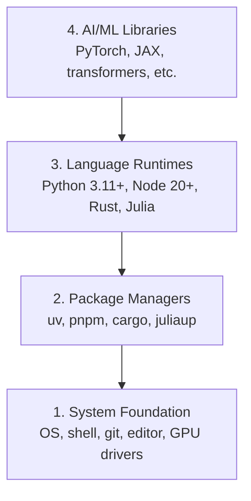

# 开发环境

> 中文译文。代码、命令和标识符保持英文。若与原文不一致，以同目录 docs/en.md 为准。

> 工具会塑造你的思维方式。一次配好，配到位。

**Type:** 动手做
**Languages:** Python、Node.js、Rust
**Prerequisites:** 无
**Time:** 约 45 分钟

## 学习目标

- 从零配好 Python 3.11+、Node.js 20+ 和 Rust 工具链
- 配置虚拟环境和包管理器，让构建可以复现
- 用 CUDA/MPS 验证能否访问 GPU，并跑一次测试张量运算
- 理解四层技术栈：系统、包、运行时、AI 库

## 问题

你即将用 Python、TypeScript、Rust 和 Julia，跨 500 多节课学习 AI 工程。如果环境是坏的，每一课都会变成跟工具缠斗，而不是在学习。

大多数人会跳过环境配置。然后他们花好几个小时调试导入错误、版本冲突，以及缺失的 CUDA 驱动。我们要把这件事一次做对。

## 概念

一套 AI 工程环境有四层：



我们自下而上安装。每一层都依赖它下面的那一层。

```figure
s0-env-stack
```

## 动手做

### 第 1 步：系统基础

检查你的系统，并装上基础工具。

```bash
# macOS
xcode-select --install
brew install git curl wget

# Ubuntu/Debian
sudo apt update && sudo apt install -y build-essential git curl wget unzip

# Windows (use WSL2)
wsl --install -d Ubuntu-24.04
```

### 第 2 步：用 uv 安装 Python

我们用 `uv`——它比 pip 快 10 到 100 倍，而且会自动处理虚拟环境。

```bash
curl -LsSf https://astral.sh/uv/install.sh | sh

uv python install 3.12

uv venv
source .venv/bin/activate  # or .venv\Scripts\activate on Windows

uv pip install numpy matplotlib jupyter
```

验证：

```python
import sys
print(f"Python {sys.version}")

import numpy as np
print(f"NumPy {np.__version__}")
a = np.array([1, 2, 3])
print(f"Vector: {a}, dot product with itself: {np.dot(a, a)}")
```

### 第 3 步：用 pnpm 安装 Node.js

用于 TypeScript 课程（智能体、MCP（模型上下文协议）服务器、Web 应用）。

```bash
curl -fsSL https://fnm.vercel.app/install | bash
fnm install 22
fnm use 22

npm install -g pnpm

node -e "console.log('Node', process.version)"
```

fnm 安装程序会先检查 `unzip`。如果没有，就以 `Not installing fnm due to missing dependencies.` 退出：在 Linux 上它要解压一个 zip 归档，在 macOS 上则通过 Homebrew 安装。macOS 自带 `unzip`；Ubuntu、Debian 和 WSL2 从第 1 步的 apt 那一行得到它（如果跳过了那一步，就执行 `sudo apt install -y unzip`）。

**macOS / Apple Silicon（M1/M2/M3/M4）：** 如果安装程序停在 `Error: Cannot install under Rosetta 2 in ARM default prefix (/opt/homebrew)`，说明你的终端正跑在 Rosetta 2 下（`arch` 会打印 `i386`），而 Homebrew 是原生的 arm64 构建。强制用 arm64 安装 fnm，把它接进你的 shell，然后从 `fnm install 22` 起重跑上面的命令：

```bash
arch -arm64 brew install fnm
echo 'eval "$(fnm env --use-on-cd)"' >> ~/.zshrc
source ~/.zshrc
```

### 第 4 步：Rust

用于对性能要求很高的课（推理、系统）。

```bash
curl --proto '=https' --tlsv1.2 -sSf https://sh.rustup.rs | sh

rustc --version
cargo --version
```

### 第 5 步：Julia（可选）

用于数学很重、Julia 特别擅长的课。

```bash
curl -fsSL https://install.julialang.org | sh

julia -e 'println("Julia ", VERSION)'
```

### 第 6 步：GPU 配置（如果你有 GPU）

**NVIDIA（Linux / Windows）：**

```bash
nvidia-smi

# Install PyTorch with CUDA
uv pip install torch torchvision torchaudio --index-url https://download.pytorch.org/whl/cu124
```

**macOS / Apple Silicon（M1/M2/M3/M4）：** Mac 上没有 CUDA——这是预期情况，不是失败。**不要**传入 `--index-url .../cuXXX`（那些 wheel 二进制包只适用于 Linux 和 Windows，所以安装会失败）。安装普通构建，其中包含 Apple 的 MPS（Metal）GPU 后端：

```bash
uv pip install torch torchvision torchaudio
```

验证（任何平台都适用）：

```python
import torch
print(f"CUDA available: {torch.cuda.is_available()}")           # False on macOS — expected
print(f"MPS available:  {torch.backends.mps.is_available()}")   # True on Apple Silicon
if torch.cuda.is_available():
    print(f"GPU: {torch.cuda.get_device_name(0)}")
```

没有 GPU？没关系。大多数课在 CPU 上就能跑。训练量很大的课，用 Google Colab 或云端 GPU。

### 第 7 步：验证你想开始的路线

本课的每条命令都从仓库根目录运行，也就是包含 `README.md` 和 `phases/` 的那个目录。预检只检查开始所选路线真正需要的东西。它默认跳过更后面的工具，这样初学者看到的是一个清楚的答案，而不是一堵警告墙。

开始完整的初学者序列：

```bash
python3 phases/00-setup-and-tooling/01-dev-environment/code/verify.py --route beginner
```

或者只检查你想走的路线：

```bash
python3 phases/00-setup-and-tooling/01-dev-environment/code/verify.py --route ml-foundations
python3 phases/00-setup-and-tooling/01-dev-environment/code/verify.py --route llm-engineering
python3 phases/00-setup-and-tooling/01-dev-environment/code/verify.py --route agents
python3 phases/00-setup-and-tooling/01-dev-environment/code/verify.py --route mcp
python3 phases/00-setup-and-tooling/01-dev-environment/code/verify.py --route agent-skills
python3 phases/00-setup-and-tooling/01-dev-environment/code/verify.py --route certification
```

如果你希望同一次预检也查看后续课程用到的可选工具和依赖，加上 `--show-later`。缺少的后续工具永远不会挡住所选路线。

每一项失败的必需检查都会带上检测到的路径或导入错误，以及一条精确的纠正命令。Agent Skills 路线和认证路线还会显示需要手动做的宿主检查，因为一段 Python 脚本无法证明某个 AI 宿主已经发现了一项技能，也无法证明你所选的技能作用域是可写的。

当初学者预检通过时，它会打印出第一节能直接运行的课的确切位置：

```text
Ready to start Beginner course.
Next: python3 phases/01-math-foundations/01-linear-algebra-intuition/code/vectors.py
```

## 使用

你的环境已经可以开始你检查过的路线。等某一课要用到后续工具时再安装，不要让整套技术栈挡住你的第一课。下面是整套课程里你会用到的东西：

| 语言 | 使用位置 | 包管理器 |
|----------|---------|-----------------|
| Python | 第 1–12 阶段（机器学习、深度学习、自然语言处理、视觉、音频、大语言模型） | uv |
| TypeScript | 第 13–17 阶段（工具、智能体、蜂群、基础设施） | pnpm |
| Rust | 第 12、15–17 阶段（对性能关键的系统） | cargo |
| Julia | 第 1 阶段（数学基础） | Pkg |

## 交付

本课产出一个验证脚本，任何人都可以运行它来检查自己的环境。

参见 `outputs/prompt-env-check.md`，其中的提示词帮助 AI 助手诊断环境问题。

## 练习

1. 运行验证脚本，并修复所有失败项
2. 为本课程创建一个 Python 虚拟环境，并安装 PyTorch
3. 用全部四种语言各写一个 “hello world”，并分别运行
