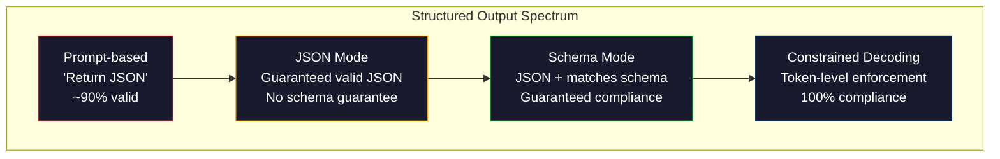
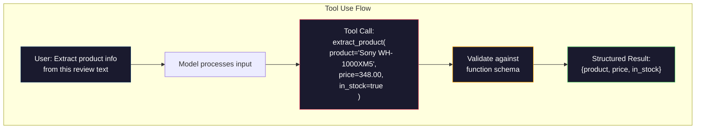

# 结构化输出：JSON、模式校验与约束解码

> 中文译文。代码、命令和标识符保持英文。若与原文不一致，以同目录 docs/en.md 为准。

> 你的 LLM 返回的是字符串。你的应用需要的是 JSON。这条鸿沟搞垮的生产系统，比任何一次模型幻觉都多。结构化输出是自然语言和带类型数据之间的桥。做对了，你的 LLM 就变成一个可靠的 API。做错了，你就会在凌晨三点用正则表达式去解析自由文本。

**Type:** 动手做
**Languages:** Python
**Prerequisites:** 第 10 阶段，第 01–05 课（从零实现大语言模型）
**Time:** 约 90 分钟
**Related:** 第 5 阶段 · 20（结构化输出与约束解码）涵盖解码器层面的理论（FSM/CFG，即有限状态机/上下文无关文法的 logit 处理器、Outlines、XGrammar）。本课聚焦生产环境里的 SDK 表面（OpenAI 的 `response_format`、Anthropic 的工具调用、Instructor）——如果想理解 API 之下发生了什么，请先读第 5 阶段 · 20。

## 学习目标

- 用 OpenAI 和 Anthropic 的 API 参数，实现 JSON 模式和受模式约束的输出
- 构建一层 Pydantic 校验，拒绝格式错误的 LLM 输出，并带着错误反馈重试
- 解释约束解码如何在 token 层面强制生成合法 JSON，而不需要后处理
- 设计稳健的抽取提示词，可靠地把非结构化文本转换成带类型的数据结构

## 问题

你让 LLM：“从这段文本里抽出产品名称、价格和是否有货。”它回答：

```
The product is the Sony WH-1000XM5 headphones, which cost $348.00 and are currently in stock.
```

这是一个完全正确的答案。对你的应用来说，它也完全没用。你的库存系统需要 `{"product": "Sony WH-1000XM5", "price": 348.00, "in_stock": true}`。你需要一个 JSON 对象，带有特定的键、特定的类型、特定的值约束。你需要的不是一个句子。

朴素的办法：在提示词里加上“以 JSON 回复”。这在 90% 的时候有效。另外 10%，模型会把 JSON 包进 Markdown 代码围栏，或者加上 “Here's the JSON:” 这样的开场白，或者因为括号提前闭合而产出语法非法的 JSON。你的 JSON 解析器崩溃。你的流水线中断。你加上 try/except 和一个重试循环。重试有时会产出不同的数据。于是，解析问题上面又叠了一层一致性问题。

这不是提示词工程问题。这是解码问题。模型从左到右生成 token。在每个位置，它从 10 万以上的词表选项里挑选最可能的下一个 token。在任意一个位置，这些选项里的大多数都会产出非法 JSON。如果模型刚刚吐出 `{"price":`，下一个 token 必须是数字、引号（表示字符串）、`null`、`true`、`false`，或者一个负号。其他任何东西都会产出非法 JSON。没有约束时，模型可能会挑一个英语里完全合理、语法上却灾难性错误的词。

## 概念

### 结构化输出的光谱

结构化输出的控制有四个层级，后一层都比前一层更可靠。



**基于提示词**（“以合法 JSON 回复”）：没有强制。模型通常会遵守，但有时不会。可靠性：约 90%。失败模式：Markdown 代码围栏、开场白、输出被截断、结构错误。

**JSON 模式**：API 保证输出是合法 JSON。OpenAI 的 `response_format: { type: "json_object" }` 会启用它。输出可以无错误地解析。但它未必匹配你期望的模式——多余的键、错误的类型、缺失的字段。

**Schema 模式**：API 接收一份 JSON Schema，并保证输出与之匹配。到 2026 年，每一家主流提供方都原生支持这一点：OpenAI 的 `response_format: { type: "json_schema", json_schema: {...} }`（也可以写成 `tool_choice="required"`）、Anthropic 带 `input_schema` 的工具调用，以及 Gemini 的 `response_schema` 加上 `response_mime_type: "application/json"`。输出会具有你指定的精确键、类型和约束。

**约束解码**：生成过程中，在每个 token 位置，解码器屏蔽掉所有会导致非法输出的 token。如果模式要求一个数字，而模型正要吐出一个字母，该 token 的概率就被设为零。模型只能产出通向合法输出的 token。OpenAI 的结构化输出模式，以及 Outlines 和 Guidance 这类库，在底层做的就是这件事。

### JSON Schema：契约语言

JSON Schema 是你告诉模型（或校验层）输出必须长成什么样的方式。每一种主流结构化输出系统都用它。

```json
{
  "type": "object",
  "properties": {
    "product": { "type": "string" },
    "price": { "type": "number", "minimum": 0 },
    "in_stock": { "type": "boolean" },
    "categories": {
      "type": "array",
      "items": { "type": "string" }
    }
  },
  "required": ["product", "price", "in_stock"]
}
```

这份模式说的是：输出必须是一个对象，包含字符串 `product`、非负数字 `price`、布尔值 `in_stock`，以及一个可选的字符串数组 `categories`。任何不匹配的输出都会被拒绝。

模式能应付那些难处理的情况：嵌套对象、元素带类型的数组、枚举（把字符串约束到特定取值）、正则匹配（作用在字符串上），以及组合子（oneOf、anyOf、allOf，用于多态输出）。

### Pydantic 的做法

在 Python 里，你不用手写 JSON Schema。你定义一个 Pydantic 模型，它会替你生成模式。

```python
from pydantic import BaseModel

class Product(BaseModel):
    product: str
    price: float
    in_stock: bool
    categories: list[str] = []
```

这会产出与上面相同的 JSON Schema。Instructor 库（以及 OpenAI 的 SDK）直接接受 Pydantic 模型：传入模型类，拿回一个校验过的实例。如果 LLM 的输出不匹配，Instructor 会自动重试。

### 函数调用 / 工具调用

这是解决同一问题的另一种接口。你不是让模型直接产出 JSON，而是定义带类型参数的“工具”（函数）。模型输出一次带结构化参数的函数调用。OpenAI 称之为“函数调用”。Anthropic 称之为“工具调用”。结果是一样的：结构化数据。



当模型需要选择调用哪个函数，而不只是填参数时，更适合用工具调用。如果你有 10 种不同的抽取模式，模型必须根据输入挑出正确的那一种，工具调用会同时给你模式选择和结构化输出。

### 常见失败模式

即便有了模式强制，结构化输出仍可能以不易察觉的方式失败。

**幻觉出来的值**：输出匹配模式，但里面是编造的数据。文本写的是 348 美元，模型却给出 `{"price": 299.99}`。模式校验抓不住这种情况——类型是对的，值是错的。

**枚举混淆**：你把一个字段约束为 `["in_stock", "out_of_stock", "preorder"]`。模型输出 `"available"`——语义上对，但不在允许的集合里。好的约束解码能防止这一点。基于提示词的做法不能。

**嵌套对象的深度**：嵌套很深的模式（4 层及以上）会产出更多错误。每一层嵌套都是模型可能跟丢结构的地方。

**数组长度**：模型可能在数组里放进太多或太少的元素。模式支持 `minItems` 和 `maxItems`，但并非所有提供方都在解码层面强制执行它们。

**可选字段被漏掉**：模型省略那些技术上可选、但对你的用例在语义上很重要的字段。即便数据有时确实缺失，也在模式里把它们设为必填——迫使模型显式产出 `null`。

```figure
mx-schema-funnel
```

## 动手做

### 第 1 步：JSON Schema 校验器

从零写一个校验器，检查一个 Python 对象是否匹配某份 JSON Schema。它跑在输出这一侧，用来核实是否符合约定。

```python
import json

def validate_schema(data, schema):
    errors = []
    _validate(data, schema, "", errors)
    return errors

def _validate(data, schema, path, errors):
    schema_type = schema.get("type")

    if schema_type == "object":
        if not isinstance(data, dict):
            errors.append(f"{path}: expected object, got {type(data).__name__}")
            return
        for key in schema.get("required", []):
            if key not in data:
                errors.append(f"{path}.{key}: required field missing")
        properties = schema.get("properties", {})
        for key, value in data.items():
            if key in properties:
                _validate(value, properties[key], f"{path}.{key}", errors)

    elif schema_type == "array":
        if not isinstance(data, list):
            errors.append(f"{path}: expected array, got {type(data).__name__}")
            return
        min_items = schema.get("minItems", 0)
        max_items = schema.get("maxItems", float("inf"))
        if len(data) < min_items:
            errors.append(f"{path}: array has {len(data)} items, minimum is {min_items}")
        if len(data) > max_items:
            errors.append(f"{path}: array has {len(data)} items, maximum is {max_items}")
        items_schema = schema.get("items", {})
        for i, item in enumerate(data):
            _validate(item, items_schema, f"{path}[{i}]", errors)

    elif schema_type == "string":
        if not isinstance(data, str):
            errors.append(f"{path}: expected string, got {type(data).__name__}")
            return
        enum_values = schema.get("enum")
        if enum_values and data not in enum_values:
            errors.append(f"{path}: '{data}' not in allowed values {enum_values}")

    elif schema_type == "number":
        if not isinstance(data, (int, float)):
            errors.append(f"{path}: expected number, got {type(data).__name__}")
            return
        minimum = schema.get("minimum")
        maximum = schema.get("maximum")
        if minimum is not None and data < minimum:
            errors.append(f"{path}: {data} is less than minimum {minimum}")
        if maximum is not None and data > maximum:
            errors.append(f"{path}: {data} is greater than maximum {maximum}")

    elif schema_type == "boolean":
        if not isinstance(data, bool):
            errors.append(f"{path}: expected boolean, got {type(data).__name__}")

    elif schema_type == "integer":
        if not isinstance(data, int) or isinstance(data, bool):
            errors.append(f"{path}: expected integer, got {type(data).__name__}")
```

### 第 2 步：Pydantic 风格的模型到模式

写一个最小的类到模式转换器。定义一个 Python 类，并自动生成它的 JSON Schema。

```python
class SchemaField:
    def __init__(self, field_type, required=True, default=None, enum=None, minimum=None, maximum=None):
        self.field_type = field_type
        self.required = required
        self.default = default
        self.enum = enum
        self.minimum = minimum
        self.maximum = maximum

def python_type_to_schema(field):
    type_map = {
        str: "string",
        int: "integer",
        float: "number",
        bool: "boolean",
    }

    schema = {}

    if field.field_type in type_map:
        schema["type"] = type_map[field.field_type]
    elif field.field_type == list:
        schema["type"] = "array"
        schema["items"] = {"type": "string"}
    elif isinstance(field.field_type, dict):
        schema = field.field_type

    if field.enum:
        schema["enum"] = field.enum
    if field.minimum is not None:
        schema["minimum"] = field.minimum
    if field.maximum is not None:
        schema["maximum"] = field.maximum

    return schema

def model_to_schema(name, fields):
    properties = {}
    required = []

    for field_name, field in fields.items():
        properties[field_name] = python_type_to_schema(field)
        if field.required:
            required.append(field_name)

    return {
        "type": "object",
        "properties": properties,
        "required": required,
    }
```

### 第 3 步：受约束的 token 过滤器

模拟约束解码。给定一段写到一半的 JSON 字符串和一份模式，判断当前位置上哪些 token 类别是合法的。

```python
def next_valid_tokens(partial_json, schema):
    stripped = partial_json.strip()

    if not stripped:
        return ["{"]

    try:
        json.loads(stripped)
        return ["<EOS>"]
    except json.JSONDecodeError:
        pass

    last_char = stripped[-1] if stripped else ""

    if last_char == "{":
        return ['"', "}"]
    elif last_char == '"':
        if stripped.endswith('":'):
            return ['"', "0-9", "true", "false", "null", "[", "{"]
        return ["a-z", '"']
    elif last_char == ":":
        return [" ", '"', "0-9", "true", "false", "null", "[", "{"]
    elif last_char == ",":
        return [" ", '"', "{", "["]
    elif last_char in "0123456789":
        return ["0-9", ".", ",", "}", "]"]
    elif last_char == "}":
        return [",", "}", "]", "<EOS>"]
    elif last_char == "]":
        return [",", "}", "<EOS>"]
    elif last_char == "[":
        return ['"', "0-9", "true", "false", "null", "{", "[", "]"]
    else:
        return ["any"]

def demonstrate_constrained_decoding():
    partial_states = [
        '',
        '{',
        '{"product"',
        '{"product":',
        '{"product": "Sony"',
        '{"product": "Sony",',
        '{"product": "Sony", "price":',
        '{"product": "Sony", "price": 348',
        '{"product": "Sony", "price": 348}',
    ]

    print(f"{'Partial JSON':<45} {'Valid Next Tokens'}")
    print("-" * 80)
    for state in partial_states:
        valid = next_valid_tokens(state, {})
        display = state if state else "(empty)"
        print(f"{display:<45} {valid}")
```

### 第 4 步：抽取流水线

把上面的部分合成一条抽取流水线：定义模式，模拟 LLM 产出结构化输出，校验输出，并处理重试。

```python
def simulate_llm_extraction(text, schema, attempt=0):
    if "headphones" in text.lower() or "sony" in text.lower():
        if attempt == 0:
            return '{"product": "Sony WH-1000XM5", "price": 348.00, "in_stock": true, "categories": ["audio", "headphones"]}'
        return '{"product": "Sony WH-1000XM5", "price": 348.00, "in_stock": true}'

    if "laptop" in text.lower():
        return '{"product": "MacBook Pro 16", "price": 2499.00, "in_stock": false, "categories": ["computers"]}'

    return '{"product": "Unknown", "price": 0, "in_stock": false}'

def extract_with_retry(text, schema, max_retries=3):
    for attempt in range(max_retries):
        raw = simulate_llm_extraction(text, schema, attempt)

        try:
            data = json.loads(raw)
        except json.JSONDecodeError as e:
            print(f"  Attempt {attempt + 1}: JSON parse error -- {e}")
            continue

        errors = validate_schema(data, schema)
        if not errors:
            return data

        print(f"  Attempt {attempt + 1}: Schema validation errors -- {errors}")

    return None

product_schema = {
    "type": "object",
    "properties": {
        "product": {"type": "string"},
        "price": {"type": "number", "minimum": 0},
        "in_stock": {"type": "boolean"},
        "categories": {"type": "array", "items": {"type": "string"}},
    },
    "required": ["product", "price", "in_stock"],
}
```

### 第 5 步：运行完整流水线

```python
def run_demo():
    print("=" * 60)
    print("  Structured Output Pipeline Demo")
    print("=" * 60)

    print("\n--- Schema Definition ---")
    product_fields = {
        "product": SchemaField(str),
        "price": SchemaField(float, minimum=0),
        "in_stock": SchemaField(bool),
        "categories": SchemaField(list, required=False),
    }
    generated_schema = model_to_schema("Product", product_fields)
    print(json.dumps(generated_schema, indent=2))

    print("\n--- Schema Validation ---")
    test_cases = [
        ({"product": "Test", "price": 10.0, "in_stock": True}, "Valid object"),
        ({"product": "Test", "price": -5.0, "in_stock": True}, "Negative price"),
        ({"product": "Test", "in_stock": True}, "Missing price"),
        ({"product": "Test", "price": "ten", "in_stock": True}, "String as price"),
        ("not an object", "String instead of object"),
    ]

    for data, label in test_cases:
        errors = validate_schema(data, product_schema)
        status = "PASS" if not errors else f"FAIL: {errors}"
        print(f"  {label}: {status}")

    print("\n--- Constrained Decoding Simulation ---")
    demonstrate_constrained_decoding()

    print("\n--- Extraction Pipeline ---")
    texts = [
        "The Sony WH-1000XM5 headphones are priced at $348 and currently available.",
        "The new MacBook Pro 16-inch laptop costs $2499 but is sold out.",
        "This is a random sentence with no product info.",
    ]

    for text in texts:
        print(f"\n  Input: {text[:60]}...")
        result = extract_with_retry(text, product_schema)
        if result:
            print(f"  Output: {json.dumps(result)}")
        else:
            print(f"  Output: FAILED after retries")
```

## 使用

### OpenAI 结构化输出

```python
# from openai import OpenAI
# from pydantic import BaseModel
#
# client = OpenAI()
#
# class Product(BaseModel):
#     product: str
#     price: float
#     in_stock: bool
#
# response = client.beta.chat.completions.parse(
#     model="gpt-5-mini",
#     messages=[
#         {"role": "system", "content": "Extract product information."},
#         {"role": "user", "content": "Sony WH-1000XM5, $348, in stock"},
#     ],
#     response_format=Product,
# )
#
# product = response.choices[0].message.parsed
# print(product.product, product.price, product.in_stock)
```

OpenAI 的结构化输出模式在内部使用约束解码。模型生成的每一个 token，都保证最终输出匹配这份 Pydantic 模式。不需要重试。不需要再校验。约束被做进了解码过程本身。

### Anthropic 工具调用

```python
# import anthropic
#
# client = anthropic.Anthropic()
#
# response = client.messages.create(
#     model="claude-opus-4-7",
#     max_tokens=1024,
#     tools=[{
#         "name": "extract_product",
#         "description": "Extract product information from text",
#         "input_schema": {
#             "type": "object",
#             "properties": {
#                 "product": {"type": "string"},
#                 "price": {"type": "number"},
#                 "in_stock": {"type": "boolean"},
#             },
#             "required": ["product", "price", "in_stock"],
#         },
#     }],
#     messages=[{"role": "user", "content": "Extract: Sony WH-1000XM5, $348, in stock"}],
# )
```

Anthropic 通过工具调用实现结构化输出。模型发出一次工具调用，其结构化参数匹配 `input_schema`。结果相同，API 的表面不同。

### Instructor 库

```python
# pip install instructor
# import instructor
# from openai import OpenAI
# from pydantic import BaseModel
#
# client = instructor.from_openai(OpenAI())
#
# class Product(BaseModel):
#     product: str
#     price: float
#     in_stock: bool
#
# product = client.chat.completions.create(
#     model="gpt-5-mini",
#     response_model=Product,
#     messages=[{"role": "user", "content": "Sony WH-1000XM5, $348, in stock"}],
# )
```

Instructor 包装任意 LLM 客户端，并加上带校验的自动重试。如果第一次尝试没有通过校验，它会把错误作为上下文发回模型，请模型修正输出。这对任何提供方都有效，不只是 OpenAI。

## 交付

本课产出 `outputs/prompt-structured-extractor.md`——一份可复用的提示词模板。给定模式定义，它就能从任意文本中抽取结构化数据。把一份 JSON Schema 和非结构化文本喂给它，它返回经过校验的 JSON。

它还产出 `outputs/skill-structured-outputs.md`——一个决策框架，根据你的提供方、可靠性要求和模式复杂度，选择合适的结构化输出策略。

## 练习

1. 扩展模式校验器，使其支持 `oneOf`（数据必须恰好匹配若干模式中的一个）。这用来处理多态输出——例如，一个字段既可以是形状不同的 `Product` 对象，也可以是 `Service` 对象。

2. 构建一个“模式差异”工具，比较两份模式，区分破坏性变更（删掉了必填字段、改了类型）和非破坏性变更（加了可选字段、放宽了约束）。在生产环境里给抽取模式做版本管理时，这是必需的。

3. 实现一个更贴近真实情况的约束解码模拟器。给定一份 JSON Schema，以及一个包含 100 个 token 的词表（字母、数字、标点、关键字），逐步走过生成过程，在每个位置屏蔽非法 token。测量每一步里词表有百分之多少是合法的。

4. 构建一套抽取评测。创建 50 条产品描述，并手工标注 JSON 输出。对全部 50 条运行你的抽取流水线，测量精确匹配、字段级准确率和类型符合度。找出哪些字段最难抽对。

5. 给你的抽取流水线加上“置信度”。对每个抽取出的字段，估计模型有多确信（依据 token 概率，或者把抽取跑 3 次并测量一致性）。把低置信度的字段标出来，交给人工复核。

## 关键术语

| 术语 | 人们怎么说 | 它实际的含义 |
|------|----------------|----------------------|
| JSON 模式 | “返回 JSON” | 保证输出在语法上是合法 JSON 的 API 标志，但不强制任何特定模式 |
| 结构化输出 | “带类型的 JSON” | 匹配某一份具体 JSON Schema 的输出，键、类型和约束都正确 |
| 约束解码 | “引导式生成” | 在每个 token 位置屏蔽掉会产生非法输出的 token——保证 100% 符合模式 |
| JSON Schema | “一份 JSON 模板” | 一种声明式语言，用来描述 JSON 数据的结构、类型和约束（OpenAPI、JSON Forms 等都在用） |
| Pydantic | “增强版的 Python dataclasses” | 用类型校验定义数据模型的 Python 库，FastAPI 和 Instructor 用它生成 JSON Schema |
| 函数调用 | “工具调用” | LLM 输出一次结构化的函数调用（名称加上带类型的参数），而不是自由文本——OpenAI 和 Anthropic 都支持 |
| Instructor | “给 LLM 用的 Pydantic” | 包装 LLM 客户端、返回经过校验的 Pydantic 实例的 Python 库，校验失败时自动重试 |
| token 屏蔽 | “过滤词表” | 生成时把特定 token 的概率设为零，使模型无法把它们产生出来 |
| 模式符合 | “形状对得上” | 输出含有每一个必填字段，类型正确，值落在约束之内，且没有不允许的多余字段 |
| 重试循环 | “再试，直到成功” | 把校验错误发回模型，请它修正输出——Instructor 会自动做这件事，次数上限可以配置 |

## 延伸阅读

- [OpenAI Structured Outputs Guide](https://platform.openai.com/docs/guides/structured-outputs) —— OpenAI API 中基于 JSON Schema 的约束解码的官方文档
- [Willard & Louf, 2023 -- "Efficient Guided Generation for Large Language Models"](https://arxiv.org/abs/2307.09702) —— Outlines 论文，描述如何把 JSON Schema 编译成有限状态机，以便施加 token 级约束
- [Instructor documentation](https://python.useinstructor.com/) —— 借助 Pydantic 校验和重试，从任意 LLM 得到结构化输出的标准库
- [Anthropic Tool Use Guide](https://docs.anthropic.com/en/docs/tool-use) —— Claude 如何通过带 JSON Schema `input_schema` 的工具调用实现结构化输出
- [JSON Schema specification](https://json-schema.org/) —— 每一种主流结构化输出系统都在使用的这门模式语言的完整规范
- [Outlines library](https://github.com/outlines-dev/outlines) —— 把正则表达式和 JSON Schema 编译成有限状态机的开源约束生成库
- [Dong et al., "XGrammar: Flexible and Efficient Structured Generation Engine for Large Language Models" (MLSys 2025)](https://arxiv.org/abs/2411.15100) —— 当前最先进的文法引擎；用下推自动机编译，以大约每 token 100 纳秒的速度屏蔽 token。
- [Beurer-Kellner et al., "Prompting Is Programming: A Query Language for Large Language Models" (LMQL)](https://arxiv.org/abs/2212.06094) —— LMQL 论文，把约束解码表述为一门带有类型约束和值约束的查询语言。
- [Microsoft Guidance (framework docs)](https://github.com/guidance-ai/guidance) —— 由模板驱动的约束生成；与提供方无关，是 Outlines 和 XGrammar 的补充。
