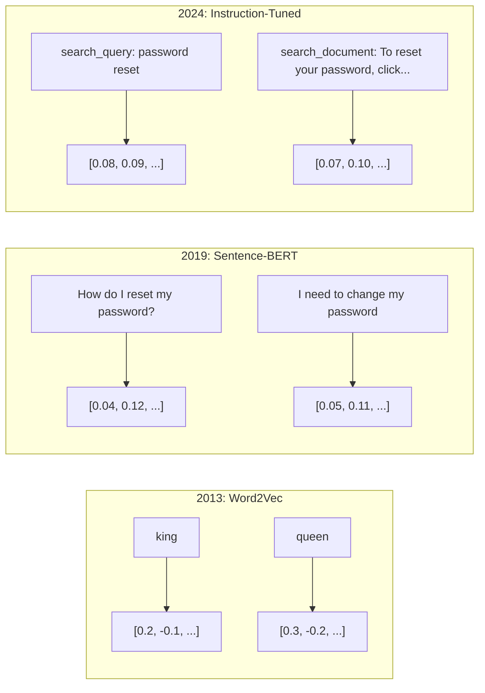
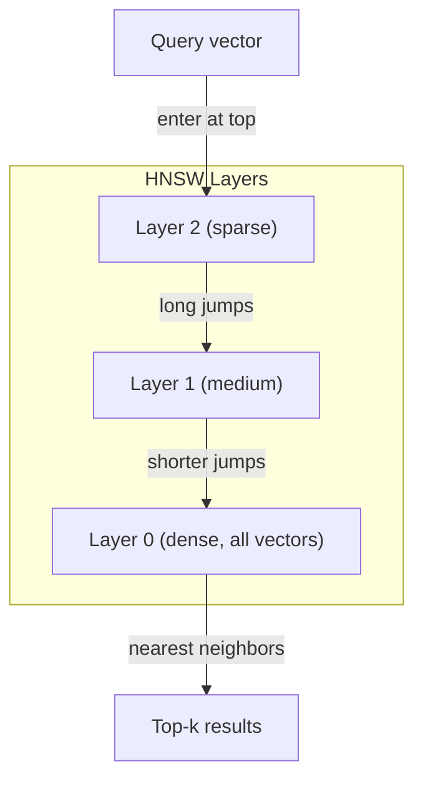

# 嵌入与向量表示

> 中文译文。代码、命令和标识符保持英文。若与原文不一致，以同目录 docs/en.md 为准。

> 文本是离散的。数学是连续的。每当你让 LLM 去找“相似”的文档、比较含义，或做超出关键词的搜索，你都在依靠一座连接这两个世界的桥。这座桥就是嵌入。如果不理解嵌入，你就不理解现代 AI。你只是在用它。

**Type:** 动手做
**Languages:** Python
**Prerequisites:** 第 11 阶段，第 01 课（提示词工程）
**Time:** 约 75 分钟
**Related:** 第 5 阶段 · 22（嵌入模型深入）涵盖稠密、稀疏与多向量的对比、Matryoshka 截断，以及按能力轴选择模型。本课聚焦生产流水线（向量数据库、HNSW、相似度数学）。选定模型之前，先读第 5 阶段 · 22。

## 学习目标

- 用 API 提供方和开源模型生成文本嵌入，并计算它们之间的余弦相似度
- 解释嵌入为什么能解决关键词搜索处理不了的词汇错配问题
- 构建一个语义搜索索引，按含义而不是按关键词精确匹配来检索文档
- 用检索基准（精确率@k、召回率）评测嵌入质量，并为你的任务选对嵌入模型

## 问题

你有 1 万张支持工单。客户写道：“my payment didn't go through.”你需要找出过去相似的工单。关键词搜索能找到含有 “payment” 和 “didn't go through” 的工单。它会漏掉 “transaction failed”、“charge was declined” 和 “billing error”。这些工单说的是完全同一个问题，用的却是完全不同的词。

这就是词汇错配问题。人的语言有几十种方式说同一件事。关键词搜索把每个词当成一个没有含义的独立符号。它不可能知道 “declined” 和 “didn't go through” 指的是同一个概念。

你需要一种文本表示，让相似度由含义决定，而不是由拼写决定。你需要一种办法，把 “my payment didn't go through” 和 “transaction was declined” 放进某个数学空间里彼此靠近，同时把 “my payment arrived on time” 推远，尽管它们共享 “payment” 这个词。

这种表示就是嵌入。

## 概念

### 什么是嵌入？

嵌入是表示文本含义的稠密浮点数向量。“稠密”这个词很重要——每一维都携带信息，不像稀疏表示（词袋、TF-IDF）那样大多数维度是零。

“The cat sat on the mat”会变成类似 `[0.023, -0.041, 0.087, ..., 0.012]` 的东西——一份 768 到 3072 个数的列表，具体取决于模型。这些数字编码含义。你从不直接去读它们。你拿它们做比较。

### Word2Vec 的突破

2013 年，Google 的 Tomas Mikolov 及其同事发表了 Word2Vec。核心洞见是：训练一个神经网络，根据邻居预测一个词（或根据一个词预测邻居），隐藏层的权重就变成有意义的向量表示。

著名的结果：

```
king - man + woman = queen
```

对词嵌入做向量运算，能够抓住语义关系。从 “man” 到 “woman” 的方向，大致与从 “king” 到 “queen” 的方向相同。这一刻，整个领域意识到：几何可以编码含义。

Word2Vec 产出 300 维向量。每个词无论上下文如何，都只有一个向量。“river bank”里的 “bank” 和 “bank account”里的 “bank” 嵌入相同。这个局限推动了此后十年的研究。

### 从词到句子

词嵌入表示的是单个 token。生产系统需要嵌入整个句子、段落或文档。出现了四种做法：

**取平均**：对句子里所有词向量取均值。便宜、有损，对短文本却出奇地够用。词序完全丢掉——“dog bites man”和“man bites dog”会得到完全相同的嵌入。

**CLS token**：Transformer 模型（BERT，2018）会输出一个特殊的 [CLS] token 嵌入，代表整个输入。比取平均好，但 [CLS] token 是为下一句预测训练的，不是为相似度训练的。

**对比学习**：显式训练模型，把相似的配对推到一起，把不相似的配对推开。Sentence-BERT（Reimers 与 Gurevych，2019）用了这种方法，并成为现代嵌入模型的基础。给定 “How do I reset my password?” 和 “I need to change my password”，模型学会这两者应当拥有几乎相同的向量。

**指令微调嵌入**：最新的做法。E5 和 GTE 这类模型接受一个任务前缀（“search_query:”、“search_document:”），告诉模型要产出哪一种嵌入。这样，一个模型就能承担多种任务。



### 现代嵌入模型

市场上已经沉淀出少数几种生产级选项（截至 2026 年初的 MTEB 分数，MTEB v2）：

| 模型 | 提供方 | 维度 | MTEB | 上下文 | 每 100 万 token 的成本 |
|-------|----------|-----------|------|---------|------------------|
| Gemini Embedding 2 | Google | 3072（Matryoshka） | 67.7（检索） | 8192 | $0.15 |
| embed-v4 | Cohere | 1024（Matryoshka） | 65.2 | 128K | $0.12 |
| voyage-4 | Voyage AI | 1024/2048（Matryoshka） | 66.8 | 32K | $0.12 |
| text-embedding-3-large | OpenAI | 3072（Matryoshka） | 64.6 | 8192 | $0.13 |
| text-embedding-3-small | OpenAI | 1536（Matryoshka） | 62.3 | 8192 | $0.02 |
| BGE-M3 | BAAI | 1024（稠密+稀疏+ColBERT） | 63.0 多语言 | 8192 | 开放权重 |
| Qwen3-Embedding | Alibaba | 4096（Matryoshka） | 66.9 | 32K | 开放权重 |
| Nomic-embed-v2 | Nomic | 768（Matryoshka） | 63.1 | 8192 | 开放权重 |

MTEB（Massive Text Embedding Benchmark，大规模文本嵌入基准）v2 覆盖检索、分类、聚类、重排序和摘要等 100 多项任务。越高越好。到 2026 年，开放权重模型（Qwen3-Embedding、BGE-M3）在大多数能力轴上已经追平或超过闭源托管模型。Gemini Embedding 2 在纯检索上领先；Voyage 与 Cohere 在特定领域（金融、法律、代码）领先。定下模型之前，始终用你自己的查询做基准测试。

### 相似度指标

给定两个嵌入向量，有三种方式衡量它们有多相似：

**余弦相似度**：两个向量夹角的余弦。范围从 -1（相反）到 1（方向相同）。它忽略模长——一个 10 个词的句子和一篇 500 个词的文档，只要指向同一方向，分数就可以是 1.0。这是 90% 用例的默认选择。

```
cosine_sim(a, b) = dot(a, b) / (||a|| * ||b||)
```

**点积**：两个向量的原始内积。向量已经归一化（单位长度）时，它与余弦相似度相同。算起来更快。OpenAI 的嵌入是归一化的，所以点积和余弦给出相同的排序。

```
dot(a, b) = sum(a_i * b_i)
```

**欧氏（L2）距离**：向量空间里的直线距离。越小越相似。它对模长差异敏感。当空间里的绝对位置重要、而不只是方向时，用它。

```
L2(a, b) = sqrt(sum((a_i - b_i)^2))
```

何时用哪一种：

| 指标 | 何时使用 | 何时避免 |
|--------|----------|------------|
| 余弦相似度 | 比较长度不同的文本；大多数检索任务 | 模长本身携带信息 |
| 点积 | 嵌入已经归一化；要最快的速度 | 向量的模长各不相同 |
| 欧氏距离 | 聚类；空间上的最近邻问题 | 比较长度相差极大的文档 |

### 向量数据库与 HNSW

暴力相似度搜索会把查询和每一条已存储的向量比较。100 万条 1536 维向量，每次查询就是 15 亿次乘加。太慢了。

向量数据库用近似最近邻（ANN）算法解决这个问题。占主导地位的算法是 HNSW（Hierarchical Navigable Small World，分层可导航小世界图）：

1. 构建向量的多层图
2. 顶层稀疏——相距较远的簇之间有长程连接
3. 底层稠密——邻近向量之间有细粒度连接
4. 搜索从顶层进入，贪心下降，逐步收细
5. 以 O(log n) 而不是 O(n) 的时间返回近似的前 k 个结果

HNSW 用很小的准确率损失（召回率通常仍有 95%–99%）换来巨大的速度提升。在 1000 万条向量上，暴力搜索要花数秒。HNSW 只要数毫秒。



生产环境里的选择：

| 数据库 | 类型 | 最适合 | 最大规模 |
|----------|------|----------|-----------|
| Pinecone | 托管 SaaS | 免运维的生产环境 | 数十亿 |
| Weaviate | 开源 | 自托管、混合搜索 | 1 亿以上 |
| Qdrant | 开源 | 高性能、带过滤 | 1 亿以上 |
| ChromaDB | 嵌入式 | 原型开发、本地开发 | 100 万 |
| pgvector | Postgres 扩展 | 已经在用 Postgres | 1000 万 |
| FAISS | 库 | 进程内、研究 | 10 亿以上 |

### 分块策略

文档太长，不能当成单个向量来嵌入。一份 50 页的 PDF 覆盖几十个主题——它的嵌入会变成一切的平均，结果跟任何具体内容都不像。你把文档切成块，再逐块嵌入。

**固定大小分块**：每 N 个 token 切一刀，并带上 M 个 token 的重叠。简单，也可预期。文档没有清晰结构时效果很好。一个 512 个 token 的块、50 个 token 的重叠：第 1 块是第 0–511 个 token，第 2 块是第 462–973 个 token。

**按句子分块**：在句子边界切开，把句子攒到 token 上限为止。每个块至少是一个完整句子。这比固定大小好，因为你不会把一个意思从中间切断。

**递归分块**：先尝试在最大的边界处切开（章节标题）。如果仍然太大，再试段落边界。然后是句子边界。然后是字符上限。这就是 LangChain 的 `RecursiveCharacterTextSplitter`，它对混合格式的语料效果很好。

**语义分块**：先嵌入每一个句子，再把嵌入相近的连续句子分到一组。当嵌入相似度降到某个阈值以下，就开始新的一块。这很贵（每个句子都要单独嵌入），但得到的块最连贯。

| 策略 | 复杂度 | 质量 | 最适合 |
|----------|-----------|---------|----------|
| 固定大小 | 低 | 尚可 | 无结构文本、日志 |
| 按句子 | 低 | 好 | 文章、邮件 |
| 递归 | 中 | 好 | Markdown、HTML、混合文档 |
| 语义 | 高 | 最好 | 对检索质量要求极高的场景 |

对大多数系统，合适的区间是 256–512 个 token 的块，再加 50 个 token 的重叠。

### 双编码器与交叉编码器

双编码器（bi-encoder）分别嵌入查询和文档，然后比较向量。快——查询只嵌入一次，再去和预先算好的文档嵌入比较。检索用的就是它。

交叉编码器（cross-encoder）把查询和一篇文档当作同一次输入，输出一个相关性分数。慢——每一对查询和文档都要过一遍完整模型。但准得多，因为它可以同时在查询 token 和文档 token 之间做注意力。

生产中的做法是：双编码器取出前 100 个候选，交叉编码器把它们重排序成前 10 个。这就是先检索、再重排序的流水线。


重排序模型：Cohere Rerank 3.5（每 1000 次查询 2 美元）、BGE-reranker-v2（免费、开源）、Jina Reranker v2（免费、开源）。

### Matryoshka 嵌入

传统嵌入是全有或全无。一个 1536 维向量就用 1536 个浮点数。不重新训练，就不能截到 256 维。

Matryoshka 表示学习（Kusupati 等人，2022）解决了这个问题。模型被训练成让前 N 维抓住最重要的信息，就像俄罗斯套娃。把 1536 维的 Matryoshka 嵌入截到 256 维会损失一些准确率，但仍然能用。

OpenAI 的 text-embedding-3-small 和 text-embedding-3-large 通过 `dimensions` 参数支持 Matryoshka 截断。请求 256 维而不是 1536 维，存储降为六分之一，在 MTEB 基准上大约损失 3%–5% 的准确率。

### 二值量化

一个以 float32 存储的 1536 维嵌入占 6144 字节。乘以 1000 万篇文档：光是向量就要 61 GB。

二值量化把每个浮点数变成一个比特：正数变成 1，负数变成 0。存储从 6144 字节降到 192 字节——缩小 32 倍。相似度用汉明距离计算（数一数不同的比特），CPU 一条指令就能做完。

检索召回率大约会掉 5%–10%。常见做法是：用二值量化对数百万向量做第一遍搜索，再用全精度向量给前 1000 名重新打分。这样你能保留全精度准确率的 95% 以上，内存却只有原来的三十二分之一。

```figure
cosine-similarity
```

## 动手做

我们从零做一个语义搜索引擎。没有向量数据库。没有外部嵌入 API。纯 Python，数学交给 numpy。

### 第 1 步：文本分块

```python
def chunk_text(text, chunk_size=200, overlap=50):
    words = text.split()
    chunks = []
    start = 0
    while start < len(words):
        end = start + chunk_size
        chunk = " ".join(words[start:end])
        chunks.append(chunk)
        start += chunk_size - overlap
    return chunks


def chunk_by_sentences(text, max_chunk_tokens=200):
    sentences = text.replace("\n", " ").split(".")
    sentences = [s.strip() + "." for s in sentences if s.strip()]
    chunks = []
    current_chunk = []
    current_length = 0
    for sentence in sentences:
        sentence_length = len(sentence.split())
        if current_length + sentence_length > max_chunk_tokens and current_chunk:
            chunks.append(" ".join(current_chunk))
            current_chunk = []
            current_length = 0
        current_chunk.append(sentence)
        current_length += sentence_length
    if current_chunk:
        chunks.append(" ".join(current_chunk))
    return chunks
```

### 第 2 步：从零构建嵌入

我们用 TF-IDF 加 L2 归一化实现一种简单的稠密嵌入。这不是神经嵌入，但它遵守同一份契约：文本进去，固定大小的向量出来，相似的文本产出相似的向量。

```python
import math
import numpy as np
from collections import Counter

class SimpleEmbedder:
    def __init__(self):
        self.vocab = []
        self.idf = []
        self.word_to_idx = {}

    def fit(self, documents):
        vocab_set = set()
        for doc in documents:
            vocab_set.update(doc.lower().split())
        self.vocab = sorted(vocab_set)
        self.word_to_idx = {w: i for i, w in enumerate(self.vocab)}
        n = len(documents)
        self.idf = np.zeros(len(self.vocab))
        for i, word in enumerate(self.vocab):
            doc_count = sum(1 for doc in documents if word in doc.lower().split())
            self.idf[i] = math.log((n + 1) / (doc_count + 1)) + 1

    def embed(self, text):
        words = text.lower().split()
        count = Counter(words)
        total = len(words) if words else 1
        vec = np.zeros(len(self.vocab))
        for word, freq in count.items():
            if word in self.word_to_idx:
                tf = freq / total
                vec[self.word_to_idx[word]] = tf * self.idf[self.word_to_idx[word]]
        norm = np.linalg.norm(vec)
        if norm > 0:
            vec = vec / norm
        return vec
```

### 第 3 步：相似度函数

```python
def cosine_similarity(a, b):
    dot = np.dot(a, b)
    norm_a = np.linalg.norm(a)
    norm_b = np.linalg.norm(b)
    if norm_a == 0 or norm_b == 0:
        return 0.0
    return float(dot / (norm_a * norm_b))


def dot_product(a, b):
    return float(np.dot(a, b))


def euclidean_distance(a, b):
    return float(np.linalg.norm(a - b))
```

### 第 4 步：带暴力搜索的向量索引

```python
class VectorIndex:
    def __init__(self):
        self.vectors = []
        self.texts = []
        self.metadata = []

    def add(self, vector, text, meta=None):
        self.vectors.append(vector)
        self.texts.append(text)
        self.metadata.append(meta or {})

    def search(self, query_vector, top_k=5, metric="cosine"):
        scores = []
        for i, vec in enumerate(self.vectors):
            if metric == "cosine":
                score = cosine_similarity(query_vector, vec)
            elif metric == "dot":
                score = dot_product(query_vector, vec)
            elif metric == "euclidean":
                score = -euclidean_distance(query_vector, vec)
            else:
                raise ValueError(f"Unknown metric: {metric}")
            scores.append((i, score))
        scores.sort(key=lambda x: x[1], reverse=True)
        results = []
        for idx, score in scores[:top_k]:
            results.append({
                "text": self.texts[idx],
                "score": score,
                "metadata": self.metadata[idx],
                "index": idx
            })
        return results

    def size(self):
        return len(self.vectors)
```

### 第 5 步：语义搜索引擎

```python
class SemanticSearchEngine:
    def __init__(self, chunk_size=200, overlap=50):
        self.embedder = SimpleEmbedder()
        self.index = VectorIndex()
        self.chunk_size = chunk_size
        self.overlap = overlap

    def index_documents(self, documents, source_names=None):
        all_chunks = []
        all_sources = []
        for i, doc in enumerate(documents):
            chunks = chunk_text(doc, self.chunk_size, self.overlap)
            all_chunks.extend(chunks)
            name = source_names[i] if source_names else f"doc_{i}"
            all_sources.extend([name] * len(chunks))
        self.embedder.fit(all_chunks)
        for chunk, source in zip(all_chunks, all_sources):
            vec = self.embedder.embed(chunk)
            self.index.add(vec, chunk, {"source": source})
        return len(all_chunks)

    def search(self, query, top_k=5, metric="cosine"):
        query_vec = self.embedder.embed(query)
        return self.index.search(query_vec, top_k, metric)

    def search_with_scores(self, query, top_k=5):
        results = self.search(query, top_k)
        return [
            {
                "text": r["text"][:200],
                "source": r["metadata"].get("source", "unknown"),
                "score": round(r["score"], 4)
            }
            for r in results
        ]
```

### 第 6 步：比较相似度指标

```python
def compare_metrics(engine, query, top_k=3):
    results = {}
    for metric in ["cosine", "dot", "euclidean"]:
        hits = engine.search(query, top_k=top_k, metric=metric)
        results[metric] = [
            {"score": round(h["score"], 4), "preview": h["text"][:80]}
            for h in hits
        ]
    return results
```

## 使用

换成生产级嵌入 API 之后，架构保持不变。变的只有嵌入器：

```python
from openai import OpenAI

client = OpenAI()

def openai_embed(texts, model="text-embedding-3-small", dimensions=None):
    kwargs = {"model": model, "input": texts}
    if dimensions:
        kwargs["dimensions"] = dimensions
    response = client.embeddings.create(**kwargs)
    return [item.embedding for item in response.data]
```

用 OpenAI 做 Matryoshka 截断——同一个模型，更少的维度，更低的存储：

```python
full = openai_embed(["semantic search query"], dimensions=1536)
compact = openai_embed(["semantic search query"], dimensions=256)
```

256 维向量的存储是原来的六分之一。对 1000 万篇文档，那就是 10 GB 对 61 GB。在标准基准上，准确率大约损失 3%–5%。

用 Cohere 做重排序：

```python
import cohere

co = cohere.ClientV2()

results = co.rerank(
    model="rerank-v3.5",
    query="What is the refund policy?",
    documents=["Full refund within 30 days...", "No refunds after 90 days..."],
    top_n=3
)
```

不依赖 API 的本地嵌入：

```python
from sentence_transformers import SentenceTransformer

model = SentenceTransformer("BAAI/bge-small-en-v1.5")
embeddings = model.encode(["semantic search query", "another document"])
```

我们在动手做里写的 VectorIndex 类，上面哪一种都能用。换掉嵌入函数，搜索逻辑留着。

## 交付

本课产出：
- `outputs/prompt-embedding-advisor.md` —— 一段提示词，用来针对具体用例选择嵌入模型和策略
- `outputs/skill-embedding-patterns.md` —— 一项技能，教智能体如何在生产环境里有效使用嵌入

## 练习

1. **指标比较**：用余弦相似度、点积和欧氏距离，对样本文档跑同样的 5 条查询。记下每种指标的前 3 名。哪些查询上这些指标会不一致？为什么？

2. **块大小实验**：分别用 50、100、200 和 500 个词的块大小，为样本文档建索引。对每种大小跑 5 条查询，记下第 1 名的相似度分数。画出块大小和检索质量的关系。找出更大的块开始帮倒忙的那个点。

3. **Matryoshka 模拟**：做一个产出 500 维向量的 SimpleEmbedder。截断到 50、100、200 和 500 维。测量每次截断时检索召回率掉了多少。这是在不靠真正训练技巧的情况下，模拟 Matryoshka 的行为。

4. **二值量化**：取出搜索引擎里的嵌入，转换成二进制（正数为 1，负数为 0），并实现汉明距离搜索。把前 10 名和全精度余弦相似度的结果对比。测量重叠百分比。

5. **按句子分块**：用 `chunk_by_sentences` 替换固定大小分块。跑同样的查询，比较检索分数。尊重句子边界会让结果更好吗？

## 关键术语

| 术语 | 人们怎么说 | 它实际的含义 |
|------|----------------|----------------------|
| 嵌入 | “把文本变成数字” | 一种稠密向量，几何上的靠近程度编码了语义相似度 |
| Word2Vec | “嵌入界的鼻祖” | 2013 年的模型，靠预测上下文词来学习词向量；证明了向量运算能够编码含义 |
| 余弦相似度 | “两个向量有多像” | 向量夹角的余弦；1 表示方向相同，0 表示正交，-1 表示相反 |
| HNSW | “很快的向量搜索” | 分层可导航小世界图——多层结构，使近似最近邻搜索达到 O(log n) |
| 双编码器 | “分开嵌入，比得很快” | 把查询和文档各自编码成向量；可以预计算，检索很快 |
| 交叉编码器 | “慢，但重排序很准” | 把查询和文档成对送进完整模型；准确率更高，无法预计算 |
| Matryoshka 嵌入 | “可以截断的向量” | 训练时让前 N 维抓住最重要的信息，从而可以按不同尺寸存储 |
| 二值量化 | “1 比特嵌入” | 把浮点向量收成二进制（只留符号位），用汉明距离搜索换 32 倍的存储缩减 |
| 分块 | “为了嵌入把文档切开” | 把文档切成 256–512 个 token 的片段，使每一段都能单独嵌入、单独检索 |
| 向量数据库 | “给嵌入用的搜索引擎” | 为存储向量、并大规模做近似最近邻搜索而优化的数据存储 |
| 对比学习 | “靠比较来训练” | 一种训练方法：把相似配对的嵌入推到一起，把不相似配对的嵌入推开 |
| MTEB | “嵌入这项基准” | 大规模文本嵌入基准——8 类任务上的 56 个数据集；比较嵌入模型的标准 |

## 延伸阅读

- Mikolov et al., "Efficient Estimation of Word Representations in Vector Space" (2013) —— 开启嵌入这场变革、并提出 king-queen 类比的 Word2Vec 论文
- Reimers & Gurevych, "Sentence-BERT: Sentence Embeddings using Siamese BERT-Networks" (2019) —— 如何训练用于句子级相似度的双编码器，现代嵌入模型的基础
- Kusupati et al., "Matryoshka Representation Learning" (2022) —— 可变维度嵌入背后的技术，OpenAI 在 text-embedding-3 里采用了它
- Malkov & Yashunin, "Efficient and Robust Approximate Nearest Neighbor using Hierarchical Navigable Small World Graphs" (2018) —— HNSW 论文，大多数生产级向量搜索背后的算法
- OpenAI Embeddings Guide (platform.openai.com/docs/guides/embeddings) —— text-embedding-3 模型的实用参考，包括 Matryoshka 降维
- MTEB Leaderboard (huggingface.co/spaces/mteb/leaderboard) —— 实时基准，跨任务和语言比较所有嵌入模型
- [Muennighoff et al., "MTEB: Massive Text Embedding Benchmark" (EACL 2023)](https://arxiv.org/abs/2210.07316) —— 定义了排行榜所报告的 8 类任务（分类、聚类、成对分类、重排序、检索、语义文本相似度（STS）、摘要、双文本挖掘）的基准；在相信任何一个单独的 MTEB 分数之前，先读这篇。
- [Sentence Transformers documentation](https://www.sbert.net/) —— 双编码器与交叉编码器、池化策略，以及本课所实现的摄入–切分–嵌入–存储这条检索增强生成流水线的权威参考。
