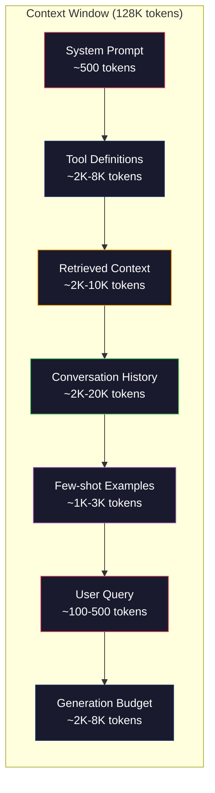
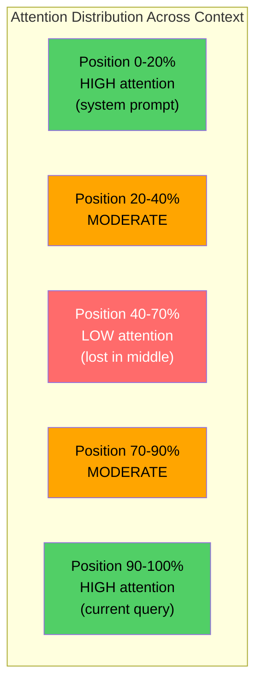
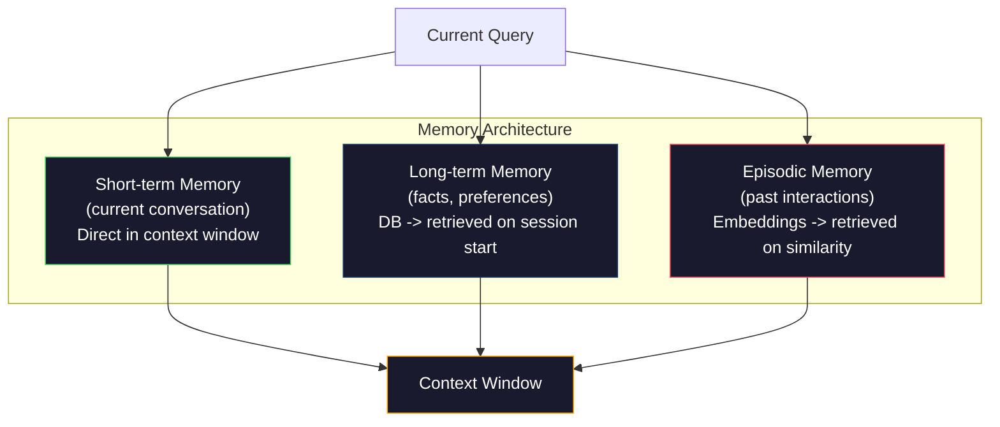

# 上下文工程：窗口、预算、记忆与检索

> 中文译文。代码、命令和标识符保持英文。若与原文不一致，以同目录 docs/en.md 为准。

> 提示词工程只是子集。上下文工程才是整场游戏。提示词是你键入的一串文本。上下文是进入模型窗口的一切：系统指令、检索到的文档、工具定义、对话历史、few-shot（少样本）示例，以及提示词本身。2026 年最出色的 AI 工程师是上下文工程师。他们决定放进什么、留下什么，以及按什么顺序放入。

**Type:** 动手做
**Languages:** Python
**Prerequisites:** 第 10 阶段（从零实现 LLM）、第 11 阶段第 01-02 课
**Time:** ~90 分钟
**Related:** 第 11 阶段 · 15（提示词缓存）——对缓存友好的布局是上下文工程的延伸。第 5 阶段 · 28（长上下文评测）讲如何用 NIAH/RULER 衡量 lost-in-the-middle（中间迷失）。

## 学习目标

- 计算上下文窗口各组成部分的 token 预算（系统提示词、工具、历史、检索到的文档、生成余量）
- 实现上下文窗口管理策略：对对话历史做截断、摘要和滑动窗口
- 为上下文组件排优先级并排序，使模型的注意力集中在最相关的信息上
- 构建一个上下文组装器，按查询类型和可用窗口空间动态分配 token

## 问题

Claude Opus 4.7 有 200K token 的窗口（beta 中为 1M）。GPT-5 有 400K。Gemini 3 Pro 有 2M。Llama 4 声称有 10M。这些数字听起来很大，直到你把它们填满。

下面是一个编程助手的真实拆分。系统提示词：500 token。50 个工具的工具定义：8,000 token。检索到的文档：4,000 token。对话历史（10 轮）：6,000 token。当前用户查询：200 token。生成预算（最大输出）：4,000 token。合计：22,700 token。这只占 128K 窗口的 18%。

但注意力并不随上下文长度线性扩展。拥有 128K token 上下文的模型要付出二次注意力成本（朴素 transformer 中为 O(n^2)，不过大多数生产模型使用高效注意力变体）。更重要的是，检索准确率会下降。“Needle in a Haystack”（大海捞针）测试表明，模型很难找到放在长上下文中间的信息。Liu 等人（2023）的研究表明，LLM 对长上下文开头和结尾的信息检索准确率接近完美，但对放在中间的信息（上下文的 40–70% 位置）准确率下降 10–20%。这种 lost-in-the-middle 效应因模型而异，但影响当前所有架构。

实践教训是：有 200K token 可用，并不意味着用满 200K token 就有效。精心策划的 10K token 上下文，往往胜过一股脑倒进去的 100K token 上下文。上下文工程是在上下文窗口内最大化信噪比的学科。

你放进窗口的每一个 token，都会挤掉一个本可以携带更相关信息的 token。每一个无关的工具定义、每一轮过时的对话、每一块不能回答问题的检索文本——都会让模型在该任务上稍稍变差。

## 概念

### 上下文窗口是稀缺资源

把上下文窗口想成 RAM，而不是磁盘。它快、可直接访问，但有限。你装不下一切。你必须做选择。



每个组件都在争夺空间。增加更多工具定义，对话历史的空间就更少。增加更多检索上下文，few-shot 示例的空间就更少。上下文工程是分配这笔预算以最大化任务表现的技艺。

### Lost-in-the-Middle

上下文工程中最重要的实证发现。模型对上下文开头和结尾的信息关注更好。中间的信息得到的注意力分数更低，更可能被忽略。

Liu 等人（2023）系统地测试了这一点。他们把一篇相关文档放在 20 篇无关文档的不同位置，并测量答案准确率。相关文档在最前或最后时，准确率为 85–90%。放在中间（20 篇中的第 10 篇）时，准确率降到 60–70%。

这有直接的工程含义：

- 把最重要的信息放在最前（系统提示词、关键指令）
- 把当前查询和最相关的上下文放在最后（近因偏差有帮助）
- 把上下文的中间当作最低优先级区域
- 如果必须把信息放在中间，就把要点在末尾再重复一遍



### 上下文组件

**系统提示词**：设定人设、约束和行为规则。它放在最前，并在各轮之间保持不变。Claude Code 的系统提示词（含工具定义和行为指令）大约用 6,000 token。保持紧凑。系统提示词里的每一个词都会在每次 API 调用中重复。

**工具定义**：每个工具增加 50–200 token（名称、描述、参数 schema）。50 个工具、每个 150 token，在对话开始之前就是 7,500 token。动态工具选择——只纳入与当前查询相关的工具——可以把这部分减少 60–80%。

**检索上下文**：来自向量数据库的文档、搜索结果、文件内容。检索质量直接决定回答质量。糟糕的检索比不检索更糟——它用噪声填满窗口，并主动误导模型。

**对话历史**：此前每一条用户消息和助手回复。随对话长度线性增长。50 轮对话、每轮 200 token，就是 10,000 token 的历史。其中大部分与当前查询无关。

**Few-shot 示例**：展示期望行为的输入/输出对。两到三个精心挑选的示例，对输出质量的提升往往超过数千 token 的指令。但它们占用空间。

**生成预算**：为模型回复预留的 token。如果把窗口填满，模型就没有空间作答。至少预留 2,000–4,000 token 用于生成。

### 上下文压缩策略

**历史摘要**：不逐字保留此前所有轮次，而是定期对对话做摘要。“我们讨论了 X，决定了 Y，用户想要 Z”用 100 token，就能替换占用 2,000 token 的 10 轮。当历史超过阈值（例如 5,000 token）时运行摘要。

**相关性过滤**：按当前查询给每篇检索文档打分，丢掉低于阈值的文档。如果检索了 10 个块但只有 3 个相关，就丢掉另外 7 个。3 个高度相关的块，好过 10 个平庸的块。

**工具裁剪**：对用户查询意图分类，只纳入与该意图相关的工具。代码问题不需要日历工具。日程问题不需要文件系统工具。这可以把工具定义从 8,000 token 减到 1,000。

**递归摘要**：对很长的文档分阶段摘要。先摘要每一节，再摘要这些摘要。一份 50 页的文档变成抓住要点的 500 token 摘要。

### 记忆系统

上下文工程横跨三个时间尺度。

**短期记忆**：当前对话。直接存在上下文窗口里。随每一轮增长。由摘要和截断管理。

**长期记忆**：跨对话持久存在的事实和偏好。“用户偏好 TypeScript。”“项目使用 PostgreSQL。”存在数据库里，在会话开始时检索。Claude Code 把它存在 CLAUDE.md 文件中。ChatGPT 存在它的记忆功能里。

**情景记忆**：可能相关的具体过往交互。“上周二，我们在认证模块里调试过类似问题。”存成嵌入，当当前对话与过去某一幕匹配时检索出来。



### 动态上下文组装

关键洞见：不同查询需要不同上下文。静态系统提示词 + 静态工具 + 静态历史是浪费。最好的系统按查询动态组装上下文。

1. 对查询意图分类
2. 选择相关工具（不是全部工具）
3. 检索相关文档（不是固定集合）
4. 纳入相关的历史轮次（不是全部历史）
5. 加入与任务类型匹配的 few-shot 示例
6. 按重要性排序：关键的放最前，重要的放最后，可选的放中间

这就是好的 AI 应用和出色的 AI 应用之间的差别。模型是同一个。上下文才是区分因素。

```figure
lost-in-the-middle
```

## 动手做

### 第 1 步：Token 计数器

你无法为量不出来的东西做预算。做一个简单的 token 计数器（用空白分词近似，因为精确计数取决于分词器）。

```python
import json
import numpy as np
from collections import OrderedDict

def count_tokens(text):
    if not text:
        return 0
    return int(len(text.split()) * 1.3)

def count_tokens_json(obj):
    return count_tokens(json.dumps(obj))
```

### 第 2 步：上下文预算管理器

核心抽象。预算管理器跟踪每个组件用了多少 token，并强制执行上限。

```python
class ContextBudget:
    def __init__(self, max_tokens=128000, generation_reserve=4000):
        self.max_tokens = max_tokens
        self.generation_reserve = generation_reserve
        self.available = max_tokens - generation_reserve
        self.allocations = OrderedDict()

    def allocate(self, component, content, max_tokens=None):
        tokens = count_tokens(content)
        if max_tokens and tokens > max_tokens:
            words = content.split()
            target_words = int(max_tokens / 1.3)
            content = " ".join(words[:target_words])
            tokens = count_tokens(content)

        used = sum(self.allocations.values())
        if used + tokens > self.available:
            allowed = self.available - used
            if allowed <= 0:
                return None, 0
            words = content.split()
            target_words = int(allowed / 1.3)
            content = " ".join(words[:target_words])
            tokens = count_tokens(content)

        self.allocations[component] = tokens
        return content, tokens

    def remaining(self):
        used = sum(self.allocations.values())
        return self.available - used

    def utilization(self):
        used = sum(self.allocations.values())
        return used / self.max_tokens

    def report(self):
        total_used = sum(self.allocations.values())
        lines = []
        lines.append(f"Context Budget Report ({self.max_tokens:,} token window)")
        lines.append("-" * 50)
        for component, tokens in self.allocations.items():
            pct = tokens / self.max_tokens * 100
            bar = "#" * int(pct / 2)
            lines.append(f"  {component:<25} {tokens:>6} tokens ({pct:>5.1f}%) {bar}")
        lines.append("-" * 50)
        lines.append(f"  {'Used':<25} {total_used:>6} tokens ({total_used/self.max_tokens*100:.1f}%)")
        lines.append(f"  {'Generation reserve':<25} {self.generation_reserve:>6} tokens")
        lines.append(f"  {'Remaining':<25} {self.remaining():>6} tokens")
        return "\n".join(lines)
```

### 第 3 步：Lost-in-the-Middle 重新排序

实现重新排序策略：最重要的条目放在开头和结尾，最不重要的放在中间。

```python
def reorder_lost_in_middle(items, scores):
    paired = sorted(zip(scores, items), reverse=True)
    sorted_items = [item for _, item in paired]

    if len(sorted_items) <= 2:
        return sorted_items

    first_half = sorted_items[::2]
    second_half = sorted_items[1::2]
    second_half.reverse()

    return first_half + second_half

def score_relevance(query, documents):
    query_words = set(query.lower().split())
    scores = []
    for doc in documents:
        doc_words = set(doc.lower().split())
        if not query_words:
            scores.append(0.0)
            continue
        overlap = len(query_words & doc_words) / len(query_words)
        scores.append(round(overlap, 3))
    return scores
```

### 第 4 步：对话历史压缩器

对旧的对话轮次做摘要，以收回 token 预算。

```python
class ConversationManager:
    def __init__(self, max_history_tokens=5000):
        self.turns = []
        self.summaries = []
        self.max_history_tokens = max_history_tokens

    def add_turn(self, role, content):
        self.turns.append({"role": role, "content": content})
        self._compress_if_needed()

    def _compress_if_needed(self):
        total = sum(count_tokens(t["content"]) for t in self.turns)
        if total <= self.max_history_tokens:
            return

        while total > self.max_history_tokens and len(self.turns) > 4:
            old_turns = self.turns[:2]
            summary = self._summarize_turns(old_turns)
            self.summaries.append(summary)
            self.turns = self.turns[2:]
            total = sum(count_tokens(t["content"]) for t in self.turns)

    def _summarize_turns(self, turns):
        parts = []
        for t in turns:
            content = t["content"]
            if len(content) > 100:
                content = content[:100] + "..."
            parts.append(f"{t['role']}: {content}")
        return "Previous: " + " | ".join(parts)

    def get_context(self):
        parts = []
        if self.summaries:
            parts.append("[Conversation Summary]")
            for s in self.summaries:
                parts.append(s)
        parts.append("[Recent Conversation]")
        for t in self.turns:
            parts.append(f"{t['role']}: {t['content']}")
        return "\n".join(parts)

    def token_count(self):
        return count_tokens(self.get_context())
```

### 第 5 步：动态工具选择器

只纳入与当前查询相关的工具。先对意图分类，再过滤。

```python
TOOL_REGISTRY = {
    "read_file": {
        "description": "Read contents of a file",
        "tokens": 120,
        "categories": ["code", "files"],
    },
    "write_file": {
        "description": "Write content to a file",
        "tokens": 150,
        "categories": ["code", "files"],
    },
    "search_code": {
        "description": "Search for patterns in codebase",
        "tokens": 130,
        "categories": ["code"],
    },
    "run_command": {
        "description": "Execute a shell command",
        "tokens": 140,
        "categories": ["code", "system"],
    },
    "create_calendar_event": {
        "description": "Create a new calendar event",
        "tokens": 180,
        "categories": ["calendar"],
    },
    "list_emails": {
        "description": "List recent emails",
        "tokens": 160,
        "categories": ["email"],
    },
    "send_email": {
        "description": "Send an email message",
        "tokens": 200,
        "categories": ["email"],
    },
    "web_search": {
        "description": "Search the web for information",
        "tokens": 140,
        "categories": ["research"],
    },
    "query_database": {
        "description": "Run a SQL query on the database",
        "tokens": 170,
        "categories": ["code", "data"],
    },
    "generate_chart": {
        "description": "Generate a chart from data",
        "tokens": 190,
        "categories": ["data", "visualization"],
    },
}

def classify_intent(query):
    query_lower = query.lower()

    intent_keywords = {
        "code": ["code", "function", "bug", "error", "file", "implement", "refactor", "debug", "test"],
        "calendar": ["meeting", "schedule", "calendar", "appointment", "event"],
        "email": ["email", "mail", "send", "inbox", "message"],
        "research": ["search", "find", "what is", "how does", "explain", "look up"],
        "data": ["data", "query", "database", "chart", "graph", "analytics", "sql"],
    }

    scores = {}
    for intent, keywords in intent_keywords.items():
        score = sum(1 for kw in keywords if kw in query_lower)
        if score > 0:
            scores[intent] = score

    if not scores:
        return ["code"]

    max_score = max(scores.values())
    return [intent for intent, score in scores.items() if score >= max_score * 0.5]

def select_tools(query, token_budget=2000):
    intents = classify_intent(query)
    relevant = {}
    total_tokens = 0

    for name, tool in TOOL_REGISTRY.items():
        if any(cat in intents for cat in tool["categories"]):
            if total_tokens + tool["tokens"] <= token_budget:
                relevant[name] = tool
                total_tokens += tool["tokens"]

    return relevant, total_tokens
```

### 第 6 步：完整的上下文组装流水线

把所有部分接起来。给定一个查询，动态组装最优上下文。

```python
class ContextEngine:
    def __init__(self, max_tokens=128000, generation_reserve=4000):
        self.budget = ContextBudget(max_tokens, generation_reserve)
        self.conversation = ConversationManager(max_history_tokens=5000)
        self.system_prompt = (
            "You are a helpful AI assistant. You have access to tools for "
            "code editing, file management, web search, and data analysis. "
            "Use the appropriate tools for each task. Be concise and accurate."
        )
        self.knowledge_base = [
            "Python 3.12 introduced type parameter syntax for generic classes using bracket notation.",
            "The project uses PostgreSQL 16 with pgvector for embedding storage.",
            "Authentication is handled by Supabase Auth with JWT tokens.",
            "The frontend is built with Next.js 15 using the App Router.",
            "API rate limits are set to 100 requests per minute per user.",
            "The deployment pipeline uses GitHub Actions with Docker multi-stage builds.",
            "Test coverage must be above 80% for all new modules.",
            "The codebase follows the repository pattern for data access.",
        ]

    def assemble(self, query):
        self.budget = ContextBudget(self.budget.max_tokens, self.budget.generation_reserve)

        system_content, _ = self.budget.allocate("system_prompt", self.system_prompt, max_tokens=1000)

        tools, tool_tokens = select_tools(query, token_budget=2000)
        tool_text = json.dumps(list(tools.keys()))
        tool_content, _ = self.budget.allocate("tools", tool_text, max_tokens=2000)

        relevance = score_relevance(query, self.knowledge_base)
        threshold = 0.1
        relevant_docs = [
            doc for doc, score in zip(self.knowledge_base, relevance)
            if score >= threshold
        ]

        if relevant_docs:
            doc_scores = [s for s in relevance if s >= threshold]
            reordered = reorder_lost_in_middle(relevant_docs, doc_scores)
            doc_text = "\n".join(reordered)
            doc_content, _ = self.budget.allocate("retrieved_context", doc_text, max_tokens=3000)

        history_text = self.conversation.get_context()
        if history_text.strip():
            history_content, _ = self.budget.allocate("conversation_history", history_text, max_tokens=5000)

        query_content, _ = self.budget.allocate("user_query", query, max_tokens=500)

        return self.budget

    def chat(self, query):
        self.conversation.add_turn("user", query)
        budget = self.assemble(query)
        response = f"[Response to: {query[:50]}...]"
        self.conversation.add_turn("assistant", response)
        return budget


def run_demo():
    print("=" * 60)
    print("  Context Engineering Pipeline Demo")
    print("=" * 60)

    engine = ContextEngine(max_tokens=128000, generation_reserve=4000)

    print("\n--- Query 1: Code task ---")
    budget = engine.chat("Fix the bug in the authentication module where JWT tokens expire too early")
    print(budget.report())

    print("\n--- Query 2: Research task ---")
    budget = engine.chat("What is the best approach for implementing vector search in PostgreSQL?")
    print(budget.report())

    print("\n--- Query 3: After conversation history builds up ---")
    for i in range(8):
        engine.conversation.add_turn("user", f"Follow-up question number {i+1} about the implementation details of the system")
        engine.conversation.add_turn("assistant", f"Here is the response to follow-up {i+1} with technical details about the architecture")

    budget = engine.chat("Now implement the changes we discussed")
    print(budget.report())

    print("\n--- Tool Selection Examples ---")
    test_queries = [
        "Fix the bug in auth.py",
        "Schedule a meeting with the team for Tuesday",
        "Show me the database query performance stats",
        "Search for best practices on error handling",
    ]

    for q in test_queries:
        tools, tokens = select_tools(q)
        intents = classify_intent(q)
        print(f"\n  Query: {q}")
        print(f"  Intents: {intents}")
        print(f"  Tools: {list(tools.keys())} ({tokens} tokens)")

    print("\n--- Lost-in-the-Middle Reordering ---")
    docs = ["Doc A (most relevant)", "Doc B (somewhat relevant)", "Doc C (least relevant)",
            "Doc D (relevant)", "Doc E (moderately relevant)"]
    scores = [0.95, 0.60, 0.20, 0.80, 0.50]
    reordered = reorder_lost_in_middle(docs, scores)
    print(f"  Original order: {docs}")
    print(f"  Scores:         {scores}")
    print(f"  Reordered:      {reordered}")
    print(f"  (Most relevant at start and end, least relevant in middle)")
```

## 用起来

### 由运行壳（harness）管理的上下文

Claude Code 用分层方式管理上下文。系统提示词包含行为规则和工具定义（约 6K token）。你打开一个文件时，其内容被注入为上下文。你搜索时，结果被加进来。旧的对话轮次会被摘要。CLAUDE.md 提供跨会话持久存在的长期记忆。

关键的工程决策：Claude Code 不会把你的整个代码库倒进上下文。它按需检索相关文件。这就是实践中的上下文工程。

### 动态上下文加载

Cursor 把你的整个代码库索引成嵌入。当你输入查询时，它用向量相似度检索最相关的文件和代码块。只有这些片段进入上下文窗口。一个 50 万行的代码库被压缩成最相关的 5–10 个代码块。

这就是该模式：把一切嵌入，按需检索，只纳入要紧的内容。

### 助手的长期记忆

ChatGPT 把用户偏好和事实存为长期记忆。每次对话开始时，检索相关记忆并放进系统提示词。“用户偏好 Python”只花 5 个 token，但能在多次对话中省下数百 token 的重复指令。

### 作为上下文工程的检索增强生成

检索增强生成是形式化的上下文工程。你不是把知识塞进模型权重（训练）或系统提示词（静态上下文），而是在查询时检索相关文档，注入上下文窗口。整条检索增强生成流水线——分块、嵌入、检索、重排序——都是为了解决一个问题：把正确的信息放进上下文窗口。

## 交付

本课产出 `outputs/prompt-context-optimizer.md`——一份可复用的提示词，用于审计上下文组装策略并推荐优化。把你的系统提示词、工具数量、平均历史长度和检索策略喂给它，它会找出 token 浪费并给出改进建议。

它还产出 `outputs/skill-context-engineering.md`——一个决策框架，按任务类型、上下文窗口大小和延迟预算来设计上下文组装流水线。

## 练习

1. 给 ContextBudget 类加一个“token 浪费检测器”。它应标出占用预算超过 30% 的组件，并按组件类型给出具体压缩策略（摘要历史、裁剪工具、对文档重排序）。

2. 为检索上下文实现语义去重。如果两篇检索文档相似度超过 80%（按词重叠，或按其嵌入的余弦相似度），只保留分数更高的那篇。测量这能收回多少 token 预算。

3. 做一个“上下文回放”工具。给定一份对话记录，用 ContextEngine 回放，并可视化预算分配如何逐轮变化。绘制各组件随时间的 token 用量。找出上下文开始被压缩的那一轮。

4. 实现基于优先级的工具选择器。不要二元的纳入/排除，而是给每个工具对当前查询打一个相关性分数。按相关性降序纳入工具，直到工具预算用尽。比较纳入 5、10、20 和 50 个工具时的任务表现。

5. 构建多策略上下文压缩器。实现三种压缩策略（截断、摘要、抽取关键句），并在 20 篇文档上做基准测试。衡量压缩率与信息保留之间的权衡（压缩后的版本是否仍包含该查询的答案？）。

## 关键术语

| 术语 | 人们怎么说 | 实际含义 |
|------|----------------|----------------------|
| 上下文窗口 | “模型能读多少” | 模型在单次前向传播中处理的最大 token 数（输入 + 输出）——GPT-5 为 400K，Claude Opus 4.7 为 200K（beta 为 1M），Gemini 3 Pro 为 2M |
| 上下文工程 | “高级提示词工程” | 决定什么进入上下文窗口、以什么顺序、以什么优先级的学科——涵盖检索、压缩、工具选择和记忆管理 |
| lost-in-the-middle | “模型会忘掉中间的东西” | 实证发现：LLM 对上下文开头和结尾关注更好，放在中间的信息准确率下降 10–20% |
| Token 预算 | “你还剩多少 token” | 把上下文窗口容量显式分配给各组件（系统提示词、工具、历史、检索、生成），并对每个组件设上限 |
| 动态上下文 | “临时加载内容” | 按意图分类、相关工具选择和检索结果，为每个查询不同地组装上下文窗口 |
| 历史摘要 | “压缩对话” | 用简洁摘要替换逐字的旧对话轮次，在保留关键信息的同时降低 token 成本 |
| 工具裁剪 | “只纳入相关工具” | 对查询意图分类，只纳入匹配的工具定义，把工具的 token 成本降低 60–80% |
| 长期记忆 | “跨会话记住” | 存在数据库中、在会话开始时检索的事实和偏好——CLAUDE.md、ChatGPT Memory 及类似系统 |
| 情景记忆 | “记住具体的过往事件” | 以嵌入形式存储的过往交互，当当前查询与过去某次对话相似时被检索 |
| 生成预算 | “留给答案的空间” | 为模型输出预留的 token——如果上下文把窗口完全填满，模型就没有空间回复 |

## 延伸阅读

- [Liu et al., 2023 -- "Lost in the Middle: How Language Models Use Long Contexts"](https://arxiv.org/abs/2307.03172)——关于位置相关注意力的权威研究，表明模型难以利用长上下文中间的信息
- [Anthropic's Contextual Retrieval blog post](https://www.anthropic.com/news/contextual-retrieval)——Anthropic 如何做上下文感知的块检索，把检索失败降低 49%
- [Simon Willison's "Context Engineering"](https://simonwillison.net/2025/Jun/27/context-engineering/)——命名该学科、并将其与提示词工程区分开的博文
- [LangChain documentation on RAG](https://python.langchain.com/docs/tutorials/rag/)——把检索增强生成作为上下文工程模式的实践实现
- [Greg Kamradt's Needle in a Haystack test](https://github.com/gkamradt/LLMTest_NeedleInAHaystack)——揭示所有主流模型都存在位置相关检索失败的基准测试
- [Pope et al., "Efficiently Scaling Transformer Inference" (2022)](https://arxiv.org/abs/2211.05102)——为什么上下文长度驱动显存和延迟，以及 KV cache（KV 缓存）、MQA 和 GQA 如何改变预算计算。
- [Agrawal et al., "SARATHI: Efficient LLM Inference by Piggybacking Decodes with Chunked Prefills" (2023)](https://arxiv.org/abs/2308.16369)——推理的两个阶段，使长提示词在 TTFT 上昂贵、在 TPOT 上便宜；这是上下文打包权衡背后的依据。
- [Ainslie et al., "GQA: Training Generalized Multi-Query Transformer Models from Multi-Head Checkpoints" (EMNLP 2023)](https://arxiv.org/abs/2305.13245)——分组查询注意力论文，在生产解码器中把 KV 显存降到原来的 1/8，且不损失质量。
