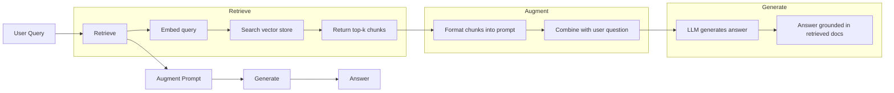
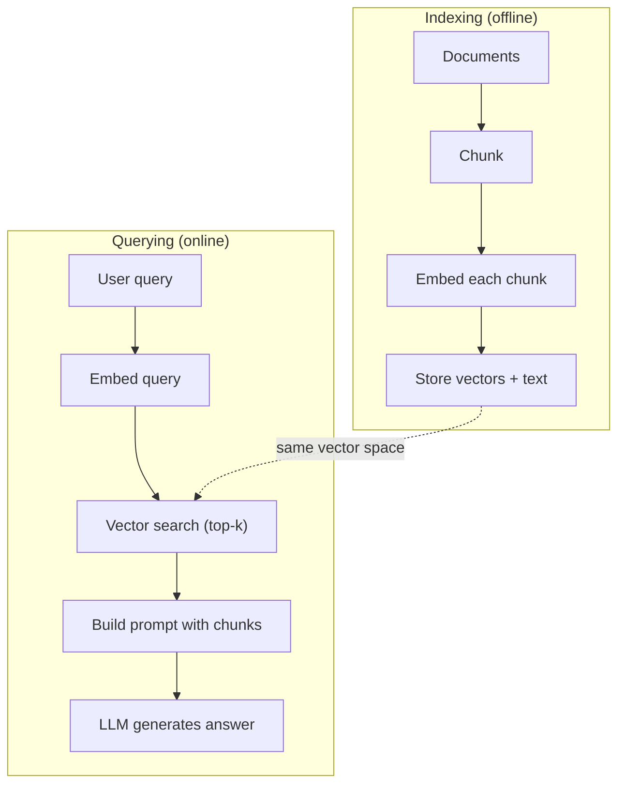

# RAG（检索增强生成）

> 中文译文。代码、命令和标识符保持英文。若与原文不一致，以同目录 docs/en.md 为准。

> 你的 LLM 只知道训练截止日期之前的一切。它不知道你公司的文档、你的代码库，或上周的会议记录。检索增强生成通过检索相关文档并把它们塞进提示词来解决这个问题。它是生产级 AI 中部署最广的模式。如果这门课你只做一件事，就做一条检索增强生成流水线。

**Type:** 动手做
**Languages:** Python
**Prerequisites:** 第 10 阶段（从零实现 LLM）、第 11 阶段第 01-05 课
**Time:** ~90 分钟
**Related:** 第 5 阶段 · 23（面向检索增强生成的分块策略）讲六种分块算法以及各自何时胜出。第 5 阶段 · 22（嵌入模型深入）讲如何选择嵌入模型。第 11 阶段 · 07（高级 RAG）讲混合搜索、重排序和查询变换。

## 学习目标

- 构建完整的检索增强生成流水线：文档加载、分块、嵌入、向量存储、检索和生成
- 用向量数据库（ChromaDB、FAISS 或 Pinecone）实现带正确索引的语义搜索
- 解释为什么对需要把回答锚定在知识上的应用，检索增强生成优于微调（成本、新鲜度、归因）
- 用检索指标（精确率、召回率）和生成指标（忠实性、答案相关性）评测检索增强生成的质量

## 问题

你为公司做了一个聊天机器人。客户问“企业版套餐的退款政策是什么？”LLM 给出关于典型 SaaS 退款政策的泛泛回答。真正的政策埋在一份 200 页的内部 wiki 里：企业客户有 60 天窗口，按比例退款。LLM 从未见过这份文档。它不可能知道训练时没见过的东西。

微调是一种解法。拿 LLM，在内部文档上训练，再部署更新后的模型。这能工作，但问题严重。微调的算力要花数千美元。文档一改，模型立刻过时。你无法知道模型依据的是哪个来源。如果公司下个月收购了另一条产品线，你得再微调一次。

检索增强生成是另一种解法。模型保持不动。问题进来时，在文档库里搜索相关段落，把它们粘贴到问题之前的提示词里，让模型用这些段落作为上下文作答。文档库可以在几分钟内更新。你能看到究竟检索了哪些文档。模型本身从不改变。这就是检索增强生成成为生产中主导模式的原因：更便宜、更新鲜、更可审计，而且适用于任何 LLM。

## 概念

### 检索增强生成模式

整个模式只需四步：



查询 -> 检索 -> 增强提示词 -> 生成。每个检索增强生成系统都遵循这个模式。生产系统之间的差别在每一步的细节：如何分块、如何嵌入、如何搜索、如何构造提示词。

### 为什么检索增强生成胜过微调

| 关注点 | 微调 | RAG |
|---------|------------|-----|
| 成本 | 每次训练 $1,000–$100,000+ | 每次查询 $0.01–$0.10（嵌入 + LLM） |
| 新鲜度 | 重新训练之前一直过时 | 重新索引文档后几分钟内更新 |
| 可审计性 | 无法把答案追溯到来源 | 可以展示确切检索到的段落 |
| 幻觉 | 仍然会随意产生幻觉 | 锚定在检索到的文档上 |
| 数据隐私 | 训练数据被烘进权重 | 文档留在你的向量库里 |

微调永久改变模型权重。检索增强生成只是暂时改变模型的上下文。对大多数应用，你要的是临时上下文。

微调胜出的一种情况：你需要模型采纳某种无法仅靠提示词达成的特定风格、语气或推理模式。对事实性知识检索，检索增强生成每次都赢。

### 嵌入模型

嵌入模型把文本转换成稠密向量。相似文本在这个高维空间中产生彼此靠近的向量。“How do I reset my password?”和“I need to change my password”几乎不共享词语，却产生近乎相同的向量。“The cat sat on the mat”产生非常不同的向量。

常见嵌入模型（2026 阵容——完整分析见第 5 阶段 · 22；Matryoshka 是套娃式表示，维度可以截断）：

| 模型 | 维度 | 提供方 | 说明 |
|-------|-----------|----------|-------|
| text-embedding-3-small | 1536（Matryoshka） | OpenAI | 大多数用例下性价比最好 |
| text-embedding-3-large | 3072（Matryoshka） | OpenAI | 准确率更高，可截断到 256/512/1024 |
| Gemini Embedding 2 | 3072（Matryoshka） | Google | MTEB 检索领先；8K 上下文 |
| voyage-4 | 1024/2048（Matryoshka） | Voyage AI | 领域变体（代码、金融、法律） |
| Cohere embed-v4 | 1024（Matryoshka） | Cohere | 多语言强，128K 上下文 |
| BGE-M3 | 1024（稠密 + 稀疏 + ColBERT） | BAAI（开放权重） | 一个模型给出三种视图 |
| Qwen3-Embedding | 4096（Matryoshka） | Alibaba（开放权重） | 开放权重检索分数领先 |
| all-MiniLM-L6-v2 | 384 | 开放权重（Sentence Transformers） | 原型基线 |

本课我们用 TF-IDF 自己做一个简单嵌入。不是因为生产系统用 TF-IDF，而是因为它把概念变得具体：文本进去，向量出来，相似文本产生相似向量。

### 向量相似度

给定两个向量，如何衡量相似度？三种选择：

**余弦相似度**：两向量夹角的余弦。范围从 -1（相反）到 1（相同）。忽略幅度，只关心方向。这是检索增强生成的默认选择。

```
cosine_sim(a, b) = dot(a, b) / (||a|| * ||b||)
```

**点积**：原始内积。更长的向量得分更高。当幅度携带信息时有用（更长的文档可能更相关）。

```
dot(a, b) = sum(a_i * b_i)
```

**L2（欧氏）距离**：向量空间中的直线距离。距离越小 = 越相似。对幅度差异敏感。

```
L2(a, b) = sqrt(sum((a_i - b_i)^2))
```

余弦相似度是标准。它按幅度归一化，因此能优雅处理不同长度的文档。当有人说“向量搜索”时，他们几乎总是指余弦相似度。

### 分块策略

文档太长，不能作为单个向量嵌入。一份 50 页的 PDF 可能产生糟糕的嵌入，因为它包含几十个主题。相反，你把文档拆成块，分别嵌入每个块。

**固定大小分块**：每 N 个 token 切一次。简单且可预测。512 token 的块、50 token 重叠，意味着块 1 是 token 0–511，块 2 是 token 462–973，依此类推。重叠确保你不会在倒霉的边界上把句子切开。

**语义分块**：在自然边界处切分。段落、章节或 markdown 标题。每个块是一个连贯的意义单元。实现更复杂，但检索更好。

**递归分块**：先尝试在最大边界处切分（章节标题）。如果某一节仍然太大，就在段落边界切。如果某一段仍然太大，就在句子边界切。这就是 LangChain 的 RecursiveCharacterTextSplitter 做法，实践中效果很好。

块大小比人们以为的更要紧：

- 太小（64–128 token）：每个块缺少上下文。“上季度它增长了 15%”如果不知道“它”指什么就毫无意义。
- 太大（2048+ token）：每个块覆盖多个主题，稀释相关性。你搜索营收数据时，得到的块 10% 关于营收、90% 关于人数。
- 最佳区间（256–512 token）：上下文足以自成一体，又足够聚焦而相关。

大多数生产检索增强生成系统使用 256–512 token 的块，并有 50 token 重叠。Anthropic 的检索增强生成指南推荐这个范围。

### 向量数据库

一旦有了嵌入，你需要地方存储并搜索它们。选项：

| 数据库 | 类型 | 最适合 |
|----------|------|----------|
| FAISS | 库（进程内） | 原型、中小数据集 |
| Chroma | 轻量数据库 | 本地开发、小型部署 |
| Pinecone | 托管服务 | 不想承担运维的生产环境 |
| Weaviate | 开源数据库 | 自托管生产 |
| pgvector | Postgres 扩展 | 已经在用 Postgres |
| Qdrant | 开源数据库 | 高性能自托管 |

本课我们构建一个简单的内存向量库。它把向量存在列表里，做暴力余弦相似度搜索。这等价于使用 flat 索引的 FAISS。大约到 100,000 个向量之前还能撑，再多就变慢。生产系统使用近似最近邻（ANN）算法，例如 HNSW，在毫秒内搜索数百万向量。

### 完整流水线



索引阶段对每份文档运行一次（或在文档更新时运行）。查询阶段在每次用户请求时运行。在生产中，索引可能用数小时处理数百万文档。查询必须在一秒内响应。

### 真实数字

大多数生产检索增强生成系统使用这些参数：

- **k = 5 到 10**：每次查询检索的块数
- **块大小 = 256 到 512 token**，50 token 重叠
- **上下文预算**：每次查询 2,500–5,000 token 的检索内容
- **总提示词**：约 8,000–16,000 token（系统提示词 + 检索块 + 对话历史 + 用户查询）
- **嵌入维度**：384–3072，取决于模型
- **索引吞吐**：使用 API 嵌入时每秒 100–1,000 份文档
- **查询延迟**：检索 50–200ms，生成 500–3000ms

```figure
rag-chunking
```

## 动手做

### 第 1 步：文档分块

```python
def chunk_text(text, chunk_size=200, overlap=50):
    words = text.split()
    chunks = []
    start = 0
    while start < len(words):
        end = start + chunk_size
        chunk = " ".join(words[start:end])
        chunks.append(chunk)
        start += chunk_size - overlap
    return chunks
```

### 第 2 步：TF-IDF 嵌入

我们构建一个简单的嵌入函数。TF-IDF（Term Frequency-Inverse Document Frequency，词频-逆文档频率）不是神经嵌入，但它把文本转成向量的方式能捕捉词的重要性。文档中频繁的词 TF 更高。整个语料中稀有的词 IDF 更高。二者的乘积给出一个向量，其中重要且有区分度的词取值很高。

```python
import math
from collections import Counter

def build_vocabulary(documents):
    vocab = set()
    for doc in documents:
        vocab.update(doc.lower().split())
    return sorted(vocab)

def compute_tf(text, vocab):
    words = text.lower().split()
    count = Counter(words)
    total = len(words)
    return [count.get(word, 0) / total for word in vocab]

def compute_idf(documents, vocab):
    n = len(documents)
    idf = []
    for word in vocab:
        doc_count = sum(1 for doc in documents if word in doc.lower().split())
        idf.append(math.log((n + 1) / (doc_count + 1)) + 1)
    return idf

def tfidf_embed(text, vocab, idf):
    tf = compute_tf(text, vocab)
    return [t * i for t, i in zip(tf, idf)]
```

### 第 3 步：余弦相似度搜索

```python
def cosine_similarity(a, b):
    dot = sum(x * y for x, y in zip(a, b))
    norm_a = math.sqrt(sum(x * x for x in a))
    norm_b = math.sqrt(sum(x * x for x in b))
    if norm_a == 0 or norm_b == 0:
        return 0.0
    return dot / (norm_a * norm_b)

def search(query_embedding, stored_embeddings, top_k=5):
    scores = []
    for i, emb in enumerate(stored_embeddings):
        sim = cosine_similarity(query_embedding, emb)
        scores.append((i, sim))
    scores.sort(key=lambda x: x[1], reverse=True)
    return scores[:top_k]
```

### 第 4 步：提示词构造

这就是检索增强生成里 “augmented”（增强）发生的地方。取出检索到的块，格式化成提示词，让 LLM 基于所给上下文作答。

```python
def build_rag_prompt(query, retrieved_chunks):
    context = "\n\n---\n\n".join(
        f"[Source {i+1}]\n{chunk}"
        for i, chunk in enumerate(retrieved_chunks)
    )
    return f"""Answer the question based ONLY on the following context.
If the context doesn't contain enough information, say "I don't have enough information to answer that."

Context:
{context}

Question: {query}

Answer:"""
```

### 第 5 步：完整的检索增强生成流水线

```python
class RAGPipeline:
    def __init__(self):
        self.chunks = []
        self.embeddings = []
        self.vocab = []
        self.idf = []

    def index(self, documents):
        all_chunks = []
        for doc in documents:
            all_chunks.extend(chunk_text(doc))
        self.chunks = all_chunks
        self.vocab = build_vocabulary(all_chunks)
        self.idf = compute_idf(all_chunks, self.vocab)
        self.embeddings = [
            tfidf_embed(chunk, self.vocab, self.idf)
            for chunk in all_chunks
        ]

    def query(self, question, top_k=5):
        query_emb = tfidf_embed(question, self.vocab, self.idf)
        results = search(query_emb, self.embeddings, top_k)
        retrieved = [(self.chunks[i], score) for i, score in results]
        prompt = build_rag_prompt(
            question, [chunk for chunk, _ in retrieved]
        )
        return prompt, retrieved
```

### 第 6 步：生成（模拟）

在生产中，这里是调用 LLM API 的地方。本课我们通过从检索上下文中抽取最相关的句子来模拟生成。

```python
def simple_generate(prompt, retrieved_chunks):
    query_words = set(prompt.lower().split("question:")[-1].split())
    best_sentence = ""
    best_score = 0
    for chunk in retrieved_chunks:
        for sentence in chunk.split("."):
            sentence = sentence.strip()
            if not sentence:
                continue
            words = set(sentence.lower().split())
            overlap = len(query_words & words)
            if overlap > best_score:
                best_score = overlap
                best_sentence = sentence
    return best_sentence if best_sentence else "I don't have enough information."
```

## 用起来

换成真实的嵌入模型和 LLM，代码几乎不变：

```python
from openai import OpenAI

client = OpenAI()

def embed(text):
    response = client.embeddings.create(
        model="text-embedding-3-small",
        input=text
    )
    return response.data[0].embedding

def generate(prompt):
    response = client.chat.completions.create(
        model="gpt-4o-mini",
        messages=[{"role": "user", "content": prompt}],
        temperature=0
    )
    return response.choices[0].message.content
```

或使用 Anthropic：

```python
import anthropic

client = anthropic.Anthropic()

def generate(prompt):
    response = client.messages.create(
        model="claude-sonnet-5",
        max_tokens=1024,
        messages=[{"role": "user", "content": prompt}]
    )
    return response.content[0].text
```

流水线是同一条。换掉嵌入函数。换掉生成函数。检索逻辑、分块、提示词构造——无论用哪个模型都完全相同。

要做大规模向量存储，把暴力搜索换成真正的向量数据库：

```python
import chromadb

client = chromadb.Client()
collection = client.create_collection("my_docs")

collection.add(
    documents=chunks,
    ids=[f"chunk_{i}" for i in range(len(chunks))]
)

results = collection.query(
    query_texts=["What is the refund policy?"],
    n_results=5
)
```

Chroma 在内部处理嵌入（默认使用 all-MiniLM-L6-v2），并把向量存在本地数据库中。同一模式，底层实现不同。

## 交付

本课产出：
- `outputs/prompt-rag-architect.md`——用于为特定用例设计检索增强生成系统的提示词
- `outputs/skill-rag-pipeline.md`——教智能体如何构建和调试检索增强生成流水线的技能

## 练习

1. 把 TF-IDF 嵌入换成简单的词袋方法（二元：词出现为 1，否则为 0）。在示例文档上比较检索质量。TF-IDF 应该更好，因为它给稀有词更高权重。

2. 试验块大小：在同一组文档上尝试 50、100、200 和 500 个词。对每种大小，跑同样的 5 个查询，统计有多少次在 top-3 中返回了相关块。找出检索质量达到峰值的最佳区间。

3. 给每个块加上元数据（源文档名、块位置）。修改提示词模板，加入来源引用，使 LLM 引用其来源。

4. 实现一个简单评测：给定 10 对问答，把每个问题跑过检索增强生成流水线，测量检索到的块中有多大比例包含答案。这就是 k 处的检索召回率（retrieval recall at k）。

5. 构建感知对话的检索增强生成流水线：保留最近 3 轮交流的历史，把它们和检索块一起放进提示词。用追问来测试，例如先问定价，再问“那企业版呢？”

## 关键术语

| 术语 | 人们怎么说 | 实际含义 |
|------|----------------|----------------------|
| RAG（检索增强生成） | “能读你文档的 AI” | 检索相关文档，粘贴进提示词，并生成锚定在这些文档上的答案 |
| 嵌入 | “把文本变成数字” | 文本的稠密向量表示，相似含义产生相似向量 |
| 向量数据库 | “给 AI 用的搜索引擎” | 为存储向量并按相似度找最近邻而优化的数据存储 |
| 分块 | “把文档拆成片段” | 把文档拆成更小的片段（通常 256–512 token），以便各自独立嵌入和检索 |
| 余弦相似度 | “两个向量有多相似” | 两向量夹角的余弦；1 = 方向相同，0 = 正交，-1 = 相反 |
| Top-k 检索 | “取 k 个最佳匹配” | 从向量库返回与查询最相似的 k 个块 |
| 上下文窗口 | “LLM 能看到多少文本” | LLM 在单次请求中能处理的最大 token 数；检索到的块必须放进这个范围 |
| 增强生成 | “用给定上下文作答” | 用检索文档作为上下文生成回复，而不是只依赖训练得到的知识 |
| TF-IDF | “词的重要性打分” | 词频乘以逆文档频率；按词在语料中的区分度加权 |
| 索引 | “为搜索准备文档” | 离线的分块、嵌入和存储过程，以便查询时可以搜索 |

## 延伸阅读

- Lewis et al., "Retrieval-Augmented Generation for Knowledge-Intensive NLP Tasks" (2020)——Facebook AI Research 的原始 RAG 论文，把先检索再生成的模式形式化
- Anthropic 的 RAG 文档（docs.anthropic.com）——关于块大小、提示词构造和评测的实践指南
- Pinecone Learning Center, "What is RAG?"——对检索增强生成流水线的清晰图解，并考虑生产因素
- Sentence-BERT: Reimers & Gurevych (2019)——all-MiniLM 嵌入模型背后的论文，展示如何训练双编码器以做语义相似度
- [Karpukhin et al., "Dense Passage Retrieval for Open-Domain Question Answering" (EMNLP 2020)](https://arxiv.org/abs/2004.04906)——DPR 论文，证明稠密双编码器检索在开放域问答上胜过 BM25，并为现代检索增强生成检索器定下模式。
- [LlamaIndex High-Level Concepts](https://docs.llamaindex.ai/en/stable/getting_started/concepts.html)——构建检索增强生成流水线时要知道的主要概念：数据加载器、节点解析器、索引、检索器、响应合成器。
- [LangChain RAG tutorial](https://python.langchain.com/docs/tutorials/rag/)——另一种风格的编排器；用 chain-of-runnables 的视角看同一套先检索再生成的模式。
