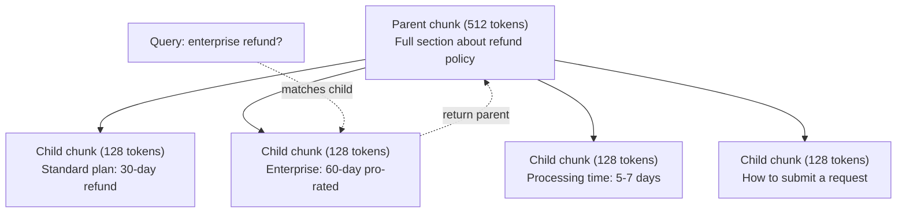
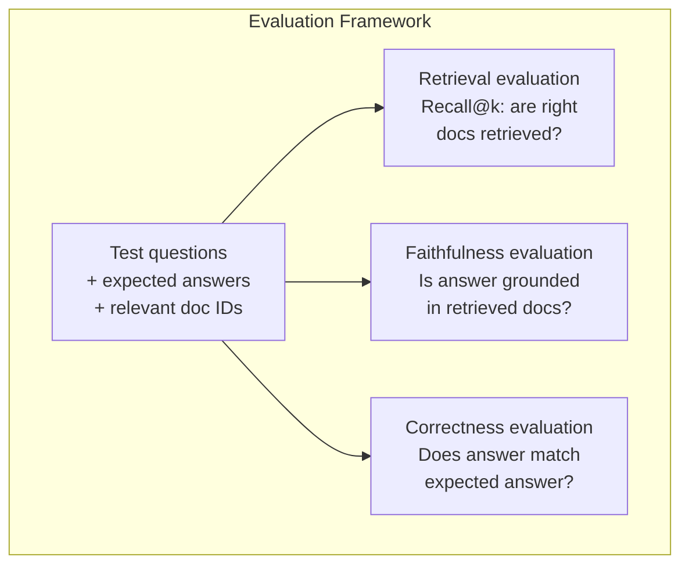

# 高级 RAG（检索增强生成）：分块、重排序、混合搜索

> 中文译文。代码、命令和标识符保持英文。若与原文不一致，以同目录 docs/en.md 为准。

> 基础的检索增强生成只取回最相似的 top-k 个块。这对简单问题够用。一碰到多跳推理、含糊查询和大型语料，它就撑不住了。高级检索增强生成，就是“在 10 篇文档上能跑的演示”和“在 1,000 万篇文档上能工作的系统”之间的差别。

**Type:** 动手做
**Languages:** Python
**Prerequisites:** 第 11 阶段第 06 课（RAG）
**Time:** ~90 分钟
**Related:** 第 5 阶段 · 23（面向检索增强生成的分块策略）覆盖全部六种分块算法——递归、语义、句子、父文档、late chunking（延迟分块）、contextual retrieval（上下文检索）——并附 Vectara/Anthropic 基准。本课在其上继续：混合搜索、重排序、查询变换。

## 学习目标

- 实现能保留文档结构和上下文的高级分块策略（语义、递归、父子）
- 构建混合搜索流水线，结合 BM25 关键词匹配、语义向量搜索和交叉编码器重排序器
- 应用查询变换技术（HyDE（假设文档嵌入）、multi-query（多查询）、step-back（退后一步）），改善含糊或复杂问题上的检索
- 诊断并修复常见检索增强生成失败：检索到错误的块、答案不在上下文中、多跳推理崩溃

## 问题

你在第 06 课构建了基础检索增强生成流水线。它在小语料上的直接问题能工作。现在试试这些：

**含糊查询**：“What was revenue last quarter?”（上季度营收是多少？）语义搜索返回关于 revenue strategy、revenue projections，以及 CFO 对 revenue growth 看法的块。它们都与 “revenue” 一词语义相近。没有一块包含实际数字。正确的块写着 “$47.2M in Q3 2025”，但用的是 “earnings” 而不是 “revenue”。嵌入模型认为 “revenue strategy” 比 “Q3 earnings were $47.2M” 更接近该查询。

**多跳问题**：“Which team had the highest customer satisfaction score improvement?”（哪个团队的客户满意度分数提升最高？）这需要找到每个团队的满意度分数、比较它们并找出最大值。没有单个块包含答案。信息散落在各团队报告中。

**大语料问题**：你有 200 万个块。正确答案在第 1,847,293 号块。你的 top-5 检索拉回第 14、89,201、1,200,000、44 和 901,333 号块。在嵌入空间中很近，但没有一块包含答案。在这个规模上，近似最近邻搜索引入的误差足以把相关结果挤出 top-k。

基础检索增强生成失败，是因为向量相似度不等于相关性。一个块可以与查询语义相似，却对回答它没有用。高级检索增强生成用四种技术应对：混合搜索（加上关键词匹配）、重排序（更仔细地给候选打分）、查询变换（搜索前先修正查询），以及更好的分块（以正确的粒度检索）。

## 概念

### 混合搜索：语义 + 关键词

语义搜索（向量相似度）擅长理解含义。“How do I cancel my subscription?”能匹配“Steps to terminate your plan”，尽管它们没有共同的词。但它会漏掉精确匹配。如果嵌入模型把“E-4021”当成噪声，“Error code E-4021”可能匹配不到包含“E-4021”的块。

关键词搜索（BM25）正好相反。它擅长精确匹配。“E-4021”完美匹配。但如果文档写的是“terminate your plan”，“cancel my subscription”会返回零结果。

混合搜索两者都跑，然后合并结果。

**BM25**（Best Matching 25）是标准关键词搜索算法。自 1990 年代以来它就是搜索引擎的骨干。公式：

```
BM25(q, d) = sum over terms t in q:
    IDF(t) * (tf(t,d) * (k1 + 1)) / (tf(t,d) + k1 * (1 - b + b * |d| / avgdl))
```

其中 tf(t,d) 是词项 t 在文档 d 中的词频，IDF(t) 是逆文档频率，|d| 是文档长度，avgdl 是平均文档长度，k1 控制词频饱和（默认 1.2），b 控制长度归一化（默认 0.75）。

通俗地说：当文档包含查询词项（尤其是稀有词项）时，BM25 给更高分，但对重复词项有递减收益。一个把“revenue”出现 50 次的文档，并不会比只出现一次的文档相关 50 倍。

### 倒数排名融合（Reciprocal Rank Fusion，RRF）

你有两份排名列表：一份来自向量搜索，一份来自 BM25。如何合并？倒数排名融合是标准做法。

```
RRF_score(d) = sum over rankings R:
    1 / (k + rank_R(d))
```

其中 k 是常数（通常为 60），防止排名最高的结果主导一切。

一篇在向量搜索中排第 1、在 BM25 中排第 5 的文档得到：1/(60+1) + 1/(60+5) = 0.0164 + 0.0154 = 0.0318

一篇在向量搜索中排第 3、在 BM25 中排第 2 的文档得到：1/(60+3) + 1/(60+2) = 0.0159 + 0.0161 = 0.0320

RRF 自然地平衡两种信号。在两份列表中都排名靠前的文档得分最好。在一份列表中排第 1、但在另一份中缺席的文档得到中等分数。它之所以稳健，是因为它用的是排名而不是原始分数，因此两个系统分数分布的差异无关紧要。

### 重排序

检索（无论向量、关键词还是混合）快但不精确。它使用双编码器：查询和每篇文档独立嵌入，然后比较。嵌入计算一次并被缓存。这可以扩展到数百万文档。

重排序使用交叉编码器：查询和候选文档一起送入模型，输出相关性分数。模型同时看到两段文本，能捕捉它们之间细粒度的交互。交叉编码器能理解“What were Q3 earnings?”与包含“$47.2M in Q3”的块高度相关，即使双编码器错过了这层联系。

权衡：交叉编码器比双编码器慢 100–1000 倍，因为它们联合处理查询-文档对。你无法为一百万篇文档预先计算交叉编码器分数。解法是：检索更大的候选集（混合搜索的 top-50），再用交叉编码器重排序，得到最终的 top-5。


常见重排序模型（2026 阵容）：
- Cohere Rerank 3.5：托管 API，多语言，在混合语料上召回增益最好
- Voyage rerank-2.5：托管 API，托管方案中延迟最低
- Jina-Reranker-v2 Multilingual：开放权重，100+ 种语言
- bge-reranker-v2-m3：开放权重，强基线
- cross-encoder/ms-marco-MiniLM-L-6-v2：开放权重，可在 CPU 上跑，适合做原型
- ColBERTv2 / Jina-ColBERT-v2：迟交互多向量重排序器——打分时复杂度是 O(tokens) 而不是 O(docs)

### 查询变换

有时问题不在检索，而在查询本身。“What was that thing about the new policy change?”（那个关于新政策变动的东西是什么来着？）是很糟糕的搜索查询。它没有具体词项。嵌入是模糊的。没有检索系统能据此找到正确文档。

**查询改写**：把用户查询改写成更好的搜索查询。LLM 可以做这件事：

```
User: "What was that thing about the new policy change?"
Rewritten: "Recent policy changes and updates"
```

**HyDE（Hypothetical Document Embeddings，假设文档嵌入）**：不用查询去搜索，而是生成一个假设答案，嵌入它，再搜索相似的真实文档。

```
Query: "What is the refund policy for enterprise?"
Hypothetical answer: "Enterprise customers are eligible for a full refund
within 60 days of purchase. Refunds are pro-rated based on the remaining
subscription period and processed within 5-7 business days."
```

嵌入这个假设答案，搜索与之相似的真实文档。直觉是：假设答案在嵌入空间中比原问题更靠近真实答案。问题和答案的语言结构不同。生成假设答案，就是在嵌入里弥合“问题空间”和“答案空间”之间的差距。

HyDE 在检索前多一次 LLM 调用。这会增加 500–2000ms 的延迟。当原始查询的检索质量很差时，这是值得的。

### 父子分块

标准分块迫使你权衡：小块便于精确检索，大块提供足够上下文。父子分块消除这一权衡。

为检索索引小块（128 token）。当某个小块被检索到时，把其父块（512 token）返回给提示词。小块精确匹配查询。父块为 LLM 提供足够上下文以生成好的答案。



查询“enterprise refund?”精确匹配子块 C2。但提示词收到的是完整父块 P，其中包含关于处理时间和提交流程的周围上下文。

### 元数据过滤

在跑向量搜索之前，按元数据过滤语料：日期、来源、类别、作者、语言。这缩小搜索空间，并防止无关结果。

“What changed in the security policy last month?”（上个月安全政策有什么变化？）应该只搜索最近 30 天、安全类别中的文档。没有元数据过滤，你就会搜索整个语料，可能检索到一份两年前、恰好语义相似的安全文档。

生产检索增强生成系统在每个块旁存储元数据：源文档、创建日期、类别、作者、版本。向量数据库支持在相似度搜索之前按元数据预过滤，这对规模化性能至关重要。

### 评测

你构建了检索增强生成系统。怎么知道它是否有效？三个指标：

**检索相关性（Recall@k）**：对一组已知相关文档的测试问题，有多大比例的相关文档出现在 top-k 结果中？如果某问题的答案在第 47 号块，第 47 号块是否出现在 top-5？

**忠实性**：生成的答案是否锚定在检索到的文档上？如果检索块说“60 天退款窗口”，模型却说“90 天退款窗口”，那就是忠实性失败。模型尽管有正确上下文，仍然产生了幻觉。

**答案正确性**：生成的答案是否与期望答案匹配？这是端到端指标。它结合了检索质量和生成质量。

一个简单的忠实性检查：取出生成答案中的每条断言，验证它（在实质上）出现在检索块中。如果答案包含任何检索块里都没有的事实，它很可能是幻觉。



```figure
agentic-rag-loop
```

## 动手做

### 第 1 步：BM25 实现

```python
import math
from collections import Counter

class BM25:
    def __init__(self, k1=1.2, b=0.75):
        self.k1 = k1
        self.b = b
        self.docs = []
        self.doc_lengths = []
        self.avg_dl = 0
        self.doc_freqs = {}
        self.n_docs = 0

    def index(self, documents):
        self.docs = documents
        self.n_docs = len(documents)
        self.doc_lengths = []
        self.doc_freqs = {}

        for doc in documents:
            words = doc.lower().split()
            self.doc_lengths.append(len(words))
            unique_words = set(words)
            for word in unique_words:
                self.doc_freqs[word] = self.doc_freqs.get(word, 0) + 1

        self.avg_dl = sum(self.doc_lengths) / self.n_docs if self.n_docs else 1

    def score(self, query, doc_idx):
        query_words = query.lower().split()
        doc_words = self.docs[doc_idx].lower().split()
        doc_len = self.doc_lengths[doc_idx]
        word_counts = Counter(doc_words)
        score = 0.0

        for term in query_words:
            if term not in word_counts:
                continue
            tf = word_counts[term]
            df = self.doc_freqs.get(term, 0)
            idf = math.log((self.n_docs - df + 0.5) / (df + 0.5) + 1)
            numerator = tf * (self.k1 + 1)
            denominator = tf + self.k1 * (1 - self.b + self.b * doc_len / self.avg_dl)
            score += idf * numerator / denominator

        return score

    def search(self, query, top_k=10):
        scores = [(i, self.score(query, i)) for i in range(self.n_docs)]
        scores.sort(key=lambda x: x[1], reverse=True)
        return scores[:top_k]
```

### 第 2 步：倒数排名融合

```python
def reciprocal_rank_fusion(ranked_lists, k=60):
    scores = {}
    for ranked_list in ranked_lists:
        for rank, (doc_id, _) in enumerate(ranked_list):
            if doc_id not in scores:
                scores[doc_id] = 0.0
            scores[doc_id] += 1.0 / (k + rank + 1)
    fused = sorted(scores.items(), key=lambda x: x[1], reverse=True)
    return fused
```

### 第 3 步：混合搜索流水线

```python
def hybrid_search(query, chunks, vector_embeddings, vocab, idf, bm25_index, top_k=5, fusion_k=60):
    query_emb = tfidf_embed(query, vocab, idf)
    vector_results = search(query_emb, vector_embeddings, top_k=top_k * 3)
    bm25_results = bm25_index.search(query, top_k=top_k * 3)
    fused = reciprocal_rank_fusion([vector_results, bm25_results], k=fusion_k)
    return fused[:top_k]
```

### 第 4 步：简单重排序器

在生产中，你会使用交叉编码器模型。这里我们构建一个重排序器，用词重叠、词项重要性和短语匹配来给查询-文档相关性打分。

```python
def rerank(query, candidates, chunks):
    query_words = set(query.lower().split())
    stop_words = {"the", "a", "an", "is", "are", "was", "were", "what", "how",
                  "why", "when", "where", "do", "does", "for", "of", "in", "to",
                  "and", "or", "on", "at", "by", "it", "its", "this", "that",
                  "with", "from", "be", "has", "have", "had", "not", "but"}
    query_terms = query_words - stop_words

    scored = []
    for doc_id, initial_score in candidates:
        chunk = chunks[doc_id].lower()
        chunk_words = set(chunk.split())

        term_overlap = len(query_terms & chunk_words)

        query_bigrams = set()
        q_list = [w for w in query.lower().split() if w not in stop_words]
        for i in range(len(q_list) - 1):
            query_bigrams.add(q_list[i] + " " + q_list[i + 1])
        bigram_matches = sum(1 for bg in query_bigrams if bg in chunk)

        position_boost = 0
        for term in query_terms:
            pos = chunk.find(term)
            if pos != -1 and pos < len(chunk) // 3:
                position_boost += 0.5

        rerank_score = (
            term_overlap * 1.0
            + bigram_matches * 2.0
            + position_boost
            + initial_score * 5.0
        )
        scored.append((doc_id, rerank_score))

    scored.sort(key=lambda x: x[1], reverse=True)
    return scored
```

### 第 5 步：HyDE（假设文档嵌入）

```python
def hyde_generate_hypothesis(query):
    templates = {
        "what": "The answer to '{query}' is as follows: Based on our documentation, {topic} involves specific policies and procedures that define how the process works.",
        "how": "To address '{query}': The process involves several steps. First, you need to initiate the request. Then, the system processes it according to the defined rules.",
        "default": "Regarding '{query}': Our records indicate specific details and policies related to this topic that provide a comprehensive answer."
    }
    query_lower = query.lower()
    if query_lower.startswith("what"):
        template = templates["what"]
    elif query_lower.startswith("how"):
        template = templates["how"]
    else:
        template = templates["default"]

    topic_words = [w for w in query.lower().split()
                   if w not in {"what", "is", "the", "how", "do", "does", "a", "an",
                                "for", "of", "to", "in", "on", "at", "by", "and", "or"}]
    topic = " ".join(topic_words) if topic_words else "this topic"

    return template.format(query=query, topic=topic)


def hyde_search(query, chunks, vector_embeddings, vocab, idf, top_k=5):
    hypothesis = hyde_generate_hypothesis(query)
    hypothesis_emb = tfidf_embed(hypothesis, vocab, idf)
    results = search(hypothesis_emb, vector_embeddings, top_k)
    return results, hypothesis
```

### 第 6 步：父子分块

```python
def create_parent_child_chunks(text, parent_size=200, child_size=50):
    words = text.split()
    parents = []
    children = []
    child_to_parent = {}

    parent_idx = 0
    start = 0
    while start < len(words):
        parent_end = min(start + parent_size, len(words))
        parent_text = " ".join(words[start:parent_end])
        parents.append(parent_text)

        child_start = start
        while child_start < parent_end:
            child_end = min(child_start + child_size, parent_end)
            child_text = " ".join(words[child_start:child_end])
            child_idx = len(children)
            children.append(child_text)
            child_to_parent[child_idx] = parent_idx
            child_start += child_size

        parent_idx += 1
        start += parent_size

    return parents, children, child_to_parent
```

### 第 7 步：忠实性评测

```python
def evaluate_faithfulness(answer, retrieved_chunks):
    answer_sentences = [s.strip() for s in answer.split(".") if len(s.strip()) > 10]
    if not answer_sentences:
        return 1.0, []

    grounded = 0
    ungrounded = []
    context = " ".join(retrieved_chunks).lower()

    for sentence in answer_sentences:
        words = set(sentence.lower().split())
        stop_words = {"the", "a", "an", "is", "are", "was", "were", "and", "or",
                      "to", "of", "in", "for", "on", "at", "by", "it", "this", "that"}
        content_words = words - stop_words
        if not content_words:
            grounded += 1
            continue

        matched = sum(1 for w in content_words if w in context)
        ratio = matched / len(content_words) if content_words else 0

        if ratio >= 0.5:
            grounded += 1
        else:
            ungrounded.append(sentence)

    score = grounded / len(answer_sentences) if answer_sentences else 1.0
    return score, ungrounded


def evaluate_retrieval_recall(queries_with_relevant, retrieval_fn, k=5):
    total_recall = 0.0
    results = []

    for query, relevant_indices in queries_with_relevant:
        retrieved = retrieval_fn(query, k)
        retrieved_indices = set(idx for idx, _ in retrieved)
        relevant_set = set(relevant_indices)
        hits = len(retrieved_indices & relevant_set)
        recall = hits / len(relevant_set) if relevant_set else 1.0
        total_recall += recall
        results.append({
            "query": query,
            "recall": recall,
            "hits": hits,
            "total_relevant": len(relevant_set)
        })

    avg_recall = total_recall / len(queries_with_relevant) if queries_with_relevant else 0
    return avg_recall, results
```

## 用起来

使用真实交叉编码器做重排序：

```python
from sentence_transformers import CrossEncoder

reranker = CrossEncoder("cross-encoder/ms-marco-MiniLM-L-6-v2")

def rerank_with_cross_encoder(query, candidates, chunks, top_k=5):
    pairs = [(query, chunks[doc_id]) for doc_id, _ in candidates]
    scores = reranker.predict(pairs)
    scored = list(zip([doc_id for doc_id, _ in candidates], scores))
    scored.sort(key=lambda x: x[1], reverse=True)
    return scored[:top_k]
```

使用 Cohere 的托管重排序器：

```python
import cohere

co = cohere.Client()

def rerank_with_cohere(query, candidates, chunks, top_k=5):
    docs = [chunks[doc_id] for doc_id, _ in candidates]
    response = co.rerank(
        model="rerank-english-v3.0",
        query=query,
        documents=docs,
        top_n=top_k
    )
    return [(candidates[r.index][0], r.relevance_score) for r in response.results]
```

用真实 LLM 做 HyDE：

```python
import anthropic

client = anthropic.Anthropic()

def hyde_with_llm(query):
    response = client.messages.create(
        model="claude-sonnet-5",
        max_tokens=256,
        messages=[{
            "role": "user",
            "content": f"Write a short paragraph that would be a good answer to this question. Do not say you don't know. Just write what the answer would look like.\n\nQuestion: {query}"
        }]
    )
    return response.content[0].text
```

用 Weaviate 做生产级混合搜索：

```python
import weaviate

client = weaviate.connect_to_local()

collection = client.collections.get("Documents")
response = collection.query.hybrid(
    query="enterprise refund policy",
    alpha=0.5,
    limit=10
)
```

alpha 参数控制平衡：0.0 = 纯关键词（BM25），1.0 = 纯向量，0.5 = 等权重。大多数生产系统把 alpha 设在 0.3 到 0.7 之间。

## 交付

本课产出：
- `outputs/prompt-advanced-rag-debugger.md`——用于诊断和修复检索增强生成质量问题的提示词
- `outputs/skill-advanced-rag.md`——用于构建带混合搜索和重排序的生产级检索增强生成的技能

## 练习

1. 在示例文档上比较 BM25、向量搜索和混合搜索。对 5 个测试查询中的每一个，记录哪种方法把最相关的块放在第 1 位。混合搜索应至少在 5 个里赢 3 个。

2. 实现元数据过滤。给每份文档加一个“category”字段（security、billing、api、product）。在跑向量搜索之前，把块过滤到只剩相关类别。用“What encryption is used?”测试，并验证它只搜索 security 类别的块。

3. 用第 06 课的简单 generate 函数构建完整的 HyDE 流水线。在全部 5 个测试查询上，比较直接查询搜索与 HyDE 搜索的检索质量（top-3 相关性）。HyDE 应改善含糊查询的结果。

4. 在示例文档上实现父子分块策略。使用 child_size=30 和 parent_size=100。用子块搜索，但在提示词中返回父块。把生成的答案与 chunk_size=50 的标准分块比较。

5. 创建评测数据集：10 个问题，已知答案所在的块。对 (a) 仅向量搜索、(b) 仅 BM25、(c) 混合搜索、(d) 混合 + 重排序，测量 Recall@3、Recall@5 和 Recall@10。画出结果，并找出重排序帮助最大的地方。

## 关键术语

| 术语 | 人们怎么说 | 实际含义 |
|------|----------------|----------------------|
| BM25 | “关键词搜索” | 一种概率排序算法，按词频、逆文档频率和文档长度归一化给文档打分 |
| 混合搜索 | “两全其美” | 并行运行语义（向量）和关键词（BM25）搜索，再用排名融合合并结果 |
| 倒数排名融合 | “合并排名列表” | 把多份排名列表合并：对每份列表中的每篇文档，把 1/(k + rank) 加总 |
| 重排序 | “第二遍打分” | 用更昂贵的交叉编码器模型，对初次检索的候选集重新打分 |
| 交叉编码器 | “查询与文档的联合模型” | 把查询和文档作为单一输入、产出相关性分数的模型；比双编码器更准确，但对全库搜索太慢 |
| 双编码器 | “独立嵌入模型” | 独立嵌入查询和文档的模型；因为嵌入是预先计算的所以快，但不如交叉编码器准确 |
| HyDE | “用一个假答案去搜索” | 为查询生成假设答案，嵌入它，再搜索与之相似的真实文档 |
| 父子分块 | “小块搜索，大块上下文” | 索引小块以精确检索，但返回更大的父块以提供足够上下文 |
| 元数据过滤 | “先缩小再搜索” | 在跑向量搜索之前按属性（日期、来源、类别）过滤文档，以缩小搜索空间 |
| 忠实性 | “它有没有锚定在检索内容上” | 生成的答案是否由检索文档支持，而不是从模型训练数据中幻觉出来 |

## 延伸阅读

- Robertson & Zaragoza, "The Probabilistic Relevance Framework: BM25 and Beyond" (2009)——BM25 的权威参考，解释公式背后的概率基础
- Cormack et al., "Reciprocal Rank Fusion Outperforms Condorcet and Individual Rank Learning Methods" (2009)——原始 RRF 论文，表明它胜过更复杂的融合方法
- Gao et al., "Precise Zero-Shot Dense Retrieval without Relevance Labels" (2022)——HyDE 论文，证明假设文档嵌入无需任何训练数据就能改善检索
- Nogueira & Cho, "Passage Re-ranking with BERT" (2019)——表明在 BM25 之上做交叉编码器重排序能显著提高检索质量
- [Khattab et al., "DSPy: Compiling Declarative Language Model Calls into Self-Improving Pipelines" (2023)](https://arxiv.org/abs/2310.03714)——把提示词构造和权重选择当作检索流水线上的优化问题；若想“用程序编排 LLM”而不是“用提示词编排 LLM”，读这篇。
- [Edge et al., "From Local to Global: A Graph RAG Approach to Query-Focused Summarization" (Microsoft Research 2024)](https://arxiv.org/abs/2404.16130)——GraphRAG 论文：实体-关系抽取 + Leiden 社区发现，用于面向查询的摘要；全局检索与局部检索的区分。
- [Asai et al., "Self-RAG: Learning to Retrieve, Generate, and Critique through Self-Reflection" (ICLR 2024)](https://arxiv.org/abs/2310.11511)——带反思 token 的自我评测检索增强生成；越过静态“先检索再生成”的智能体前沿。
- [LangChain Query Construction blog](https://blog.langchain.dev/query-construction/)——如何把自然语言查询翻译成结构化数据库查询（Text-to-SQL、Cypher），作为检索前的一步。
