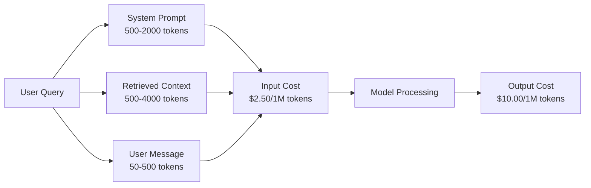
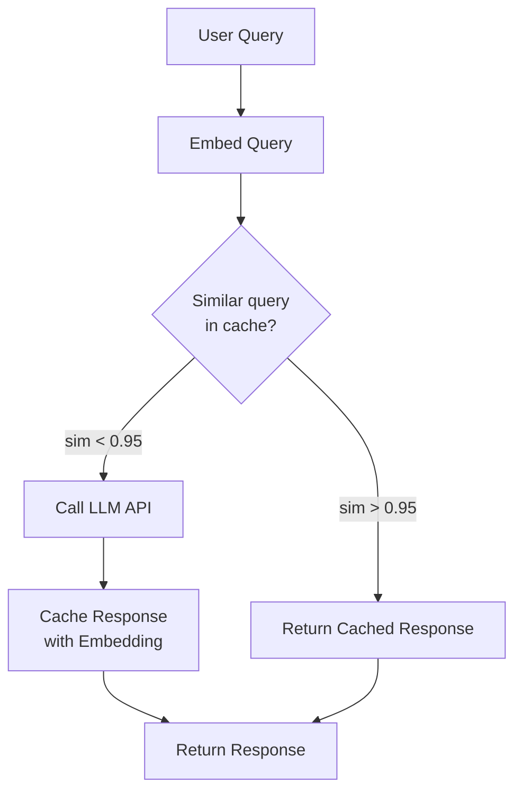
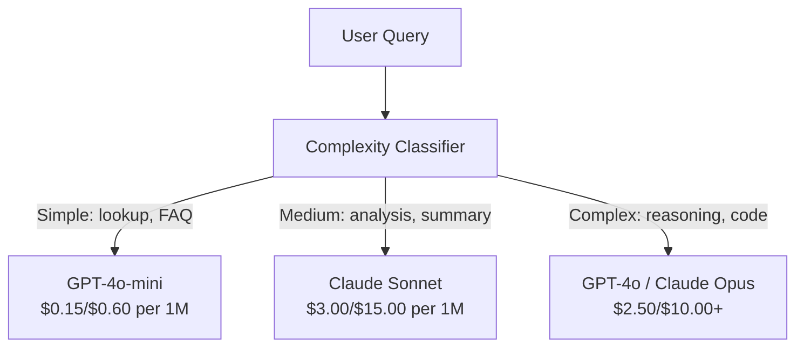

# 缓存、限流与成本优化

> 中文译文。代码、命令和标识符保持英文。若与原文不一致，以同目录 docs/en.md 为准。

> 大多数 AI 初创公司不是死于糟糕的模型，而是死于糟糕的单位经济。一次 GPT-4o 调用只花几分钱的零头。一万名用户每天各调用十次，仅输入 token 就要 250 美元——你还没收到一分钱。活下来的公司把每一次 API 调用都当成一笔财务交易，而不是一次函数调用。

**Type:** 动手做
**Languages:** Python
**Prerequisites:** 第 11 阶段第 09 课（Function Calling）
**Time:** ~45 分钟
**Related:** 第 11 阶段 · 15（Prompt Caching）——本课涵盖应用层缓存（语义缓存、精确哈希缓存、模型路由）。第 15 课涵盖提供商层提示词缓存（Anthropic cache_control、OpenAI 自动缓存、Gemini CachedContent）。两者结合可将成本降低 50–95%。

## 学习目标

- 实现语义缓存：对重复或相似的查询直接从缓存返回，而不是再发起一次新的 API 调用
- 计算各提供商的单次请求成本，并实现感知 token 的限流与预算告警
- 构建成本优化层：提示词压缩、模型路由（贵模型与便宜模型），以及响应缓存
- 设计分层缓存策略：对不同查询类型使用精确匹配、语义相似度与前缀缓存

## 问题

你做了一个检索增强生成聊天机器人。它很好用。用户也很喜欢。

然后账单来了。

GPT-5 每百万输入 token 5 美元，每百万输出 token 15 美元。Claude Opus 4.7 是输入 15 美元 / 输出 75 美元。Gemini 3 Pro 是输入 1.25 美元 / 输出 5 美元。GPT-5-mini 是 0.25 美元 / 2 美元。下面的价格仅为示意；请始终以提供商当前的定价页为准。

下面这组数字会杀死初创公司：

- 10,000 日活跃用户
- 每位用户每天 10 次查询
- 每次查询 1,000 个输入 token（系统提示词 + 上下文 + 用户消息）
- 每次响应 500 个输出 token

**每日输入成本：** 10,000 x 10 x 1,000 / 1,000,000 x $2.50 = **每天 250 美元**
**每日输出成本：** 10,000 x 10 x 500 / 1,000,000 x $10.00 = **每天 500 美元**
**每月合计：** **每月 22,500 美元**

这还只是 LLM。再加上嵌入、向量数据库托管和基础设施。一个聊天机器人一个月就要约 30,000 美元。

更残酷的是：这些查询里有 40–60% 近乎重复。用户用略有不同的措辞问同样的问题。你的系统提示词——每次请求都一模一样——却每次都被计费。检索增强生成取回的上下文文档，在问同一主题的用户之间反复出现。

你在为冗余计算支付全价。

## 概念

### LLM 调用的成本解剖

每一次 API 调用都有五个成本组成部分。



系统提示词是沉默的成本杀手。一段 1,500 token 的系统提示词随每次请求发送，仅这一段前缀就要每百万次请求 3.75 美元。按每天 10 万次请求算，就是每天 375 美元——每月 11,250 美元——而这段文字从未改变。

### 提供商缓存：内置折扣

2026 年三大主要提供商都提供提供商侧的提示词缓存，但机制不同。深入内容见第 11 阶段 · 15。

| 提供商 | 机制 | 折扣 | 最低要求 | 缓存时长 |
|----------|-----------|----------|---------|----------------|
| Anthropic | 显式 cache_control 标记 | 缓存命中享 90% 折扣（写入时多付 25%） | 1,024 tokens（Sonnet/Opus），2,048（Haiku） | 默认 5 分钟；可延长至 1 小时（写入溢价 2 倍） |
| OpenAI | 自动前缀匹配 | 缓存命中享 50% 折扣 | 1,024 tokens | 尽力而为，最长约 1 小时 |
| Google Gemini | 显式 CachedContent API | 约降低 75%（另加存储费用） | 4,096（Flash）/ 32,768（Pro） | 用户可配置的 TTL |

**Anthropic 的做法**是显式的。你用 `cache_control: {"type": "ephemeral"}` 标记提示词中的若干段落。第一次请求支付 25% 的写入溢价。之后带有相同前缀的请求享受 90% 折扣。一段平时花费 0.005 美元的 2,000 token 系统提示词，在缓存命中时只要 0.000625 美元。10 万次请求下来，每天能省 437.50 美元。

**OpenAI 的做法**是自动的。任何与先前请求匹配的提示词前缀都享受 50% 折扣。不需要标记。代价是：折扣更少、控制更少，但实现成本为零。

### 语义缓存：你自己加的一层

提供商缓存只对完全相同的前缀生效。语义缓存处理更难的情况：措辞不同、含义相同的查询。

“退货政策是什么？”（What is the return policy?）和“我该怎么退一件商品？”（How do I return an item?）是不同的字符串，但意图相同。语义缓存对两条查询都做嵌入，计算余弦相似度，若相似度超过阈值（通常是 0.92–0.95）就返回缓存的响应。



嵌入的成本可以忽略。OpenAI 的 text-embedding-3-small 每百万 token 只要 0.02 美元。查一次缓存，相对完整的 LLM 调用几乎不花钱。

### 精确缓存：哈希与匹配

对确定性调用（temperature=0、同一模型、同一提示词），精确缓存更简单也更快。对完整提示词做哈希，查缓存，命中就返回。

它非常适合：
- 系统提示词 + 固定上下文 + 完全相同的用户查询
- 工具定义完全相同的函数调用
- 同一文档被多次处理的批处理

### 限流：守住预算

限流不只是为了公平，而是为了活下去。

**Token 桶算法：** 每个用户有一只装有 N 个 token 的桶，每秒按速率 R 补充。一次请求从桶里消耗 token。桶空了，请求就被拒绝。这样既允许突发（一次用完整桶），又约束平均速率。

**按用户配额：** 按用户层级设置每日/每月 token 上限。

| 层级 | 每日 token 上限 | 每分钟最大请求数 | 模型权限 |
|------|------------------|------------------|-------------|
| Free | 50,000 | 10 | 仅 GPT-4o-mini |
| Pro | 500,000 | 60 | GPT-4o、Claude Sonnet |
| Enterprise | 5,000,000 | 300 | 全部模型 |

### 模型路由：合适的模型做合适的事

不是每次查询都需要 GPT-4o。

“商店几点关门？”（What time does the store close?）不需要每百万输出 token 10 美元的模型。GPT-4o-mini 每百万输出 token 0.60 美元就能很好地处理。Claude Haiku 每百万输出 token 1.25 美元也能处理。一个简单分类器把便宜的查询路由到便宜的模型，把复杂查询路由到昂贵的模型。



调得好的路由器仅在模型成本上就能省 40–70%。

### 成本追踪：知道钱花在哪里

你无法优化你不衡量的东西。为每一次 API 调用记录：

- 时间戳
- 模型名称
- 输入 token
- 输出 token
- 延迟（毫秒）
- 计算出的成本（美元）
- 用户 ID
- 缓存命中/未命中
- 请求类别

这些数据会揭示哪些功能很贵、哪些用户是重度消费者，以及缓存在哪里影响最大。

### 批处理：批量折扣

OpenAI 的 Batch API 以异步方式处理请求，并给予 50% 折扣。你一次最多提交 50,000 个请求，结果在 24 小时内返回。

适合用批处理的场景：
- 夜间文档处理
- 批量分类
- 评测运行
- 数据富化流水线

不适合：面向用户的实时查询（延迟很重要）。

### 预算告警与熔断器

熔断器在你触及上限时停止支出。没有它，一个 bug 或一次滥用就能在几小时内烧光月度预算。

设置三道阈值：
1. **警告**（预算的 70%）：发送告警
2. **降速**（预算的 85%）：只切换到更便宜的模型
3. **停止**（预算的 95%）：拒绝新请求，只返回缓存的响应

### 优化栈

按顺序应用这些技术。每一层都叠在前一层之上。

| 层级 | 技术 | 典型节省 | 实现成本 |
|-------|-----------|----------------|----------------------|
| 1 | 提供商提示词缓存 | 30–50% | 低（添加缓存标记） |
| 2 | 精确缓存 | 10–20% | 低（哈希 + 字典） |
| 3 | 语义缓存 | 15–30% | 中（嵌入 + 相似度） |
| 4 | 模型路由 | 40–70% | 中（分类器） |
| 5 | 限流 | 预算保护 | 低（token 桶） |
| 6 | 提示词压缩 | 10–30% | 中（重写提示词） |
| 7 | 批处理 | 符合条件的请求节省 50% | 低（Batch API） |

一个检索增强生成应用如果用上第 1–5 层，通常能把成本从每月 22,500 美元降到每月 4,000–6,000 美元。这就是烧光跑道和做成一门生意之间的差别。

### 真实节省：优化前后

下面是一个服务 10,000 日活用户的检索增强生成聊天机器人的真实拆解。

| 指标 | 优化前 | 优化后 | 节省 |
|--------|--------------------|--------------------|---------|
| 每月 LLM 成本 | $22,500 | $5,200 | 77% |
| 每次查询平均成本 | $0.0075 | $0.0017 | 77% |
| 缓存命中率 | 0% | 52% | -- |
| 路由到 mini 的查询 | 0% | 65% | -- |
| P95 延迟 | 2,800ms | 900ms（缓存命中：50ms） | 68% |
| 每月嵌入成本 | $0 | $180 | （新增成本） |
| 每月总成本 | $22,500 | $5,380 | 76% |

语义缓存的嵌入成本（每月 180 美元）在缓存命中的第一个小时内就能收回。

```figure
semantic-cache
```

## 动手做

### 第 1 步：成本计算器

做一个 token 成本计算器，掌握主流模型的当前定价。

```python
import hashlib
import time
import json
import math
from dataclasses import dataclass, field


MODEL_PRICING = {
    "gpt-4o": {"input": 2.50, "output": 10.00, "cached_input": 1.25},
    "gpt-4o-mini": {"input": 0.15, "output": 0.60, "cached_input": 0.075},
    "gpt-4.1": {"input": 2.00, "output": 8.00, "cached_input": 0.50},
    "gpt-4.1-mini": {"input": 0.40, "output": 1.60, "cached_input": 0.10},
    "gpt-4.1-nano": {"input": 0.10, "output": 0.40, "cached_input": 0.025},
    "o3": {"input": 2.00, "output": 8.00, "cached_input": 0.50},
    "o3-mini": {"input": 1.10, "output": 4.40, "cached_input": 0.55},
    "o4-mini": {"input": 1.10, "output": 4.40, "cached_input": 0.275},
    "claude-opus-4": {"input": 15.00, "output": 75.00, "cached_input": 1.50},
    "claude-sonnet-4": {"input": 3.00, "output": 15.00, "cached_input": 0.30},
    "claude-haiku-3.5": {"input": 0.80, "output": 4.00, "cached_input": 0.08},
    "gemini-2.5-pro": {"input": 1.25, "output": 10.00, "cached_input": 0.3125},
    "gemini-2.5-flash": {"input": 0.15, "output": 0.60, "cached_input": 0.0375},
}


def calculate_cost(model, input_tokens, output_tokens, cached_input_tokens=0):
    if model not in MODEL_PRICING:
        return {"error": f"Unknown model: {model}"}
    pricing = MODEL_PRICING[model]
    non_cached = input_tokens - cached_input_tokens
    input_cost = (non_cached / 1_000_000) * pricing["input"]
    cached_cost = (cached_input_tokens / 1_000_000) * pricing["cached_input"]
    output_cost = (output_tokens / 1_000_000) * pricing["output"]
    total = input_cost + cached_cost + output_cost
    return {
        "model": model,
        "input_tokens": input_tokens,
        "output_tokens": output_tokens,
        "cached_input_tokens": cached_input_tokens,
        "input_cost": round(input_cost, 6),
        "cached_input_cost": round(cached_cost, 6),
        "output_cost": round(output_cost, 6),
        "total_cost": round(total, 6),
    }
```

### 第 2 步：精确缓存

对完整提示词做哈希，对完全相同的请求返回缓存的响应。

```python
class ExactCache:
    def __init__(self, max_size=1000, ttl_seconds=3600):
        self.cache = {}
        self.max_size = max_size
        self.ttl = ttl_seconds
        self.hits = 0
        self.misses = 0

    def _hash(self, model, messages, temperature):
        key_data = json.dumps({"model": model, "messages": messages, "temperature": temperature}, sort_keys=True)
        return hashlib.sha256(key_data.encode()).hexdigest()

    def get(self, model, messages, temperature=0.0):
        if temperature > 0:
            self.misses += 1
            return None
        key = self._hash(model, messages, temperature)
        if key in self.cache:
            entry = self.cache[key]
            if time.time() - entry["timestamp"] < self.ttl:
                self.hits += 1
                entry["access_count"] += 1
                return entry["response"]
            del self.cache[key]
        self.misses += 1
        return None

    def put(self, model, messages, temperature, response):
        if temperature > 0:
            return
        if len(self.cache) >= self.max_size:
            oldest_key = min(self.cache, key=lambda k: self.cache[k]["timestamp"])
            del self.cache[oldest_key]
        key = self._hash(model, messages, temperature)
        self.cache[key] = {
            "response": response,
            "timestamp": time.time(),
            "access_count": 1,
        }

    def stats(self):
        total = self.hits + self.misses
        return {
            "hits": self.hits,
            "misses": self.misses,
            "hit_rate": round(self.hits / total, 4) if total > 0 else 0,
            "cache_size": len(self.cache),
        }
```

### 第 3 步：语义缓存

对查询做嵌入，当相似度超过阈值时返回缓存的响应。

```python
def simple_embed(text):
    words = text.lower().split()
    vocab = {}
    for w in words:
        vocab[w] = vocab.get(w, 0) + 1
    norm = math.sqrt(sum(v * v for v in vocab.values()))
    if norm == 0:
        return {}
    return {k: v / norm for k, v in vocab.items()}


def cosine_similarity(a, b):
    if not a or not b:
        return 0.0
    all_keys = set(a) | set(b)
    dot = sum(a.get(k, 0) * b.get(k, 0) for k in all_keys)
    return dot


class SemanticCache:
    def __init__(self, similarity_threshold=0.85, max_size=500, ttl_seconds=3600):
        self.entries = []
        self.threshold = similarity_threshold
        self.max_size = max_size
        self.ttl = ttl_seconds
        self.hits = 0
        self.misses = 0

    def get(self, query):
        query_embedding = simple_embed(query)
        now = time.time()
        best_match = None
        best_sim = 0.0
        for entry in self.entries:
            if now - entry["timestamp"] > self.ttl:
                continue
            sim = cosine_similarity(query_embedding, entry["embedding"])
            if sim > best_sim:
                best_sim = sim
                best_match = entry
        if best_match and best_sim >= self.threshold:
            self.hits += 1
            best_match["access_count"] += 1
            return {"response": best_match["response"], "similarity": round(best_sim, 4), "original_query": best_match["query"]}
        self.misses += 1
        return None

    def put(self, query, response):
        if len(self.entries) >= self.max_size:
            self.entries.sort(key=lambda e: e["timestamp"])
            self.entries.pop(0)
        self.entries.append({
            "query": query,
            "embedding": simple_embed(query),
            "response": response,
            "timestamp": time.time(),
            "access_count": 1,
        })

    def stats(self):
        total = self.hits + self.misses
        return {
            "hits": self.hits,
            "misses": self.misses,
            "hit_rate": round(self.hits / total, 4) if total > 0 else 0,
            "cache_size": len(self.entries),
        }
```

### 第 4 步：限流器

带按用户配额的 token 桶限流器。

```python
class TokenBucketRateLimiter:
    def __init__(self):
        self.buckets = {}
        self.tiers = {
            "free": {"capacity": 50_000, "refill_rate": 500, "max_requests_per_min": 10},
            "pro": {"capacity": 500_000, "refill_rate": 5_000, "max_requests_per_min": 60},
            "enterprise": {"capacity": 5_000_000, "refill_rate": 50_000, "max_requests_per_min": 300},
        }

    def _get_bucket(self, user_id, tier="free"):
        if user_id not in self.buckets:
            tier_config = self.tiers.get(tier, self.tiers["free"])
            self.buckets[user_id] = {
                "tokens": tier_config["capacity"],
                "capacity": tier_config["capacity"],
                "refill_rate": tier_config["refill_rate"],
                "last_refill": time.time(),
                "request_timestamps": [],
                "max_rpm": tier_config["max_requests_per_min"],
                "tier": tier,
                "total_tokens_used": 0,
            }
        return self.buckets[user_id]

    def _refill(self, bucket):
        now = time.time()
        elapsed = now - bucket["last_refill"]
        refill = int(elapsed * bucket["refill_rate"])
        if refill > 0:
            bucket["tokens"] = min(bucket["capacity"], bucket["tokens"] + refill)
            bucket["last_refill"] = now

    def check(self, user_id, tokens_needed, tier="free"):
        bucket = self._get_bucket(user_id, tier)
        self._refill(bucket)
        now = time.time()
        bucket["request_timestamps"] = [t for t in bucket["request_timestamps"] if now - t < 60]
        if len(bucket["request_timestamps"]) >= bucket["max_rpm"]:
            return {"allowed": False, "reason": "rate_limit", "retry_after_seconds": 60 - (now - bucket["request_timestamps"][0])}
        if bucket["tokens"] < tokens_needed:
            deficit = tokens_needed - bucket["tokens"]
            wait = deficit / bucket["refill_rate"]
            return {"allowed": False, "reason": "token_limit", "tokens_available": bucket["tokens"], "retry_after_seconds": round(wait, 1)}
        return {"allowed": True, "tokens_available": bucket["tokens"]}

    def consume(self, user_id, tokens_used, tier="free"):
        bucket = self._get_bucket(user_id, tier)
        bucket["tokens"] -= tokens_used
        bucket["request_timestamps"].append(time.time())
        bucket["total_tokens_used"] += tokens_used

    def get_usage(self, user_id):
        if user_id not in self.buckets:
            return {"error": "User not found"}
        b = self.buckets[user_id]
        return {
            "user_id": user_id,
            "tier": b["tier"],
            "tokens_remaining": b["tokens"],
            "capacity": b["capacity"],
            "total_tokens_used": b["total_tokens_used"],
            "utilization": round(b["total_tokens_used"] / b["capacity"], 4) if b["capacity"] else 0,
        }
```

### 第 5 步：成本追踪器

记录每一次调用，并计算累计总额。

```python
class CostTracker:
    def __init__(self, monthly_budget=1000.0):
        self.logs = []
        self.monthly_budget = monthly_budget
        self.alerts = []

    def log_call(self, model, input_tokens, output_tokens, cached_input_tokens=0, latency_ms=0, user_id="anonymous", cache_status="miss"):
        cost = calculate_cost(model, input_tokens, output_tokens, cached_input_tokens)
        entry = {
            "timestamp": time.time(),
            "model": model,
            "input_tokens": input_tokens,
            "output_tokens": output_tokens,
            "cached_input_tokens": cached_input_tokens,
            "latency_ms": latency_ms,
            "cost": cost["total_cost"],
            "user_id": user_id,
            "cache_status": cache_status,
        }
        self.logs.append(entry)
        self._check_budget()
        return entry

    def _check_budget(self):
        total = self.total_cost()
        pct = total / self.monthly_budget if self.monthly_budget > 0 else 0
        if pct >= 0.95 and not any(a["level"] == "stop" for a in self.alerts):
            self.alerts.append({"level": "stop", "message": f"Budget 95% consumed: ${total:.2f}/${self.monthly_budget:.2f}", "timestamp": time.time()})
        elif pct >= 0.85 and not any(a["level"] == "throttle" for a in self.alerts):
            self.alerts.append({"level": "throttle", "message": f"Budget 85% consumed: ${total:.2f}/${self.monthly_budget:.2f}", "timestamp": time.time()})
        elif pct >= 0.70 and not any(a["level"] == "warning" for a in self.alerts):
            self.alerts.append({"level": "warning", "message": f"Budget 70% consumed: ${total:.2f}/${self.monthly_budget:.2f}", "timestamp": time.time()})

    def total_cost(self):
        return round(sum(e["cost"] for e in self.logs), 6)

    def cost_by_model(self):
        by_model = {}
        for e in self.logs:
            m = e["model"]
            if m not in by_model:
                by_model[m] = {"calls": 0, "cost": 0, "input_tokens": 0, "output_tokens": 0}
            by_model[m]["calls"] += 1
            by_model[m]["cost"] = round(by_model[m]["cost"] + e["cost"], 6)
            by_model[m]["input_tokens"] += e["input_tokens"]
            by_model[m]["output_tokens"] += e["output_tokens"]
        return by_model

    def cache_savings(self):
        cache_hits = [e for e in self.logs if e["cache_status"] == "hit"]
        if not cache_hits:
            return {"saved": 0, "cache_hits": 0}
        saved = 0
        for e in cache_hits:
            full_cost = calculate_cost(e["model"], e["input_tokens"], e["output_tokens"])
            saved += full_cost["total_cost"]
        return {"saved": round(saved, 4), "cache_hits": len(cache_hits)}

    def summary(self):
        if not self.logs:
            return {"total_calls": 0, "total_cost": 0}
        total_latency = sum(e["latency_ms"] for e in self.logs)
        cache_hits = sum(1 for e in self.logs if e["cache_status"] == "hit")
        return {
            "total_calls": len(self.logs),
            "total_cost": self.total_cost(),
            "avg_cost_per_call": round(self.total_cost() / len(self.logs), 6),
            "avg_latency_ms": round(total_latency / len(self.logs), 1),
            "cache_hit_rate": round(cache_hits / len(self.logs), 4),
            "cost_by_model": self.cost_by_model(),
            "cache_savings": self.cache_savings(),
            "budget_remaining": round(self.monthly_budget - self.total_cost(), 2),
            "budget_utilization": round(self.total_cost() / self.monthly_budget, 4) if self.monthly_budget > 0 else 0,
            "alerts": self.alerts,
        }
```

### 第 6 步：模型路由器

把查询路由到能处理它的最便宜模型。

```python
SIMPLE_KEYWORDS = ["what time", "hours", "address", "phone", "price", "return policy", "hello", "hi", "thanks", "yes", "no"]
COMPLEX_KEYWORDS = ["analyze", "compare", "explain why", "write code", "debug", "architect", "design", "trade-off", "evaluate"]


def classify_complexity(query):
    q = query.lower()
    if len(q.split()) <= 5 or any(kw in q for kw in SIMPLE_KEYWORDS):
        return "simple"
    if any(kw in q for kw in COMPLEX_KEYWORDS):
        return "complex"
    return "medium"


def route_model(query, tier="pro"):
    complexity = classify_complexity(query)
    routing_table = {
        "simple": {"free": "gpt-4.1-nano", "pro": "gpt-4o-mini", "enterprise": "gpt-4o-mini"},
        "medium": {"free": "gpt-4o-mini", "pro": "claude-sonnet-4", "enterprise": "claude-sonnet-4"},
        "complex": {"free": "gpt-4o-mini", "pro": "gpt-4o", "enterprise": "claude-opus-4"},
    }
    model = routing_table[complexity].get(tier, "gpt-4o-mini")
    return {"query": query, "complexity": complexity, "model": model, "tier": tier}
```

### 第 7 步：运行演示

```python
def simulate_llm_call(model, query):
    input_tokens = len(query.split()) * 4 + 500
    output_tokens = 150 + (len(query.split()) * 2)
    latency = 200 + (output_tokens * 2)
    return {
        "model": model,
        "response": f"[Simulated {model} response to: {query[:50]}...]",
        "input_tokens": input_tokens,
        "output_tokens": output_tokens,
        "latency_ms": latency,
    }


def run_demo():
    print("=" * 60)
    print("  Caching, Rate Limiting & Cost Optimization Demo")
    print("=" * 60)

    print("\n--- Model Pricing ---")
    for model, pricing in list(MODEL_PRICING.items())[:6]:
        cost_1k = calculate_cost(model, 1000, 500)
        print(f"  {model}: ${cost_1k['total_cost']:.6f} per 1K in + 500 out")

    print("\n--- Cost Comparison: 100K Requests ---")
    for model in ["gpt-4o", "gpt-4o-mini", "claude-sonnet-4", "claude-haiku-3.5"]:
        cost = calculate_cost(model, 1000 * 100_000, 500 * 100_000)
        print(f"  {model}: ${cost['total_cost']:.2f}")

    print("\n--- Anthropic Cache Savings ---")
    no_cache = calculate_cost("claude-sonnet-4", 2000, 500, 0)
    with_cache = calculate_cost("claude-sonnet-4", 2000, 500, 1500)
    saving = no_cache["total_cost"] - with_cache["total_cost"]
    print(f"  Without cache: ${no_cache['total_cost']:.6f}")
    print(f"  With 1500 cached tokens: ${with_cache['total_cost']:.6f}")
    print(f"  Savings per call: ${saving:.6f} ({saving/no_cache['total_cost']*100:.1f}%)")

    exact_cache = ExactCache(max_size=100, ttl_seconds=300)
    semantic_cache = SemanticCache(similarity_threshold=0.75, max_size=100)
    rate_limiter = TokenBucketRateLimiter()
    tracker = CostTracker(monthly_budget=100.0)

    print("\n--- Exact Cache ---")
    messages_1 = [{"role": "user", "content": "What is the return policy?"}]
    result = exact_cache.get("gpt-4o-mini", messages_1, 0.0)
    print(f"  First lookup: {'HIT' if result else 'MISS'}")
    exact_cache.put("gpt-4o-mini", messages_1, 0.0, "You can return items within 30 days.")
    result = exact_cache.get("gpt-4o-mini", messages_1, 0.0)
    print(f"  Second lookup: {'HIT' if result else 'MISS'} -> {result}")
    result = exact_cache.get("gpt-4o-mini", messages_1, 0.7)
    print(f"  With temp=0.7: {'HIT' if result else 'MISS (non-deterministic, skip cache)'}")
    print(f"  Stats: {exact_cache.stats()}")

    print("\n--- Semantic Cache ---")
    test_queries = [
        ("What is the return policy?", "Items can be returned within 30 days with receipt."),
        ("How do I return an item?", None),
        ("What are your store hours?", "We are open 9am-9pm Monday through Saturday."),
        ("When does the store open?", None),
        ("Tell me about quantum computing", "Quantum computers use qubits..."),
        ("Explain quantum mechanics", None),
    ]
    for query, response in test_queries:
        cached = semantic_cache.get(query)
        if cached:
            print(f"  '{query[:40]}' -> CACHE HIT (sim={cached['similarity']}, original='{cached['original_query'][:40]}')")
        elif response:
            semantic_cache.put(query, response)
            print(f"  '{query[:40]}' -> MISS (stored)")
        else:
            print(f"  '{query[:40]}' -> MISS (no match)")
    print(f"  Stats: {semantic_cache.stats()}")

    print("\n--- Rate Limiting ---")
    for i in range(12):
        check = rate_limiter.check("user_1", 1000, "free")
        if check["allowed"]:
            rate_limiter.consume("user_1", 1000, "free")
        status = "OK" if check["allowed"] else f"BLOCKED ({check['reason']})"
        if i < 5 or not check["allowed"]:
            print(f"  Request {i+1}: {status}")
    print(f"  Usage: {rate_limiter.get_usage('user_1')}")

    print("\n--- Model Routing ---")
    routing_queries = [
        "What time do you close?",
        "Summarize this quarterly earnings report",
        "Analyze the trade-offs between microservices and monoliths",
        "Hello",
        "Write code for a binary search tree with deletion",
    ]
    for q in routing_queries:
        route = route_model(q, "pro")
        print(f"  '{q[:50]}' -> {route['model']} ({route['complexity']})")

    print("\n--- Full Pipeline: Before vs After Optimization ---")
    queries = [
        "What is the return policy?",
        "How do I return something?",
        "What are your hours?",
        "When do you open?",
        "Explain the difference between TCP and UDP",
        "Compare TCP vs UDP protocols",
        "Hello",
        "What is your phone number?",
        "Write a Python function to sort a list",
        "Analyze the pros and cons of serverless architecture",
    ]

    print("\n  [Before: no caching, single model (gpt-4o)]")
    tracker_before = CostTracker(monthly_budget=1000.0)
    for q in queries:
        result = simulate_llm_call("gpt-4o", q)
        tracker_before.log_call("gpt-4o", result["input_tokens"], result["output_tokens"], latency_ms=result["latency_ms"], cache_status="miss")
    before = tracker_before.summary()
    print(f"  Total cost: ${before['total_cost']:.6f}")
    print(f"  Avg cost/call: ${before['avg_cost_per_call']:.6f}")
    print(f"  Avg latency: {before['avg_latency_ms']}ms")

    print("\n  [After: caching + routing + rate limiting]")
    exact_c = ExactCache()
    semantic_c = SemanticCache(similarity_threshold=0.75)
    tracker_after = CostTracker(monthly_budget=1000.0)

    for q in queries:
        messages = [{"role": "user", "content": q}]
        cached = exact_c.get("gpt-4o", messages, 0.0)
        if cached:
            tracker_after.log_call("gpt-4o-mini", 0, 0, latency_ms=5, cache_status="hit")
            continue
        sem_cached = semantic_c.get(q)
        if sem_cached:
            tracker_after.log_call("gpt-4o-mini", 0, 0, latency_ms=15, cache_status="hit")
            continue
        route = route_model(q)
        result = simulate_llm_call(route["model"], q)
        tracker_after.log_call(route["model"], result["input_tokens"], result["output_tokens"], latency_ms=result["latency_ms"], cache_status="miss")
        exact_c.put(route["model"], messages, 0.0, result["response"])
        semantic_c.put(q, result["response"])

    after = tracker_after.summary()
    print(f"  Total cost: ${after['total_cost']:.6f}")
    print(f"  Avg cost/call: ${after['avg_cost_per_call']:.6f}")
    print(f"  Avg latency: {after['avg_latency_ms']}ms")
    print(f"  Cache hit rate: {after['cache_hit_rate']:.0%}")

    if before["total_cost"] > 0:
        savings_pct = (1 - after["total_cost"] / before["total_cost"]) * 100
        print(f"\n  SAVINGS: {savings_pct:.1f}% cost reduction")
        print(f"  Latency improvement: {(1 - after['avg_latency_ms'] / before['avg_latency_ms']) * 100:.1f}% faster")

    print("\n--- Budget Alerts Demo ---")
    alert_tracker = CostTracker(monthly_budget=0.01)
    for i in range(5):
        alert_tracker.log_call("gpt-4o", 5000, 2000, latency_ms=500)
    print(f"  Total spent: ${alert_tracker.total_cost():.6f} / ${alert_tracker.monthly_budget}")
    for alert in alert_tracker.alerts:
        print(f"  ALERT [{alert['level'].upper()}]: {alert['message']}")

    print("\n--- Cost Breakdown by Model ---")
    multi_tracker = CostTracker(monthly_budget=500.0)
    for _ in range(50):
        multi_tracker.log_call("gpt-4o-mini", 800, 200, latency_ms=150)
    for _ in range(30):
        multi_tracker.log_call("claude-sonnet-4", 1500, 500, latency_ms=400)
    for _ in range(10):
        multi_tracker.log_call("gpt-4o", 2000, 800, latency_ms=600)
    for _ in range(10):
        multi_tracker.log_call("claude-opus-4", 3000, 1000, latency_ms=1200)
    breakdown = multi_tracker.cost_by_model()
    for model, data in sorted(breakdown.items(), key=lambda x: x[1]["cost"], reverse=True):
        print(f"  {model}: {data['calls']} calls, ${data['cost']:.6f}, {data['input_tokens']:,} in / {data['output_tokens']:,} out")
    print(f"  Total: ${multi_tracker.total_cost():.6f}")

    print("\n" + "=" * 60)
    print("  Demo complete.")
    print("=" * 60)


if __name__ == "__main__":
    run_demo()
```

## 用起来

### Anthropic 提示词缓存

```python
# import anthropic
#
# client = anthropic.Anthropic()
#
# response = client.messages.create(
#     model="claude-sonnet-5",
#     max_tokens=1024,
#     system=[
#         {
#             "type": "text",
#             "text": "You are a helpful customer support agent for Acme Corp...",
#             "cache_control": {"type": "ephemeral"},
#         }
#     ],
#     messages=[{"role": "user", "content": "What is the return policy?"}],
# )
#
# print(f"Input tokens: {response.usage.input_tokens}")
# print(f"Cache creation tokens: {response.usage.cache_creation_input_tokens}")
# print(f"Cache read tokens: {response.usage.cache_read_input_tokens}")
```

第一次调用写入缓存（溢价 25%）。之后每一次带有相同系统提示词前缀的调用都从缓存读取（90% 折扣）。缓存持续 5 分钟，每次命中都会重置计时器。

### OpenAI 自动缓存

```python
# from openai import OpenAI
#
# client = OpenAI()
#
# response = client.chat.completions.create(
#     model="gpt-4o",
#     messages=[
#         {"role": "system", "content": "You are a helpful customer support agent..."},
#         {"role": "user", "content": "What is the return policy?"},
#     ],
# )
#
# print(f"Prompt tokens: {response.usage.prompt_tokens}")
# print(f"Cached tokens: {response.usage.prompt_tokens_details.cached_tokens}")
# print(f"Completion tokens: {response.usage.completion_tokens}")
```

OpenAI 会自动缓存。任何达到 1,024 个 token 以上、且与最近一次请求匹配的提示词前缀，都享受 50% 折扣。不需要改代码——只要在响应里查看 `prompt_tokens_details.cached_tokens`，就能确认它是否生效。

### OpenAI Batch API

```python
# import json
# from openai import OpenAI
#
# client = OpenAI()
#
# requests = []
# for i, query in enumerate(queries):
#     requests.append({
#         "custom_id": f"request-{i}",
#         "method": "POST",
#         "url": "/v1/chat/completions",
#         "body": {
#             "model": "gpt-4o-mini",
#             "messages": [{"role": "user", "content": query}],
#         },
#     })
#
# with open("batch_input.jsonl", "w") as f:
#     for r in requests:
#         f.write(json.dumps(r) + "\n")
#
# batch_file = client.files.create(file=open("batch_input.jsonl", "rb"), purpose="batch")
# batch = client.batches.create(input_file_id=batch_file.id, endpoint="/v1/chat/completions", completion_window="24h")
# print(f"Batch ID: {batch.id}, Status: {batch.status}")
```

Batch API 对全部 token 给予统一的 50% 折扣。结果在 24 小时内到达。非常适合非实时工作负载：评测、数据标注、批量摘要。

### 用 Redis 做生产级语义缓存

```python
# import redis
# import numpy as np
# from openai import OpenAI
#
# r = redis.Redis()
# client = OpenAI()
#
# def get_embedding(text):
#     response = client.embeddings.create(model="text-embedding-3-small", input=text)
#     return response.data[0].embedding
#
# def semantic_cache_lookup(query, threshold=0.95):
#     query_emb = np.array(get_embedding(query))
#     keys = r.keys("cache:emb:*")
#     best_sim, best_key = 0, None
#     for key in keys:
#         stored_emb = np.frombuffer(r.get(key), dtype=np.float32)
#         sim = np.dot(query_emb, stored_emb) / (np.linalg.norm(query_emb) * np.linalg.norm(stored_emb))
#         if sim > best_sim:
#             best_sim, best_key = sim, key
#     if best_sim >= threshold and best_key:
#         response_key = best_key.decode().replace("cache:emb:", "cache:resp:")
#         return r.get(response_key).decode()
#     return None
```

在生产环境中，用向量索引（Redis Vector Search、Pinecone 或 pgvector）替换线性扫描。线性扫描在条目少于 1,000 时够用。超过这个规模，使用 ANN（近似最近邻）把查找做到 O(log n)。

## 交付

本课产出 `outputs/prompt-cost-optimizer.md`——一段可复用的提示词，用来分析你的 LLM 应用，并给出带预计节省金额的具体成本优化建议。

本课还产出 `outputs/skill-cost-patterns.md`——一套决策框架，用来为你的用例选择合适的缓存策略、限流配置和模型路由规则。

## 练习

1. **为语义缓存实现 LRU 淘汰。** 把“最旧优先”淘汰换成最近最少使用。记录每条缓存的最后访问时间，缓存满时淘汰访问时间最旧的那条。在 100 次查询上比较两种策略的命中率。

2. **做一个成本预测工具。** 给定 API 调用日志（CostTracker 的日志），按最近 7 天的平均值预测月度成本。考虑工作日/周末的模式。若预测的月度成本超出预算 20% 以上，就触发告警。

3. **实现分层语义缓存。** 使用两个相似度阈值：0.98 为高置信命中（立即返回），0.90 为中置信命中（返回时附上免责声明：“基于一个相似的先前问题……”）。记录每次命中来自哪一层，并衡量用户满意度的差异。

4. **做一个模型路由分类器。** 用基于嵌入的分类器替换基于关键词的分类器。对 50 条已标注查询（simple/medium/complex）做嵌入，然后通过寻找最近的已标注样本来分类新查询。在 20 条查询的测试集上衡量分类准确率。

5. **实现带降级级别的熔断器。** 预算达到 70% 时记录一条警告。达到 85% 时，自动把全部路由切到最便宜的模型（gpt-4o-mini）。达到 95% 时，只提供缓存响应并拒绝新查询。用 1.00 美元的预算模拟 1,000 次请求来测试，并验证每一道阈值都会正确触发。

## 关键术语

| 术语 | 人们怎么说 | 实际含义 |
|------|----------------|----------------------|
| 提示词缓存 | “把系统提示词缓存起来” | 提供商层面的缓存：重复的提示词前缀获得折扣（Anthropic 90%，OpenAI 50%）——OpenAI 不用改代码，Anthropic 需要显式标记 |
| 语义缓存 | “智能缓存” | 对查询做嵌入，计算与历史查询的相似度，相似度超过阈值就返回缓存响应——能抓住精确匹配漏掉的改写 |
| 精确缓存 | “哈希缓存” | 对完整提示词（模型 + 消息 + temperature）做哈希，对完全相同的输入返回缓存响应——只适用于 temperature=0 的确定性调用 |
| Token 桶 | “限流器” | 一种算法：每个用户有一只装 N 个 token 的桶，每秒按速率 R 补充——允许最多 N 的突发，同时把平均速率约束在 R |
| 模型路由 | “抠门路由” | 用分类器把简单查询送到便宜模型（GPT-4o-mini、Haiku），把复杂查询送到昂贵模型（GPT-4o、Opus）——模型成本能省 40–70% |
| 成本追踪 | “计量” | 记录每一次 API 调用的模型、token、延迟、成本和用户 ID，从而确切知道钱花在哪里、哪些功能很贵 |
| 熔断器 | “急停开关” | 当支出接近预算上限时，自动降级服务（更便宜的模型、仅缓存）或完全停止请求 |
| Batch API | “批量折扣” | OpenAI 的异步处理，享 50% 折扣——一次最多提交 50,000 个请求，24 小时内拿到结果 |
| 提示词压缩 | “token 节食” | 重写系统提示词和上下文，用更少的 token 保留含义——更短的提示词更便宜，而且往往效果更好 |
| 缓存命中率 | “缓存效率” | 由缓存直接返回、而不调用 LLM 的请求所占百分比——生产聊天机器人通常是 40–60%，成本按比例下降 |

## 延伸阅读

- [Anthropic Prompt Caching Guide](https://docs.anthropic.com/en/docs/build-with-claude/prompt-caching)——Anthropic 显式 cache_control 标记、定价和缓存生命周期行为的官方文档
- [OpenAI Prompt Caching](https://platform.openai.com/docs/guides/prompt-caching)——OpenAI 的自动缓存、如何通过 usage 字段确认缓存命中，以及最短前缀长度
- [OpenAI Batch API](https://platform.openai.com/docs/guides/batch)——异步处理享 50% 折扣、JSONL 格式、24 小时完成窗口，以及 5 万请求上限
- [GPTCache](https://github.com/zilliztech/GPTCache)——开源语义缓存库，支持多种嵌入后端、向量存储和淘汰策略
- [Martian Model Router](https://docs.withmartian.com)——生产级模型路由，自动为每个查询选择能够处理它的最便宜模型
- [Not Diamond](https://www.notdiamond.ai)——基于机器学习的模型路由器，从你的流量模式中学习，以优化跨提供商的成本/质量权衡
- [Helicone](https://www.helicone.ai)——LLM 可观测性平台，以代理层提供成本追踪、缓存、限流和预算告警
- [Dean & Barroso, "The Tail at Scale" (CACM 2013)](https://research.google/pubs/the-tail-at-scale/)——延迟、吞吐、TTFT/TPOT 分位数，以及对冲请求；“选仍然满足 P95 的最便宜模型”背后的成本模型。
- [Kwon et al., "Efficient Memory Management for Large Language Model Serving with PagedAttention" (SOSP 2023)](https://arxiv.org/abs/2309.06180)——vLLM 论文；分页 KV-cache 加连续批处理为何在吞吐上比朴素服务器高 24 倍，也就是“缓存与成本”下面的基础设施层。
- [Dao et al., "FlashAttention-2: Faster Attention with Better Parallelism and Work Partitioning" (ICLR 2024)](https://arxiv.org/abs/2307.08691)——与提示词缓存正交的内核级成本下降；与推测解码和 GQA 一起读，才能看全成本曲线。
