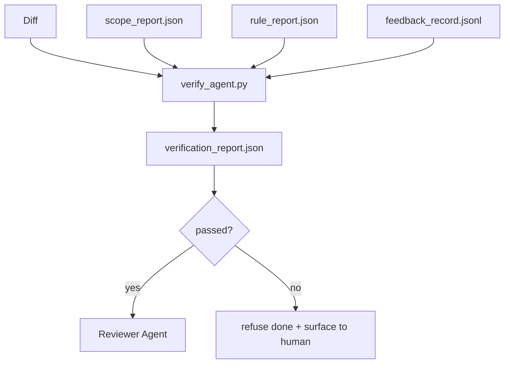

# 验证门控

> 中文译文。代码、命令和标识符保持英文。若与原文不一致，以同目录 docs/en.md 为准。

> 智能体不能把自己的工作标成完成。验证门控读取范围契约、反馈日志、规则报告和 diff，并回答一个问题：这个任务真的完成了吗？如果门控说没有，任务就没有完成，无论聊天里怎么说。

**Type:** 动手做
**Languages:** Python（标准库）
**Prerequisites:** Phase 14 · 33（规则）、Phase 14 · 36（范围）、Phase 14 · 37（反馈）
**Time:** ~55 分钟

## 学习目标

- 把验证门控定义为工作台产物之上的一个确定性函数。
- 把规则报告、范围报告、反馈记录和 diff 合成单一裁决。
- 发出一份评审智能体和 CI 都能读的 `verification_report.json`。
- 在任何阻断级失败上拒绝推进任务，没有例外。

## 问题

智能体太容易宣布成功。三种失败形态占主导：

- “看起来不错。”模型读了自己的 diff，就认定它是对的。
- “测试通过了。”说得很有信心。没有任何测试真正跑过的记录。
- “验收满足了。”验收标准被解释得足够松，意思变成“任何看起来像完成的东西”。

工作台的修复是一道验证门控：它读取智能体已经产出的产物，并作出判定。门控是确定性的。门控在版本控制里。门控接进 CI。智能体无法收买它。

## 概念



### 门控检查什么

| 检查 | 来源产物 | 严重级别 |
|-------|-----------------|----------|
| 所有验收命令都跑过 | `feedback_record.jsonl` | 阻断 |
| 所有验收命令都以零退出 | `feedback_record.jsonl` | 阻断 |
| 范围检查没有被禁止的写入 | `scope_report.json` | 阻断 |
| 范围检查没有越界写入 | `scope_report.json` | 阻断或警告 |
| 所有阻断级规则都通过 | `rule_report.json` | 阻断 |
| 反馈中没有 `null` 退出码 | `feedback_record.jsonl` | 阻断 |
| 被触碰的文件匹配 `scope.allowed_files` | 两者 | 警告 |

`warn` 发现给裁决加注释；`block` 发现阻止 `passed: true`。

### 确定性，而非概率性

对同一组产物，门控每次都必须给出相同裁决。不要 LLM 评判。LLM 评判属于评审侧（Phase 14 · 39），那里的目标是定性评测，而不是状态。

### 一份报告，一条路径

门控在每次任务收尾时发出一份 `verification_report.json`，写在 `outputs/verification/<task_id>.json` 下。CI 消费同一条路径。多道门控用不同路径会分裂事实来源。

### 无例外地拒绝

阻断级发现不能被智能体覆盖。它们只能由人覆盖，并记录 `override_reason` 和 `overridden_by` 用户 id。覆盖是一次签名变更，不是智能体的决定。

```figure
wb-gate-sequence
```

## 动手做

`code/main.py` 实现：

- 每种输入产物的加载器，全部在本地打桩，使本课自包含。
- 一个纯函数 `verify(task_id, artifacts) -> VerdictReport`。
- 一个打印器，展示逐项检查结果和最终通过/失败。
- 一个带三种任务场景的演示：干净通过、范围蔓延、缺少验收。

运行：

```
python3 code/main.py
```

输出：三份裁决报告，各自保存在脚本旁边。

## 实际中的生产模式

四种模式把门控从“又一个 lint 任务”提升为“决定性的边”。

**纵深防御，而不是单门。** 预提交钩子 → CI 状态检查 → 工具前授权钩子 → 合并前门控。每一层都是确定性的，因此一层的失败会被下一层抓住。microservices.io 2026 年 3 月的手册写得很明确：预提交钩子不可绕过，因为与模型侧技能不同，它不依赖智能体遵循指令。验证门控坐在 CI / 合并前这一层。

**用确定性检查做防御，模型评判只用于细微差别。** Anthropic 2026 年的 Hybrid Norm 配对：可验证奖励（单元测试、schema 检查、退出码）回答“代码解决了问题吗？”— LLM 量规回答“代码可读、安全、符合风格吗？”门控跑第一类；评审者（Phase 14 · 39）跑第二类。把它们混在一起会让信号塌掉。

**签名的覆盖日志，而不是 Slack 线程。** 每一次覆盖都在 `outputs/verification/overrides.jsonl` 里写一行，包含：时间戳、发现代码、原因、签名用户、当前 HEAD 提交。运行时拒绝任何缺少签名的覆盖；审计轨迹由 git 跟踪。这是覆盖策略与覆盖表演之间的分界线。

**覆盖率下限是一等检查。** 一份 `coverage_report.json` 喂给 `coverage_floor`（默认 80%）检查。如果测得的覆盖率低于下限，或比上一次合并的下限低超过 1 个百分点，门控失败。没有这项检查，智能体会悄悄删掉失败的测试，而验证报告仍然是绿的。

**`--strict` 模式把警告提升为阻断。** 对发布分支、阻断交付的 PR，或事件后的分诊，`--strict` 让每一条警告都成为硬失败。该标志按分支 opt-in；不是全局默认，因为处处严格会腐蚀日常流程。

## 使用

生产模式：

- **CI 步骤。** 一个 `verify_agent` 任务针对智能体的最终产物运行门控。合并保护在没有 `passed: true` 时拒绝。
- **交接前钩子。** 智能体运行时在生成交接文档之前调用门控。没有绿色裁决，就没有交接。
- **人工分诊。** 当智能体声称成功而人有怀疑时，操作者阅读这份报告。

门控是工作台流程里决定性的边。其他所有表面都在它的上游。

## 交付

`outputs/skill-verification-gate.md` 把门控接进一个具体项目：哪些验收命令喂给它，哪些规则是阻断级，哪些越界写入被容忍，覆盖审计日志如何存储。

## 练习

1. 增加一个 `coverage_floor` 检查：测试命令必须产出一份覆盖率至少 80% 的报告。决定由哪一份产物承载这个下限。
2. 支持 `--strict` 模式，把每一个 `warn` 提升为 `block`。记录哪些情况下严格模式是正确的默认。
3. 让门控在 JSON 之外再产出一份 Markdown 摘要。论证哪些字段属于摘要。
4. 增加一个 `time_since_last_human_touch` 检查：任何在人类按键后 60 秒内被编辑的文件，豁免越界标记。
5. 在你产品里一次真实的智能体 diff 上运行门控。有多少发现是真的，有多少是噪声？门控需要在哪里生长？

## 关键术语

| 术语 | 人们怎么说 | 实际含义 |
|------|----------------|------------------------|
| 验证门控 | “拦住事情的那道检查” | 工作台产物之上的确定性函数，产出通过/失败裁决 |
| 阻断级 | “硬失败” | 阻止 `passed: true` 并需要签名覆盖的发现 |
| 覆盖日志 | “我们为什么放行” | 带原因和用户 id 的签名条目，由评审审计 |
| 验收命令 | “证据” | 一条 shell 命令，其零退出就是 `done` 的含义 |
| 单一报告路径 | “事实来源” | `outputs/verification/<task_id>.json`，CI 和人同样消费 |

## 延伸阅读

- [Anthropic，Harness design for long-running application development](https://www.anthropic.com/engineering/harness-design-long-running-apps)
- [OpenAI Agents SDK 护栏](https://openai.github.io/openai-agents-python/guardrails/)
- [microservices.io，GenAI dev platform: guardrails](https://microservices.io/post/architecture/2026/03/09/genai-development-platform-part-1-development-guardrails.html) — 预提交与 CI 之间的纵深防御
- [ICMD，The 2026 Playbook for Agentic AI Ops](https://icmd.app/article/the-2026-playbook-for-agentic-ai-ops-guardrails-costs-and-reliability-at-scale-1776661990431) — 审批门控阶梯（草稿 → 审批 → 低于阈值时自动）
- [Type-Checked Compliance: Deterministic Guardrails（arXiv 2604.01483）](https://arxiv.org/pdf/2604.01483) — 把 Lean 4 作为确定性门控的上界
- [logi-cmd/agent-guardrails — 合并门控规范](https://github.com/logi-cmd/agent-guardrails) — 范围 + 变异测试门控
- [Guardrails AI x MLflow](https://guardrailsai.com/blog/guardrails-mlflow) — 确定性校验器作为 CI 打分器
- Phase 14 · 27 — 提示注入防御（门控的对抗配对）
- Phase 14 · 36 — 本门控所强制的范围契约
- Phase 14 · 37 — 本门控所打分的反馈日志
- Phase 14 · 39 — 门控所交接给的评审智能体
