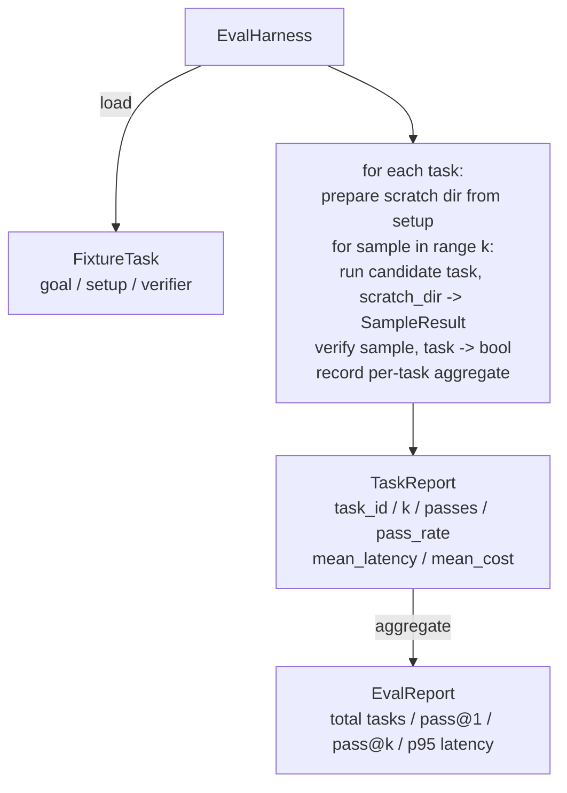

# 顶点课程 27：带样本任务的评测框架

> 中文译文。代码、命令和标识符保持英文。若与原文不一致，以同目录 docs/en.md 为准。

> 一个编码智能体的好坏，只取决于你用来测量它的那套任务。本课构建一个评测框架：它接收一个样本任务文件夹，把每一个任务交给候选智能体运行，通过一个确定性验证器打出通过或失败，并把结果汇总成 pass@1、pass@k、平均延迟和平均成本。这个框架是事实来源，让你能把回退和重构区分开。

**Type:** 动手做
**Languages:** Python（标准库）
**Prerequisites:** Phase 19 · 25（验证门控）、Phase 19 · 26（沙箱运行器）、Phase 14 · 30（评测驱动的智能体开发）、Phase 14 · 19（SWE-bench 与 GAIA 基准）
**Time:** ~90 分钟

## 学习目标

- 把样本任务定义为目标、搭建和验证器的三元组。
- 对每个任务给多次采样运行打分，并计算 pass@1 和 pass@k。
- 把延迟和成本汇总成均值和第 95 百分位指标。
- 把确定性验证器（文件 diff、退出码、正则匹配）接成可复用函数。
- 发出一份结构化 JSON 报告，供回退跟踪脚本摄入。

## 问题

没有评测框架就搭建的智能体基准，受三种失败模式困扰。

第一种是未经验证的通过。智能体说它修好了 bug，人瞥了一眼 diff，套件被标成绿色，三周后回归测试又露出同一个 bug。智能体推理得很像那么回事，却什么都没真正修好。

第二种是未被发现的回退。提示词模板的一次改动让智能体在吵闹的任务上好了 4%，在安静的任务上差了 14%。没有金标准集和逐任务分数，回退就骑进 main，直到客户抱怨才露出来。

第三种是逐任务漂移。评测周一用 100 个任务跑，周五用其中 95 个跑，因为有人重命名了五个样本。通过率看起来像提高了 5%。其实不是。

框架就是把这些失败变成事实的程序。它每次都运行每一个样本，以可复现的顺序，对照一个在确定性检查上返回真或假的验证器。

## 概念

```mermaid
flowchart LR
  F1[fixtures/task_001/<br/>task.json + expected/] --> Harness
  F2[fixtures/task_002/<br/>...] --> Harness
  Harness[Harness<br/>for each task:<br/>setup / run agent k samples /<br/>verify each sample /<br/>record latency, cost]
  Harness --> Report[EvalReport<br/>pass@1 / pass@k<br/>mean ms / p95 ms<br/>mean cost]
```

一个 `FixtureTask` 是一个小 JSON 文件，加上一个可选的 `expected/` 目录。JSON 声明一个 `id`、一个 `goal`（喂给智能体的提示词）、一个 `setup` 块（要放进草稿目录的文件），以及一个 `verifier` 块。验证器块指名框架验证器注册表里的一个函数，并提供它的参数。

三种验证器形状覆盖大多数有用的任务。

第一种是 `file_equals`。智能体运行之后，把一个具名文件与期望内容比较。这抓住“以这种确切方式修这个 bug”的任务。

第二种是 `regex_match`。具名文件的内容与一条正则匹配。这抓住“函数必须存在并返回 X”的任务，那里有许多可接受的解。

第三种是 `shell_exit_zero`。框架运行一条 shell 命令（通过第 26 课的沙箱），并且只有命令以零退出时任务才通过。这抓住“测试必须通过”的任务。

框架把每个任务跑 `k` 次。Pass@k 是 `1 - (1 - p)^k`，其中 p 是经验通过率；框架也报告原始计数，以便你看出方差。延迟是每个样本的墙上时钟。成本是智能体自报的任何东西（token 数、美元，或两者）；框架跨样本求和，并给出逐任务和汇总数字。

```figure
pass-at-k
```

## 架构



候选是一个可调用对象：`Callable[[FixtureTask, str], SampleResult]`。框架通过 `tempfile.mkdtemp()` 创建草稿目录，并把它的路径作为普通字符串传入。框架不关心候选如何工作。候选可以是一个确定性的补丁应用器（对框架自测有用）、一个真实的 LLM 智能体、一个模糊器。契约就是 SampleResult。

## 你将构建什么

`main.py` 附带：

1. `FixtureTask` 数据类。
2. `SampleResult` 数据类：success_self_reported、latency_ms、cost_units、edits。
3. 带 `to_dict()` 的 `TaskReport`、`EvalReport` 数据类。
4. 把验证器名称映射到函数的 `VerifierRegistry`。内置验证器：file_equals、regex_match、shell_exit_zero。
5. `EvalHarness` 类。针对一个候选运行一个任务目录。返回 EvalReport。
6. 捆绑在 `tasks/` 里的五个样本任务：
   - `fizzbuzz` 中的差一错误
   - `factorial` 中缺少 return
   - 错误消息中的拼写错误
   - 空函数体
   - 链表遍历中的差一错误
7. 一个确定性的参考候选（`apply_known_fixes`），框架用它演示干净的 pass@1 为 1.0。
8. 演示打印 EvalReport JSON 并以零退出。

样本任务以 `tasks/` 中的 JSON 文件捆绑，并在 `tasks/<id>/buggy/` 和 `tasks/<id>/expected/` 中配有成对的源文件。框架把 buggy 复制进草稿目录，交给候选，并对照 expected 验证。

## 为什么要 pass@k，而不是只有 pass@1

真实的 LLM 智能体是随机的。pass@1 为 0.6 看起来像失败。pass@5 为 0.95 说明智能体大多数时候能得到正确答案，但在早期样本上选错了。修复是采样和排序，而不总是更多训练。Pass@k 让这一点可见。

Pass@k 与 pass@1 一起报告，因为 pass@k 会掩盖真实失败：如果模型二十次里只有一次得到正确答案，你并没有一个有用的智能体。框架把两者都展示出来。

## 它如何与 Track A 的其余部分组合

第 25 课产出了门控链。第 26 课产出了沙箱。框架对任何 `shell_exit_zero` 验证器使用沙箱。第 28 课把每一次框架运行包进一条 OTel 追踪。第 29 课针对捆绑样本之一运行端到端演示，并断言参考候选的 pass@1 = 1.0。

## 运行

```bash
cd phases/19-capstone-projects/27-eval-harness-fixture-tasks
python3 code/main.py
python3 -m pytest code/tests/ -v
```

演示以 JSON 打印 EvalReport，包括 pass@1、pass@5、平均延迟和逐任务分解。退出码为零。测试覆盖验证器函数、pass@k 数学、样本加载，以及框架针对捆绑参考候选的端到端。
