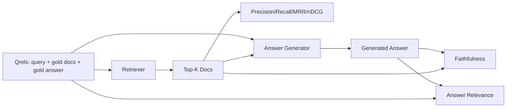

# 检索增强生成评测：Precision、Recall、MRR、nDCG、忠实性、答案相关性

> 中文译文。代码、命令和标识符保持英文。若与原文不一致，以同目录 docs/en.md 为准。

> 如果你不能同时给检索和答案打分，你就不能交付这个系统。两者不是同一个指标，同一条提示词会在不同的轴上失败。

**Type:** 动手做
**Languages:** Python
**Prerequisites:** Phase 11 第 06 课（检索增强生成）、第 10 课（评测）；Phase 19 Track B 基础（第 20–29 课）；Phase 19 第 64、65、66、67 课
**Time:** ~90 分钟

## 学习目标
- 从金标准 qrels 计算四个检索指标：precision@k、recall@k、MRR（平均倒数排名），以及 nDCG@k。
- 计算两个答案级指标：忠实性（每一个主张都依据检索到的上下文）和答案相关性（答案针对的是这个问题）。
- 构建一份样本 qrels 文件（查询、金标准文档 id、金标准答案文本），让评测从头到尾读取。
- 阅读指标值，以诊断流水线失败在哪里：检索、排序、生成，还是依据。

## 问题

一个检索增强生成系统至少有四个活动部件：分块器、检索器、重排器、生成器。其中任何一个都可能是错误答案的原因。没有分阶段指标，你就是在盲飞。

一个用户报告了一个错误答案。是因为分块器切掉了答案片段？是因为检索器没有把该块放进 top-k？是因为重排器把正确的块推过了第一位？还是因为生成器忽略了该块、自己编造了东西？你无法只从答案看出来。你需要：

- 检索指标，给检索器产出的东西打分。
- 排序指标，给正确块在顺序中的位置打分。
- 忠实性，给生成器是否留在检索到的上下文之内打分。
- 答案相关性，给答案是否针对这个问题打分。

本课在一份样本 qrels 文件之上构建全部六项。评测是离线且确定性的；在生产中，你把模拟的 LLM 作评判换成真实的。

## 概念



### Precision@k

在检索器返回的前 k 个文档中，有多大比例在金标准集合里？如果金标准有三篇文档，top-3 返回了其中两篇和一篇错误的，precision@3 就是 2 / 3。当一个不相关检索块的代价高时用 precision（生成器在它上面浪费 token，或者该块毒害答案）。

### Recall@k

在金标准文档中，有多大比例在 top-k 里？如果金标准有三篇文档，top-5 包含了全部三篇，recall@5 就是 1.0。当漏掉答案的代价高时用 recall（你宁可多看一个错误块，也不要完全错过答案块）。

在生产检索增强生成里，人们通常引用的指标是 recall@k。生成可以轻易丢掉不相关的块；它无法从一篇从未见过的块里发明答案。

### MRR（平均倒数排名）

对每个查询，找出排序列表中第一篇相关文档的位置。倒数排名是 1 / 位置。对查询集取平均。MRR 是一个单数字摘要，说明检索器把最佳答案放在顶部的程度。

MRR 对第 1 位权重很重。金标准文档在第 1 位的查询贡献 1.0。第 2 位贡献 0.5。第 10 位贡献 0.1。该指标由列表顶部主导。

### nDCG@k

归一化折损累计增益（Normalized Discounted Cumulative Gain）。完整公式给每篇检索到的文档分配一个增益（通常相关为 1，不相关为 0），按位置的对数折损，求和，再除以理想 DCG（如果你排序完美会得到的 DCG）。范围是 0 到 1。

nDCG 容纳分级相关性：金标准可以说“文档 A 是 3，文档 B 是 2，文档 C 是 1”。MRR 和 recall@k 把一切压成二值。当语料对每个查询有多篇部分相关的文档时，用 nDCG。

### 忠实性

对生成答案中的每一个主张，检查该主张是否被检索到的上下文支持。标准实现使用一条 LLM 作评判的提示词，它接受（主张，上下文）并返回是或否。指标是通过的主张所占的比例。

忠实性抓住生成器编造内容的失败模式。即便检索器返回了正确的块，一个会幻觉的生成器也是坏的。忠实性也叫依据性、支持、归因。

本课用一个确定性的模拟评判来实现忠实性：它检查每个主张的 token 是否与检索到的上下文重叠超过一个阈值。在生产中你换成真实的模型调用。指标的形状是一样的。

### 答案相关性

答案真的针对这个问题吗？忠实性问的是“答案是否依据上下文？”。答案相关性问的是“答案是否依据问题？”。一个忠实但跑题的答案在忠实性上得分高，在相关性上得分低。一个短而切题、却忽略上下文的答案在相关性上得分高，在忠实性上得分低。

标准实现同样使用 LLM 作评判：取（问题，答案），问答案是否针对这个问题。本课实现一个 token 重叠加评判的替身。

## 样本 qrels

```python
{
  "qid": "q1",
  "query": "what is the abort threshold for multipart uploads",
  "gold_doc_ids": ["d1", "d3"],
  "gold_answer_substring": "three failed parts",
  "graded_relevance": {"d1": 3, "d3": 2},
}
```

每个查询携带：
- 查询字符串，
- 一组金标准文档 id（用于 precision / recall / MRR），
- 一个分级相关性字典（用于 nDCG），
- 金标准答案子串（作为每条 qrel 上的参考元数据保留；本课的忠实性是通过把抽取出的主张对照检索到的上下文来评判的，而不是对照这个子串）。

在生产中你给这些打标签。本课附带一份手工构建的样本，使评测开箱即跑。

```figure
ci-rag-metric-ladder
```

## 动手做

`code/main.py` 实现：

- `precision_at_k(retrieved, gold, k)` — 字面定义。
- `recall_at_k(retrieved, gold, k)` — 字面定义。
- `mean_reciprocal_rank(retrieved_list_of_lists, gold_list)` — 对查询取平均。
- `ndcg_at_k(retrieved, graded_relevance, k)` — 带二值或分级增益的 DCG / IDCG。
- `extract_claims(answer)` — 把答案切成句子形状的主张。
- `faithfulness(claims, context_texts, judge)` — 被判为受支持的主张所占比例。
- `answer_relevance(question, answer, judge)` — 评判答案是否针对问题。
- `MockJudge` — 确定性的 token 重叠评判，使评测离线运行。
- `evaluate_pipeline(pipeline_fn, qrels, ks)` — 运行每一个指标的编排器。
- 一个演示：对照 qrels 跑三种流水线变体（分块器基线、混合检索、混合 + 重排），并打印一张指标表。

运行：

```bash
python3 code/main.py
```

输出在一张指标表里展示每种变体的 precision@k、recall@k、MRR、nDCG@k、忠实性和答案相关性。混合检索行在 recall 上胜过分块器基线；重排行在 MRR 上胜过混合。

## 用指标读数诊断失败

| 症状 | 可能原因 | 要修什么 |
|---------|-------------|-------------|
| recall@k 低，precision@k 低 | 分块器切掉了答案，或检索器找不到它 | 分块边界（第 64 课）或检索模态（第 65 课） |
| recall@k 还行，MRR 低 | 正确的块在 top-k 里，但不在第 1 位 | 重排器（第 66 课） |
| MRR 高，忠实性低 | 尽管上下文正确，生成器仍在编造内容 | 生成提示词；强制引用否则拒绝 |
| 忠实性高，相关性低 | 答案有依据但跑题 | 查询改写器（第 67 课）或生成提示词 |
| 四项都高，用户仍在抱怨 | 评测集不具代表性 | 用真实用户查询扩充 qrels |

## 演示会藏住的失败模式

**LLM 作评判的偏差。** 模型会把自己的输出判得比实际更忠实。评判用与生成器不同的模型族，或者人工给一个样本打分。

**qrels 腐烂。** 随着语料变化，金标准答案会漂移。一篇在 2024 年 1 月对 q1 是金标准的文档，到 2024 年 10 月不再是正确答案，因为团队给函数改了名。安排每季度一次的 qrels 复查。

**忠实性的微观检查会漏掉宏观主张。** 逐句忠实性可以通过，而整体答案的结构仍在误导。在自动化指标之上加一层样本级的定性复查。

**Recall@k 掩盖逐查询的失败。** 90% 的平均 recall 可能藏着某一类查询永远错过。按查询类别（字面、改写、多主题）切片 qrels，并按切片报告。

## 使用

生产模式：

- 在每一次检索器或生成器变更上运行评测。把 recall@k 回退当作测试失败来对待。
- 按查询持久化指标追踪。当用户抱怨时，查找匹配的 qrel 条目，看它是否本会被抓住。
- 给 qrels 分层：一套 20 个查询的冒烟集在 CI 中运行；一套 200 个的回归集每晚运行；一套 2000 个的深度集每周运行。

## 交付

第 69 课把整条流水线（分块器、检索器、重排器、生成器）接起来，并针对端到端系统运行这次评测。

## 练习

1. 增加第五个检索指标：hit-rate@k。把它与 recall@k 比较。解释它们何时不同。
2. 实现分级忠实性：0（不受支持）、1（部分受支持）、2（完全受支持）。相应地更新指标。
3. 把模拟评判换成真实的模型调用。在样本上测量模拟评判与真实评判之间的分歧。
4. 增加一个查询类别切片（“字面”、“改写”、“多主题”）。按切片报告指标。
5. 增加一个“答案长度”指标，并把它与忠实性做相关。画出曲线。

## 关键术语

| 术语 | 人们怎么说 | 实际含义 |
|------|-----------------|------------------------|
| Precision@k | “检索结果上的命中率” | top-k 中属于金标准的比例 |
| Recall@k | “金标准上的命中率” | 金标准中落在 top-k 里的比例 |
| MRR | “第一次命中的位置” | 第一篇相关文档排名的倒数的均值 |
| nDCG@k | “分级排序质量” | top-k 上的 DCG 除以理想 DCG |
| 忠实性 | “依据性” | 被检索上下文支持的答案主张所占比例 |
| 答案相关性 | “它针对问题了吗？” | 答案是否匹配问题的意图 |
| Qrels | “金标准标签” | 查询及其金标准文档和答案的标注集 |

## 延伸阅读

- Buckley、Voorhees，《Evaluating Evaluation Measure Stability》，SIGIR 2000 — 关于排序指标的经典论文
- Jarvelin、Kekalainen，《Cumulated Gain-based Evaluation of IR Techniques》 — nDCG 论文
- [Ragas：检索增强生成流水线的自动化评测](https://docs.ragas.io)
- [Anthropic，Introducing Contextual Retrieval](https://www.anthropic.com/engineering/contextual-retrieval) — 用 1 减 recall@20 给检索打分
- Phase 11 第 10 课 — 评测框架基础
- Phase 19 第 64–67 课 — 这里被评测的组件
- Phase 19 第 69 课 — 这次评测所打分的端到端流水线
