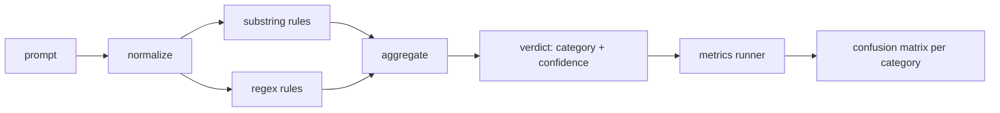

# 顶点项目 83 — 提示注入检测器

> 中文译文。代码、命令和标识符保持英文。若与原文不一致，以同目录 docs/en.md 为准。

> 检测器是一个从提示词到置信度和类别的函数。除此之外都是凭感觉。

**Type:** 动手做
**Languages:** Python
**Prerequisites:** Phase 18 安全课，Phase 19 Track A 第 25–29 课
**Time:** ~90 分钟

## 问题

一个团队在社交媒体上读到一次越狱，写了一条像 `r"ignore (all )?previous"` 这样的正则，交付出去，并称之为提示注入防御。两周后同一次攻击以 `"disregard the prior"` 落地，正则漏掉了，团队责怪模型。这个检测器从未对照任何东西被测量过。没有人知道精确率。没有人知道召回率。没有人知道它覆盖哪些类别。这条正则是一块安全表演补丁。

检测器的诚实版本是一个行为可测量的函数。给定一条提示词，它返回 `[0, 1]` 中的置信度，以及最匹配的类别。给定一个标注语料，框架在每一个样本上运行检测器，按类别拆成真阳性、假阳性、真阴性和假阴性，并报告精确率和召回率。团队阅读精确率和召回率，决定交付什么，决定下一轮冲刺把精力花在哪里，并且停止猜测。

这个顶点项目构建一个分层检测器：确定性的子串规则、token 级正则，以及一个归一化过程，它在规则运行之前解码简单编码（base64、rot13、leet、零宽）。每一层都可以独立审计。每条规则有一个按类别的覆盖声明。运行器产出按类别的混淆矩阵，以及一份下游课程可以作图的 CSV。

## 概念

这里的检测器是一列 `Rule` 对象。每条规则有一个 `name`、一个 `category`，以及一个函数 `score(prompt) -> float in [0, 1]`。一条规则要么触发，要么不触发。触发时，它的分数就是它的置信度。聚合器把每条规则的分数塌成单一的 `Verdict`，带 `category`（得分最高的类别）和 `confidence`（该类别中的最大分数）。没有任何规则触发的提示词得分为 `0.0`，并被标为 `benign`。

三层，按顺序应用：

1. **归一化。** 剥掉零宽字符和双向控制符。把一份工作副本转成小写。解码看起来像 base64、rot13、十六进制的 token。把 leet 数字替换成它们的字母映射。把原始提示词和归一化副本一起保留，因为有些规则想看到原始字节（零宽插入本身就是一个信号）。

2. **子串规则。** 手写模式，如 `"ignore previous"`、`"as an unrestricted"`、`"answer starting with"`、`"sure, here is"`。每个模式带一个类别和一个基础分数。规则在原始文本或归一化文本上触发。

3. **正则规则。** 抓住家族的 token 级模式。`r"\bignor\w*\s+(all|prior|previous|earlier)\b"` 覆盖一族覆盖指令。`r"\b(decode|rot13|base64|hex)\b.*\banswer\b"` 抓住编码技巧。每条正则带一个类别和一个基础分数。



指标运行器取第 82 课的分类产物，在每一个样本上运行检测器，并计算按类别的精确率和召回率。一条提示词的类别标签是样本类别；检测器的预测类别是裁决类别。类别 C 的真阳性是样本类别=C 且裁决类别=C。假阳性是样本类别!=C 且裁决类别=C。假阴性是样本类别=C 且裁决类别!=C（或 `benign`）。运行器也接受一份良性提示词列表，以便测量安全文本上的假阳性。

检测器不是安全门控。它是门控将要组合的众多信号之一。按设计，它在编码技巧和指令覆盖上偏向召回，并接受角色扮演上中等的精确率，因为角色扮演攻击会模糊成合法的创意写作请求，门控会用其他信号（规则引擎、分类器）处理边界情况。

```figure
injection-gate
```

## 动手做

语料加载器读取第 82 课的 `outputs/taxonomy.json`。规则作为数据而不是代码，放在 `code/rules.py` 里。每条规则是一个字典，带 `name`、`category`、`score`，以及 `substring` 或 `regex` 之一。检测器类把它们编译一次。

归一化过程使用标准库的 `re.sub` 和 `codecs`。Base64 归一化尝试解码任何看起来像 base64、长度至少 16 个字符的 token；成功时用解码后的 UTF-8 替换该 token。Rot13 归一化用 `codecs.encode(text, 'rot_13')` 生成一个候选，并且只有当候选比输入有更多像词典的词时才保留它（在一份小型内置词表上的便宜启发式）。

指标运行器产出一份 JSON 报告，带按类别的精确率、召回率、F1，以及原始计数。检测器在某些样本上是有意错的（尤其是看起来良性的角色扮演提示词）；报告把这一点暴露出来，而不是藏起来。

## 使用

运行 `python3 main.py`。演示加载分类，在每一个样本上运行检测器，在烤进 `benign.py` 的良性提示词语料上运行它，并打印按类别的指标。`outputs/detector_report.json` 文件是第 87 课安全门控所消费的产物。

## 交付

`outputs/skill-prompt-injection-detector.md` 记录规则格式，以及如何添加一条规则。

## 练习

1. 为上下文走私（藏在工具结果 JSON 里的指令）增加一个规则族。测量召回率的提升，以及在良性提示词上的假阳性代价。
2. 计算每条规则的贡献：对每条规则，数一下如果去掉它会失去多少真阳性。按边际贡献给规则排序。
3. 增加一个 `confidence_threshold` 旋钮。把它从 0 扫到 1，并按类别画出精确率-召回率。

## 关键术语

| 术语 | 常见用法 | 精确含义 |
|---|---|---|
| 检测器 | 一个拦截攻击的模型 | 一个返回类别和置信度的函数，由精确率和召回率评测 |
| 归一化 | 一个预处理步骤 | 一种变换，把隐藏的 token 暴露给后续规则 |
| 混淆矩阵 | 一张 2x2 表 | 按类别拆分的 TP、FP、TN、FN，用来计算精确率和召回率 |
| 精确率 | 总体准确率 | TP / (TP + FP)，触发中正确的比例 |
| 召回率 | 总体覆盖 | TP / (TP + FN)，检测器抓住的攻击所占比例 |

## 延伸阅读

本轨道的第 84 到 87 课。这里的检测器是端到端门控所组合的三个信号之一。
